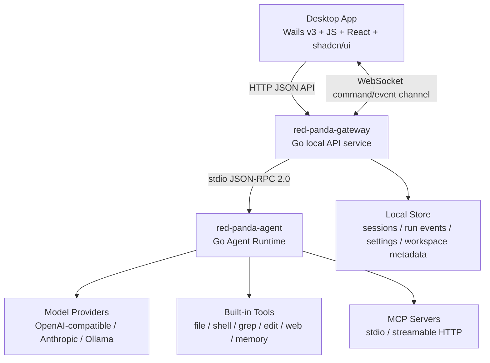

# red_panda 功能与架构设计

## 1. 设计目标

`red_panda` 是一个 Go 实现的本地 AI Agent，面向桌面端工作流、代码工作区和可扩展工具生态。

核心目标：

1. 使用 Go 作为网关服务和 Agent Runtime 的主要开发语言。
2. 保持三层架构：桌面端、中间网关服务、Agent Runtime。
3. 桌面端不直接持有 agent 执行逻辑，只通过本地网关访问能力。
4. Agent Runtime 独立进程运行，崩溃、重启、并发扩容不影响桌面端和网关。
5. 支持 provider-agnostic 模型接入、工具调用、权限确认、会话持久化、工作区管理、子 agent 和插件。
6. 先实现清晰 MVP，再演进进程池、远程 agent、团队协作等高级能力。

## 2. 总体架构



三层职责：

| 层 | 核心职责 | 不负责 |
| --- | --- | --- |
| 桌面端 | UI、会话视图、工作区视图、设置、权限确认、WebSocket 事件渲染 | 模型循环、工具执行、文件系统直接写入 |
| 中间网关服务 | HTTP/WebSocket、auth、session、workspace、event store、permission coordinator、Agent 进程管理 | provider 调用、工具真实执行、上下文压缩 |
| Agent Runtime | provider、agent loop、tools、MCP、memory、skills、subagents、context management | UI、HTTP API、桌面状态持久化 |

## 3. 推荐目录结构

```text
red_panda/
  go.work
  go.mod
  README.md
  docs/
    01-existing-project-analysis.md
    02-functional-design.md
    03-protocol.md
    04-mvp-plan.md
  cmd/
    red-panda-desktop/       # Wails v3 桌面壳入口
    red-panda-gateway/       # 本地 HTTP/WebSocket 网关
    red-panda-agent/         # stdio JSON-RPC Agent Runtime
    red-panda/               # 可选 CLI，管理启动和诊断
  internal/
    protocol/                # Gateway <-> Agent JSON-RPC 共享类型
    gateway/
      app/                   # Gin engine bootstrap, router, middleware
      controller/            # MVC controllers
      service/               # business orchestration
      repository/            # GORM repositories
      model/                 # GORM models
      dto/                   # request/response DTOs
      infra/
        database/            # SQLite(no cgo) + GORM init
        eventhub/            # WebSocket hub and run event fanout
      auth/
      runtime/               # Agent Runtime JSON-RPC client
      config/
    agent/
      loop/
      provider/
      tool/
      mcp/
      memory/
      skill/
      subagent/
      context/
      permission/
      sandbox/
      hook/
    shared/
      ids/
      jsonutil/
      log/
      paths/
      version/
```

Go 工程组织采用 Go workspace。建议根目录使用 `go.work` 管理多个 Go module，避免桌面端、网关、Agent Runtime、共享协议之间的依赖边界变成一个巨大的单体模块。

推荐模块边界：

| Module | 说明 |
| --- | --- |
| `./modules/protocol` | Gateway 与 Agent Runtime 共享的 JSON-RPC、事件和 DTO 类型 |
| `./modules/gateway` | Gin + GORM + SQLite(no cgo) 中间网关 |
| `./modules/agent` | Agent Runtime，包含模型循环、工具、子代理和 MCP |
| `./modules/desktop` | Wails v3 桌面端 Go 壳层和 JS/React/shadcn-ui 前端 |
| `./modules/cli` | 可选 CLI，用于启动、诊断和开发调试 |

依赖方向：

```text
desktop -> gateway client DTO
gateway -> protocol
gateway -> runtime process client
agent -> protocol
cli -> gateway / agent process launcher
protocol -> no internal module dependency
```

## 4. 桌面端功能设计

MVP 桌面端应包含：

1. 会话列表：新建、重命名、删除、fork、恢复最近会话。
2. Chat 工作区：流式消息、工具调用卡片、权限请求卡片、错误提示、运行状态。
3. 工作区面板：打开项目目录、文件树、文件预览、Git diff 摘要。
4. 设置：provider profile、model、base URL、API key 引用、权限模式、代理、上下文阈值。
5. 运行控制：发送、停止、重试、继续、清空上下文。
6. 子 agent 面板：查看子 agent 状态、结果、消息和取消。
7. 网关状态：健康检查、Agent Core 状态、重启 Agent。

桌面端技术选择：

- 固定使用 Wails v3 作为桌面壳。
- 前端固定使用 JavaScript + React，不使用 TypeScript。
- UI 组件体系固定使用 shadcn/ui，Tailwind CSS 作为样式基础。
- UI 信息架构参考 `night24/tauri-app`：TopBar、Sidebar、ChatPanel、Composer、ToolCard、PermissionCard、SubAgentPanel、ContextPanel，并沿用 red panda pixel LOGO。
- Wails Go 侧只负责桌面生命周期、本地网关启动/发现、系统能力桥接和窗口能力，不承载 agent 业务逻辑。
- 业务请求和事件订阅仍然走 `red-panda-gateway` 的 HTTP/WebSocket API，避免桌面端绕过网关。
- 桌面进程可以负责启动/发现本地网关，但不直接调用 Agent Runtime。
- 桌面端目录和 UI 设计见 [桌面端技术栈与 UI 设计](07-desktop-tech-ui-design.md)。

桌面端和网关对接原则：

1. 桌面端只对接网关 HTTP/WebSocket，不了解 Agent Runtime stdio JSON-RPC。
2. 桌面端启动时先发现或启动本地网关，再通过 `/healthz` 和 `/readyz` 建立可用状态。
3. 健康检查、bootstrap、工作区文件读取等短请求使用 HTTP JSON API；agent run、权限确认、取消、订阅和事件推送优先使用 WebSocket。
4. WebSocket 断线后使用 `resume` 消息携带每个 run 的 last `root_seq`，由网关从事件库续传。
5. 权限确认、子代理状态、工具输出、主代理/子代理文本都通过同一个 run event 体系进入桌面端。
6. API key 或本地 pairing token 由桌面端启动网关时生成或读取，所有非健康检查 API 都带认证头。

详细设计见 [桌面端与网关对接设计](06-desktop-gateway-integration.md)。

## 5. 中间网关服务功能设计

网关是系统的唯一本地 API 面。

技术架构固定为：

- 语言：Go。
- HTTP 框架：Gin。
- 数据库：SQLite。
- SQLite 约束：必须 no cgo，禁止依赖 `mattn/go-sqlite3`。
- ORM：GORM。
- GORM SQLite driver：使用 pure-Go 驱动，例如 `github.com/glebarez/sqlite`，而不是 GORM 官方默认 `gorm.io/driver/sqlite`。
- 架构风格：MVC + Service + Repository。Controller 只处理 HTTP 入参和响应，业务逻辑放 Service，数据访问放 Repository。
- HTTP API 输出：统一 JSON envelope。WebSocket 使用独立 message envelope，支持 request/response、event、ack、error。
- 运行形态：本地单机服务，默认只监听 `127.0.0.1`。

### 5.1 HTTP API 草案

| 方法 | 路径 | 说明 |
| --- | --- | --- |
| `GET` | `/healthz` | 网关健康检查 |
| `GET` | `/readyz` | 网关 + Agent Runtime 可用性 |
| `GET` | `/agent/status` | Agent 进程状态、协议版本、能力 |
| `POST` | `/agent/restart` | 重启 Agent Runtime |
| `POST` | `/runs` | 启动一次 agent run，返回 `run_id` |
| `GET` | `/api/v1/ws` | WebSocket 统一命令和事件通道 |
| `POST` | `/runs/{run_id}/cancel` | 取消运行 |
| `POST` | `/runs/{run_id}/permissions/{permission_id}` | 通过或拒绝权限请求 |
| `GET` | `/sessions` | 会话列表 |
| `POST` | `/sessions` | 创建会话 |
| `GET` | `/sessions/{id}` | 会话详情 |
| `GET` | `/sessions/{id}/history` | 会话消息 |
| `POST` | `/sessions/{id}/fork` | fork 会话 |
| `POST` | `/sessions/{id}/compact` | 触发压缩 |
| `DELETE` | `/sessions/{id}` | 删除会话 |
| `POST` | `/workspaces/open` | 打开工作区 |
| `GET` | `/workspaces/current` | 当前工作区 |
| `GET` | `/workspace/tree` | 文件树 |
| `GET` | `/workspace/file` | 读取文件预览 |
| `GET` | `/workspace/diff` | Git diff 摘要 |
| `GET` | `/tools` | Agent 可见工具列表 |
| `GET` | `/skills` | 当前工作区 skills |
| `GET` | `/subagents` | 子 agent 池状态 |

### 5.2 网关内部职责

1. Agent 进程管理：启动、初始化、ping、重启、退出、崩溃标记。
2. JSON-RPC client：维护 pending requests、事件路由和请求超时。
3. Run registry：记录 active runs、取消状态、WebSocket 订阅者。
4. Event store：按 `root_run_id` 和 `root_seq` 持久化事件，支持断线续传。
5. Session store：持久化会话、消息、工作区绑定和元数据。
6. Workspace manager：路径限定、文件树、文件预览、recent workspaces、diff。
7. Permission coordinator：缓存 pending permission，转发桌面决策。
8. Config manager：provider profiles、权限模式、代理、MCP 配置。
9. Auth：本地 API key，可选；默认仅绑定 `127.0.0.1`。

### 5.3 MVC 分层

推荐分层：

| 层 | 职责 |
| --- | --- |
| Router | 注册 Gin 路由、中间件、路由分组 |
| Controller | HTTP 参数绑定、鉴权上下文读取、调用 Service、统一响应 |
| Service | 业务编排：session、run、workspace、permission、agent runtime |
| Repository | GORM 数据访问，不包含业务规则 |
| Model | GORM model 和数据库迁移结构 |
| DTO | HTTP 请求/响应结构，与数据库 model 解耦 |
| Runtime Client | Agent Runtime JSON-RPC client，供 Service 调用 |
| Event Hub | WebSocket 订阅、事件持久化和事件广播 |

### 5.4 网关持久化

MVP 推荐 SQLite：

- `sessions`：会话元数据。
- `messages`：消息快照，或 JSONL 文件路径。
- `run_events`：`run_id`、`seq`、`event_type`、payload、created_at。
- `workspaces`：最近打开项目、当前 workspace。
- `settings`：非敏感配置；敏感 key 只存 keychain 或环境引用。
- `permissions`：pending/decision 审计记录。

SQLite/GORM 约束：

1. `CGO_ENABLED=0` 必须可以构建网关。
2. 数据库初始化统一放在 `internal/gateway/infra/database`。
3. 迁移使用 GORM `AutoMigrate` 起步，后续引入版本化 migration。
4. 所有查询必须接收 `context.Context`。
5. Repository 不直接向上返回 GORM 内部错误文案，Service 负责转换为领域错误。
6. SQLite 写入需要控制并发，默认启用 WAL、busy timeout 和单写队列策略。

## 6. Agent Runtime 功能设计

Agent Runtime 是独立 Go 子进程，只通过 stdio JSON-RPC 与网关通信。

Agent Runtime 必须从第一版设计时考虑多进程和子代理：

- 支持 `single_core`、`per_run_process`、`process_pool` 三种运行模式。
- 支持同进程子代理和独立进程子代理两种执行后端。
- 子代理池由 Agent Runtime 管理，网关只查询、展示、取消和转发事件。
- 子代理事件必须带 `parent_run_id`、`parent_session_id`、`subagent_id`、`child_run_id`，方便网关和桌面端聚合。
- 进程池是第二阶段实现，但协议和状态模型从 MVP 开始预留。

### 6.1 核心能力

1. Agent loop：接收 session snapshot 和 user input，调用 provider，执行工具，循环到 final。
2. Provider registry：OpenAI-compatible、Anthropic、Ollama、本地测试 echo provider。
3. Tool registry：内置工具 + MCP 工具统一暴露。
4. Permission gate：危险工具调用先发 `permission_required` 事件，等待网关 resolve。
5. Context manager：token 估算、工具输出截断、历史压缩、摘要压缩。
6. Memory：项目记忆、用户记忆、历史检索。
7. Sub-agent：支持同步/异步子 agent、状态池、mailbox、wait/cancel。
8. Skills：从工作区加载技能定义，暴露为工具或 prompt。
9. Hooks：pre tool、post tool、post LLM、session start/end。
10. MCP client：stdio 和 streamable HTTP；工具命名 `mcp__server__tool`。

### 6.2 内置工具 MVP

| 工具 | 读写 | 说明 |
| --- | --- | --- |
| `read_file` | read | 分页读取文本文件 |
| `write_file` | write | 写入文件 |
| `edit_file` | write | 精确替换 |
| `multi_edit` | write | 原子多处替换 |
| `ls` | read | 列目录 |
| `glob` | read | glob 查找 |
| `grep` | read | 正则搜索 |
| `shell` | write | 执行命令，默认需要权限 |
| `web_fetch` | read | 获取网页/接口文本 |
| `todo.write` / `todo.list` | read | 维护任务列表（`todo_write` 别名已在 docs/47 E-cutover 移除） |
| `memory_read` | read | 查询记忆 |
| `memory_write` | write | 写入记忆 |
| `subagent_spawn` | write | 创建子 agent |
| `subagent_status` | read | 查询子 agent |
| `subagent_wait` | read | 等待子 agent |
| `subagent_cancel` | write | 取消子 agent |

## 7. Gateway 与 Agent 协议

传输规则：

- newline-delimited JSON-RPC 2.0 over stdio。
- Agent stdout 只能输出 JSON-RPC 消息。
- Agent stderr 只能输出日志。
- 所有 long-running 方法采用 accepted + event notification 模式。
- `run_id` 用于路由事件。
- `seq` 保证同一个 run 内事件顺序。
- 主代理、子代理、工具 stdout/stderr、reasoning、message delta 都必须包装为 `agent.event` notification，禁止任何执行单元直接写协议 stdout。
- Agent Runtime 内部必须有 Event Multiplexer，负责接收主代理和子代理并发事件，串行分配 `root_seq` 后写入 stdout。
- 每个内容流必须有独立 `stream_id` 和 `stream_seq`，网关和桌面端按 `stream_id` 拼接 delta，不能只依赖全局顺序拼接文本。

核心方法：

| 方法 | 方向 | 说明 |
| --- | --- | --- |
| `core.initialize` | Gateway -> Agent | 协议握手、工作区、环境、能力 |
| `core.ping` | Gateway -> Agent | 健康检查 |
| `core.shutdown` | Gateway -> Agent | 优雅关闭 |
| `agent.tools` | Gateway -> Agent | 获取工具定义 |
| `agent.reply` | Gateway -> Agent | 启动一次 agent run |
| `agent.cancel` | Gateway -> Agent | 取消 run |
| `agent.subagents` | Gateway -> Agent | 查询子 agent 池 |
| `agent.skills` | Gateway -> Agent | 查询 skills |
| `agent.skill.load` | Gateway -> Agent | 加载指定 skill |
| `permission.resolve` | Gateway -> Agent | 回传权限决策 |
| `agent.event` | Agent -> Gateway | 事件 notification |

Agent event 类型：

| 事件 | 说明 |
| --- | --- |
| `message_delta` | 助手文本增量 |
| `message` | 完整消息 |
| `reasoning_delta` | 推理内容增量，按 provider 能力决定是否展示 |
| `tool_started` | 工具开始 |
| `tool_output` | 工具 stdout/stderr 增量 |
| `tool_finished` | 工具结束 |
| `tool_failed` | 工具失败 |
| `permission_required` | 需要用户授权 |
| `diff_ready` | 工作区 diff 摘要 |
| `subagent_update` | 子 agent 状态变化 |
| `usage` | token 和费用估算 |
| `finish` | run 正常结束、取消或失败 |
| `error` | 可恢复或不可恢复错误 |

事件复用的核心字段：

| 字段 | 说明 |
| --- | --- |
| `root_run_id` | 桌面端和网关 WebSocket 订阅绑定的 root run |
| `run_id` | 当前事件所属执行单元，主代理等于 root run，子代理为 child run |
| `parent_run_id` | 子代理事件的父 run；主代理为空 |
| `agent_id` | 当前输出代理 ID，主代理固定为 `root` |
| `subagent_id` | 子代理 ID；主代理为空 |
| `agent_path` | 从 root 到当前代理的路径，如 `["root","subagent_1"]` |
| `root_seq` | root run 范围内的全局事件序号，由 Runtime Event Multiplexer 分配 |
| `agent_seq` | 当前 agent 自己的事件序号 |
| `stream_id` | 文本/推理/工具输出的流 ID |
| `stream_seq` | 单个 stream 内的 delta 序号 |

详细协议见 [stdio JSON-RPC 事件复用协议](05-stdio-jsonrpc-multiplexing.md)。

## 8. 运行模式

MVP：

1. `single_core`：网关启动一个长期 Agent Runtime，所有 run 复用。

第二阶段：

1. `per_run_process`：每个 run 一个 Agent Runtime，隔离更强，开销更大。
2. `process_pool`：固定大小 Agent Runtime 池，支持并发 run。

建议默认：

- 开发和个人桌面：`single_core`。
- 高风险工具/不可信工作区：`per_run_process`。
- 多会话并发：`process_pool`。

多进程职责边界：

| 模式 | 网关职责 | Agent Runtime 职责 | 适用场景 |
| --- | --- | --- | --- |
| `single_core` | 启动一个常驻 agent，按 `run_id` 路由 | 管理多个 run 的状态、取消和子代理 | MVP、个人桌面 |
| `per_run_process` | 每个 run 启动独立 agent，run 结束后回收 | 只处理一个 root run 及其子代理 | 高隔离、高风险工具 |
| `process_pool` | 维护 agent worker 池、分配 run、故障替换 | worker 内执行 run，报告状态 | 多会话并发 |

子代理执行后端：

| 后端 | 说明 | 默认阶段 |
| --- | --- | --- |
| `in_process` | 在当前 Agent Runtime 内启动 goroutine 子任务，共享 provider/tool/memory 配置 | MVP |
| `runtime_process` | 为子代理启动独立 Agent Runtime 子进程，通过内部 JSON-RPC 连接 | 第二阶段 |
| `pool_worker` | 从 Agent Runtime worker 池分配子代理 worker | 第三阶段 |

## 9. 权限模型

权限模式：

| 模式 | 行为 |
| --- | --- |
| `strict` | 所有写操作、shell、网络写入都询问 |
| `permissive` | 只读工具自动允许，写工具询问 |
| `allow_all` | 自动允许所有工具 |
| `deny_all` | 拒绝所有非必要工具 |

权限流：

1. Agent 准备执行工具。
2. Agent permission gate 判断需要授权。
3. Agent 发 `permission_required` 事件。
4. 网关保存 pending permission 并转发给桌面端。
5. 用户在桌面端 approve/deny。
6. 桌面端调用网关 permission API。
7. 网关调用 `permission.resolve`。
8. Agent 继续或向模型返回被拒绝结果。

## 10. MVP 范围

第一阶段只实现能跑通完整三层链路的最小闭环：

1. `red-panda-gateway` 启动并初始化 `red-panda-agent`。
2. 桌面端或临时 Web UI 可创建 session 并发送 prompt。
3. Agent 支持 echo provider 和一个 OpenAI-compatible provider。
4. 支持 WebSocket 事件流：message_delta、tool_started、tool_finished、permission_required、finish、error。
5. 支持基础工具：read_file、write_file、edit_file、ls、grep、shell。
6. 支持 strict/permissive/allow_all/deny_all 权限模式。
7. 支持 SQLite session 和 run event 持久化。
8. 支持打开工作区、文件树、文件预览、diff 摘要。
9. 支持 Agent restart 和健康检查。

详细开发顺序和阶段验收见 [开发计划](08-development-plan.md)。

第二阶段再做：

1. MCP stdio/HTTP。
2. 子 agent。
3. memory/history。
4. context compaction。
5. Wails 正式桌面体验。
6. process pool。
7. skill/hook。
8. 自动更新、打包和崩溃报告。

## 11. 关键工程约束

1. 协议类型先行：HTTP API payload 和 JSON-RPC payload 都要有 Go struct 和测试。
2. Agent stdout 不允许输出日志，避免污染 JSON-RPC。
3. Gateway 必须能在 Agent 崩溃时向 active WebSocket 订阅者广播 terminal error，并把 run 标为 failed。
4. 所有文件路径必须限制在 workspace root，显式授权的外部路径除外。
5. 工具 schema 需要快照测试，避免模型可见接口漂移。
6. provider 请求前必须修复 tool call / tool result pairing。
7. 大工具输出必须截断或归档，避免单次输出撑爆上下文。
8. API key 不写入日志，不进入会话事件，不进入 Agent 明文持久化。
