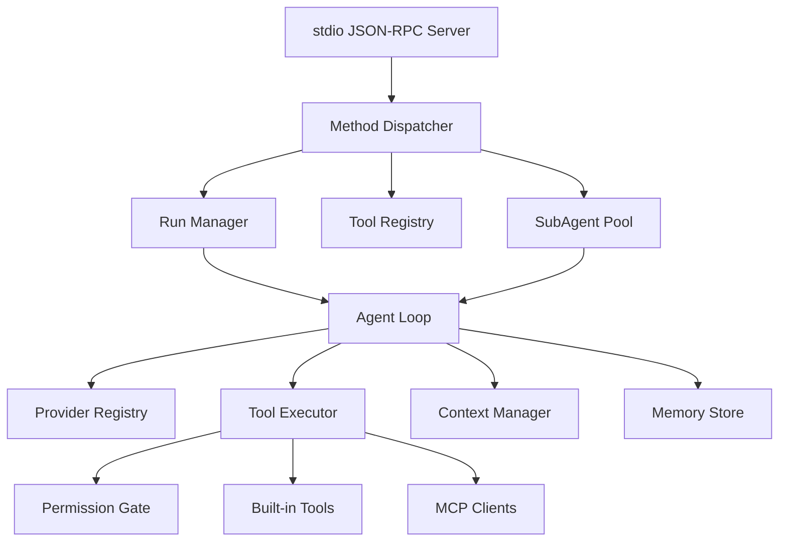

# Agent Runtime 多进程与子代理设计

## 1. 设计目标

Agent Runtime 是 `red_panda` 的执行内核，负责模型循环、工具调用、MCP、上下文管理、记忆、技能和子代理。

设计目标：

1. 使用 Go 实现。
2. 与中间网关通过 stdio JSON-RPC 通信。
3. 从第一版协议开始支持多进程扩展。
4. 子代理是 Agent Runtime 的原生能力，而不是只在网关层模拟。
5. 子代理支持同步、异步、状态查询、等待、取消和 mailbox 通信。
6. 支持 Go workspace 下的独立 module 开发。

## 2. Go Workspace 架构

根目录使用 `go.work` 管理多个模块。

推荐结构：

```text
red_panda/
  go.work
  modules/
    protocol/
      go.mod                 # module redpanda/protocol
      jsonrpc/
      event/
      method/
      permission/
    agent/
      go.mod                 # module redpanda/agent
      cmd/red-panda-agent/
      internal/runtime/
      internal/loop/
      internal/provider/
      internal/tool/
      internal/mcp/
      internal/subagent/
      internal/memory/
      internal/context/
      internal/permission/
      internal/skill/
      internal/hook/
      internal/sandbox/
    gateway/
      go.mod                 # module redpanda/gateway
      cmd/red-panda-gateway/
      internal/gateway/
    desktop/
      go.mod                 # module redpanda/desktop, Wails v3 shell
      cmd/red-panda-desktop/
    cli/
      go.mod                 # module redpanda/cli
      cmd/red-panda/
```

`go.work` 示例：

```text
go 1.24

use (
    ./modules/protocol
    ./modules/agent
    ./modules/gateway
    ./modules/desktop
    ./modules/cli
)
```

依赖规则：

1. `protocol` 不依赖任何业务模块。
2. `agent` 可以依赖 `protocol`。
3. `gateway` 可以依赖 `protocol`，但不能依赖 `agent/internal/*`。
4. `desktop` 不依赖 `agent`，通过网关 API 交互。
5. `cli` 只做启动、诊断、开发工具，不承载核心业务。

## 3. Runtime 进程模型

### 3.1 single_core

网关启动一个常驻 `red-panda-agent` 子进程。

特点：

- MVP 默认模式。
- 启动成本低。
- 多个 run 共享一个 runtime 进程。
- Runtime 内部用 `run_id` 管理并发、取消、权限 pending 和子代理。

风险：

- 单个 runtime 崩溃会影响所有 active runs。
- 隔离性弱。

### 3.2 per_run_process

网关每次 root run 启动一个独立 `red-panda-agent`。

特点：

- 隔离性强。
- run 结束后进程退出，资源回收明确。
- 适合高风险工具、不可信工作区或严格审计模式。

风险：

- 启动开销更高。
- MCP、索引、memory 等热缓存复用较差。

### 3.3 process_pool

网关维护多个 `red-panda-agent` worker。

特点：

- 支持并发会话。
- worker 崩溃可以局部替换。
- 可根据 CPU、内存和配置限制池大小。

风险：

- 调度、会话粘性、MCP 生命周期和事件路由更复杂。
- 作为第二阶段或第三阶段实现。

## 4. Runtime 内部组件



核心组件：

| 组件 | 职责 |
| --- | --- |
| JSON-RPC Server | 读取 stdin、写 stdout、日志写 stderr |
| Method Dispatcher | 分发 `core.*`、`agent.*`、`permission.*` 方法 |
| Run Manager | 管理 active runs、取消、状态、权限等待 |
| Agent Loop | provider stream、工具调用、循环控制、最终回复 |
| Tool Registry | 内置工具和 MCP 工具统一注册 |
| Permission Gate | 工具执行前判断是否需要用户授权 |
| SubAgent Pool | 管理子代理生命周期和 mailbox |
| Context Manager | token 估算、工具输出裁剪、压缩 |
| Memory Store | 项目记忆、用户记忆、历史检索 |

### 4.1 当前子代理包边界

子代理实现采用接口倒置，保持以下单向依赖：

```text
internal/runtime
    │ 构造 RunSpec、Goal 专家配置、工具与 JSON-RPC 入口
    ▼
internal/subagent
    │ Coordinator、Registry、Capture、ProcessPool、Process
    ▼
modules/protocol
```

各组件职责：

| 组件 | 所属包 | 职责 |
| --- | --- | --- |
| `Coordinator` | `internal/subagent` | 注册状态、获取进程、启动、收集结果、校验报告、释放进程和终态流转 |
| `Registry` | `internal/subagent` | 并发安全地管理子代理记录、取消函数、查询、强制终态和移除 |
| `Capture` | `internal/subagent` | 收集消息、reasoning、工具事件和失败诊断，判断最终报告是否可用 |
| `Process` / `ProcessPool` | `internal/subagent` | stdio/IPC 子进程通信和工作进程复用 |
| `runtimeProcessProvider` | `internal/runtime` | 将 `process_pool`、`runtime_process` 后端适配到 Coordinator |
| `runtimeEventSink` | `internal/runtime` | 将子代理状态和子进程事件接回 root run 事件流 |
| `executeSubagentRun` | `internal/runtime` | 解析工具参数、计算预算、构造 ChildParams、应用 Goal 专家规则并提交 RunSpec |

`internal/subagent` 不得导入 `internal/runtime`、`internal/tools` 或 Gateway。Goal、Memory、Todo 和会话策略继续由 Runtime 负责，不能下沉到通用 Coordinator。

## 5. 子代理模型

### 5.1 子代理状态

状态：

- `queued`
- `running`
- `waiting_permission`
- `completed`
- `failed`
- `cancelled`

子代理记录：

```json
{
  "subagent_id": "subagent_...",
  "name": "risk-reviewer",
  "task": "检查当前 diff 的风险",
  "mode": "async",
  "backend": "in_process",
  "status": "running",
  "parent_run_id": "run_...",
  "parent_session_id": "sess_...",
  "child_run_id": "run_...:subagent:subagent_...",
  "created_at": "2026-07-09T10:00:00Z",
  "updated_at": "2026-07-09T10:00:03Z",
  "message_count": 2,
  "result_preview": null,
  "error": null
}
```

### 5.2 子代理工具

Agent Runtime 向模型暴露子代理工具：

| 工具 | 说明 |
| --- | --- |
| `subagent_spawn` | 创建子代理，支持 sync/async |
| `subagent_status` | 查询一个或全部子代理 |
| `subagent_message` | parent/child mailbox 通信 |
| `subagent_wait` | 等待异步子代理完成 |
| `subagent_cancel` | 取消子代理 |

`subagent_spawn` 参数：

```json
{
  "task": "检查当前 diff 的风险",
  "mode": "async",
  "backend": "in_process",
  "name": "risk-reviewer",
  "max_turns": 6,
  "timeout_ms": 180000,
  "tool_allowlist": ["read_file", "grep", "git_diff"],
  "permission_mode": "permissive"
}
```

### 5.3 子代理执行后端

| 后端 | 执行方式 | 适用阶段 |
| --- | --- | --- |
| `in_process` | Runtime 内 goroutine 执行子 agent，共享当前进程资源 | 仅保留 planner 兼容路径 |
| `runtime_process` | 为子代理启动独立 `red-panda-agent` 进程 | 已实现 |
| `process_pool` | 从父 Runtime 进程池分配可复用子代理进程 | 已实现，普通 `subagent.run` 默认值 |

默认策略：

- 普通 `subagent.run` 默认使用 `process_pool`。
- 父运行显式选择不池化执行时使用 `runtime_process`。
- `in_process` 仅保留给旧版 planner 触发路径，不进入 Coordinator 的进程后端选择。

### 5.4 Coordinator 端口

Coordinator 只消费两个最小接口：

1. `ProcessProvider`：按 backend 获取子代理进程并返回单次 Release 函数。
2. `EventSink`：发送生命周期状态并桥接子进程事件。

Runtime 实现这两个接口，但接口定义保留在 `internal/subagent`。这种方式避免 `subagent -> runtime` 循环依赖，也避免用包含 Goal、Gateway 和事件细节的巨大 Host 接口掩盖耦合。

Runtime 在调用 Coordinator 前必须完成 ChildParams 构造和权限收紧。Coordinator 不修改业务上下文，只保证通用执行生命周期在成功、失败和取消路径上都释放一次进程，并保持终态不可被迟到事件覆盖。

## 6. 子代理事件

子代理事件必须通过 root run 的事件流上报，桌面端才能在同一个会话中看到完整状态。

主代理和子代理可能同时输出内容。Runtime 必须通过内部 Event Multiplexer 统一输出到 stdio JSON-RPC：

1. 主代理和子代理都只能向 Event Multiplexer 投递事件，不能直接写 stdout。
2. Event Multiplexer 为同一个 `root_run_id` 分配单调递增的 `root_seq`。
3. 每个 agent 自己维护 `agent_seq`。
4. 每个文本、reasoning、工具 stdout/stderr 都必须维护独立 `stream_id` 和 `stream_seq`。
5. 网关按 `root_run_id` 路由到 WebSocket 订阅者，按 `agent_path`、`agent_id`、`subagent_id`、`stream_id` 区分主代理和子代理输出。
6. UI 拼接流式文本时只按同一个 `stream_id` 的 `stream_seq` 拼接，不把主代理和子代理 delta 混在一起。

事件示例：

```json
{
  "root_run_id": "run_parent",
  "run_id": "run_parent:subagent:subagent_123",
  "parent_run_id": "run_parent",
  "root_seq": 42,
  "agent_seq": 7,
  "type": "subagent_update",
  "payload": {
    "subagent_id": "subagent_123",
    "parent_run_id": "run_parent",
    "parent_session_id": "sess_1",
    "child_run_id": "run_parent:subagent:subagent_123",
    "name": "risk-reviewer",
    "status": "running",
    "summary": "正在检查 diff"
  }
}
```

原则：

1. 子代理内部工具事件可以折叠为摘要，避免主会话事件流过载。
2. 子代理最终结果必须作为 `subagent_update(status=completed)` 返回。
3. 子代理失败不必导致 root run 失败，除非模型或工具显式要求。
4. 子代理权限请求仍通过 root run 的 permission flow 进入桌面端。

stdio JSON-RPC 的完整事件复用协议见 [stdio JSON-RPC 事件复用协议](05-stdio-jsonrpc-multiplexing.md)。

## 7. JSON-RPC 方法扩展

Runtime 对网关暴露：

| 方法 | 说明 |
| --- | --- |
| `agent.subagents` | 查询子代理池 |
| `agent.subagent.cancel` | 网关主动取消指定子代理 |
| `agent.run.status` | 查询 root run 和子代理聚合状态 |

模型可见子代理工具仍然是 tool call，不直接暴露为 JSON-RPC 方法。

## 8. 并发与取消

并发规则：

1. 每个 root run 有独立 `context.Context`。
2. 子代理继承 parent context，但可以有自己的 timeout。
3. 取消 root run 必须递归取消所有 running 子代理。
4. 取消单个子代理不取消 root run。
5. Runtime 关闭时必须先停止接收新 run，再取消 active runs，最后等待 grace period。

## 9. 权限继承

子代理权限默认继承 parent run：

- `permission_mode`
- workspace root
- tool allowlist / denylist
- network policy
- sandbox policy

子代理可以收紧权限，不能默认放宽权限。

如果需要放宽权限，必须由 parent agent 触发显式权限请求，并经桌面端确认。

## 10. MVP 实施顺序

1. 建立 Go workspace 和 `modules/protocol`、`modules/agent`、`modules/gateway`。
2. 实现 `single_core` runtime：initialize、ping、reply、cancel、event。
3. 实现 Run Manager 和 root run cancellation。
4. 实现 `in_process` 子代理池和 `subagent_spawn/status/wait/cancel`。
5. 网关暴露 `/subagents` 查询和取消 API。
6. 桌面端展示子代理状态。
7. 第二阶段实现 `per_run_process`。
8. 第三阶段实现 `process_pool` 和 `runtime_process` 子代理后端。
