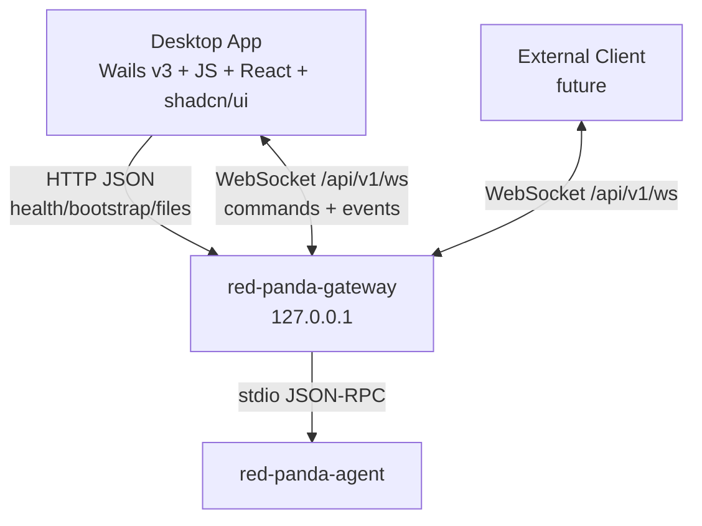

# 桌面端与网关 WebSocket 对接设计

## 1. 目标

桌面端与中间网关之间使用本地 HTTP JSON API + WebSocket 对接，不采用 SSE。

目标：

1. 桌面端只访问网关，不直接访问 Agent Runtime。
2. 网关是会话、工作区、权限、运行事件和 Agent 状态的唯一数据源。
3. WebSocket 作为桌面端和后续外部客户端的统一交互通道。
4. Agent run 的主代理、子代理、工具输出和权限事件都通过 WebSocket 推送。
5. 支持断线续传、运行恢复、心跳保活和多客户端订阅。

## 2. 连接拓扑



HTTP 只承载：

- health / readiness
- bootstrap
- 工作区文件读取等短请求
- 可选登录、配对和 token 刷新

WebSocket 承载：

- run start / cancel
- run subscribe / resume
- agent events
- permission approve / deny
- subagent cancel / subscribe
- runtime status updates
- ping / pong

## 3. 网关启动与发现

桌面端启动时：

1. 检查本地 gateway metadata 文件。
2. 如果已有网关，读取端口和 token。
3. 调用 `GET /healthz`。
4. 如果健康检查失败，尝试启动新的 `red-panda-gateway`。
5. 网关启动后写入 metadata 文件。
6. 调用 `GET /readyz` 获取 Agent Runtime 状态。
7. 调用 `GET /api/v1/app/bootstrap` 获取首屏状态。
8. 建立 WebSocket：`/api/v1/ws`。

metadata 文件示例：

```json
{
  "pid": 12345,
  "base_url": "http://127.0.0.1:17888",
  "ws_url": "ws://127.0.0.1:17888/api/v1/ws",
  "token_ref": "desktop-local-token",
  "started_at": "2026-07-09T10:00:00Z"
}
```

## 4. 认证

默认只监听 `127.0.0.1`，但仍需要本地 token。

HTTP 认证：

```http
Authorization: Bearer <local-token>
```

WebSocket 认证推荐使用子协议或首条认证消息。

方案 A：Header 认证，桌面端环境可用时优先：

```http
GET /api/v1/ws
Authorization: Bearer <local-token>
Sec-WebSocket-Protocol: redpanda.v1
```

方案 B：首条消息认证，适合浏览器限制自定义 header 的场景：

```json
{
  "id": "msg_1",
  "type": "auth",
  "payload": {
    "token": "<local-token>",
    "client": {
      "kind": "desktop",
      "name": "red-panda-desktop",
      "version": "0.1.0"
    }
  }
}
```

网关返回：

```json
{
  "id": "msg_1",
  "type": "response",
  "ok": true,
  "payload": {
    "authenticated": true,
    "connection_id": "conn_..."
  }
}
```

所有非认证消息必须在认证成功后处理。

## 5. WebSocket Message Envelope

所有 WebSocket 消息统一 envelope：

```json
{
  "id": "msg_...",
  "type": "request",
  "method": "run.start",
  "payload": {},
  "meta": {
    "client_ts": "2026-07-09T10:00:00Z"
  }
}
```

字段：

| 字段 | 说明 |
| --- | --- |
| `id` | 客户端或服务端生成的消息 ID；request 必填 |
| `type` | `auth`、`request`、`response`、`event`、`ack`、`error`、`ping`、`pong` |
| `method` | request/event 的方法名或事件名 |
| `payload` | 业务数据 |
| `meta` | 可选元数据 |

response：

```json
{
  "id": "msg_...",
  "type": "response",
  "ok": true,
  "payload": {},
  "error": null
}
```

error：

```json
{
  "id": "msg_...",
  "type": "error",
  "ok": false,
  "error": {
    "code": "run_not_found",
    "message": "run not found",
    "recoverable": true
  }
}
```

## 6. WebSocket Methods

### 6.1 run.start

启动一次 agent run。

```json
{
  "id": "msg_100",
  "type": "request",
  "method": "run.start",
  "payload": {
    "session_id": "sess_1",
    "input": {
      "text": "分析这个项目"
    },
    "options": {
      "provider_profile_id": "deepseek",
      "model": "deepseek-chat",
      "permission_mode": "strict"
    },
    "subscribe": true
  }
}
```

响应：

```json
{
  "id": "msg_100",
  "type": "response",
  "ok": true,
  "payload": {
    "accepted": true,
    "run_id": "run_1",
    "session_id": "sess_1",
    "subscribed": true,
    "from_seq": 0
  }
}
```

### 6.2 run.subscribe

订阅一个或多个 run 的事件。

```json
{
  "id": "msg_101",
  "type": "request",
  "method": "run.subscribe",
  "payload": {
    "runs": [
      {
        "run_id": "run_1",
        "after_seq": 42
      }
    ]
  }
}
```

响应：

```json
{
  "id": "msg_101",
  "type": "response",
  "ok": true,
  "payload": {
    "subscriptions": [
      {
        "run_id": "run_1",
        "status": "subscribed",
        "replayed": 12
      }
    ]
  }
}
```

网关必须先回放 `root_seq > after_seq` 的历史事件，再发送 live 事件。

### 6.3 run.resume

恢复多个 active run。用于桌面端刷新或 WebSocket 重连。

```json
{
  "id": "msg_102",
  "type": "request",
  "method": "run.resume",
  "payload": {
    "last_seen": {
      "run_1": 42,
      "run_2": 7
    }
  }
}
```

响应：

```json
{
  "id": "msg_102",
  "type": "response",
  "ok": true,
  "payload": {
    "resumed": [
      {
        "run_id": "run_1",
        "status": "running",
        "from_seq": 42
      }
    ],
    "missing": []
  }
}
```

### 6.4 run.cancel

取消 root run。

```json
{
  "id": "msg_103",
  "type": "request",
  "method": "run.cancel",
  "payload": {
    "run_id": "run_1",
    "reason": "user_cancelled"
  }
}
```

### 6.5 permission.resolve

权限确认。

```json
{
  "id": "msg_104",
  "type": "request",
  "method": "permission.resolve",
  "payload": {
    "permission_id": "perm_1",
    "decision": "approve",
    "scope": "once",
    "reason": "用户确认"
  }
}
```

拒绝：

```json
{
  "id": "msg_105",
  "type": "request",
  "method": "permission.resolve",
  "payload": {
    "permission_id": "perm_1",
    "decision": "deny",
    "reason": "不允许安装依赖"
  }
}
```

### 6.6 subagent.cancel

取消子代理。

```json
{
  "id": "msg_106",
  "type": "request",
  "method": "subagent.cancel",
  "payload": {
    "run_id": "run_1",
    "subagent_id": "subagent_7",
    "reason": "user_cancelled"
  }
}
```

### 6.7 agent.status

查询 Agent Runtime 状态。

```json
{
  "id": "msg_107",
  "type": "request",
  "method": "agent.status",
  "payload": {}
}
```

## 7. WebSocket Events

### 7.1 run.event

网关向客户端推送 Agent event envelope。

```json
{
  "id": "srv_42",
  "type": "event",
  "method": "run.event",
  "payload": {
    "root_run_id": "run_1",
    "run_id": "run_1",
    "root_seq": 42,
    "type": "message_delta",
    "agent": {
      "agent_id": "root",
      "role": "root",
      "path": ["root"]
    },
    "stream": {
      "stream_id": "stream_root_msg_1",
      "kind": "message",
      "seq": 3,
      "final": false
    },
    "payload": {
      "message_id": "msg_1",
      "delta": "继续分析"
    }
  }
}
```

客户端收到后应回 ack。

```json
{
  "id": "srv_42",
  "type": "ack",
  "payload": {
    "root_run_id": "run_1",
    "root_seq": 42
  }
}
```

ack 用于优化连接内流控，不作为持久化成功依据。客户端仍需本地记录 last seen `root_seq`。

### 7.2 permission.required

也可以作为 `run.event` 的 payload 类型出现。为了外部客户端统一处理，网关可额外推一个高层事件：

```json
{
  "id": "srv_50",
  "type": "event",
  "method": "permission.required",
  "payload": {
    "permission_id": "perm_1",
    "run_id": "run_1",
    "tool_name": "shell",
    "risk": "high",
    "summary": "执行 npm install"
  }
}
```

桌面端可以只依赖 `run.event`，外部客户端可选择订阅高层 permission 事件。

### 7.3 runtime.status

Agent Runtime 状态变化：

```json
{
  "id": "srv_60",
  "type": "event",
  "method": "runtime.status",
  "payload": {
    "available": true,
    "mode": "single_core",
    "active_runs": 1,
    "active_subagents": 2
  }
}
```

## 8. 断线恢复

客户端必须维护：

```json
{
  "last_seen": {
    "run_1": 42,
    "run_2": 7
  }
}
```

重连流程：

1. 重新建立 `/api/v1/ws`。
2. 完成 auth。
3. 发送 `run.resume`，携带 last seen map。
4. 网关回放所有 `root_seq > last_seen[run_id]` 的事件。
5. 回放结束后进入 live 推送。

网关规则：

1. 以 `(root_run_id, root_seq)` 为事件唯一索引。
2. 不按连接接收时间重排。
3. 对 terminal run 也允许回放。
4. 如果事件日志已被清理，返回 `replay_unavailable`，客户端重新拉取 session history。

## 9. 心跳和保活

客户端每 20 秒发送：

```json
{
  "id": "ping_1",
  "type": "ping",
  "payload": {
    "ts": "2026-07-09T10:00:00Z"
  }
}
```

网关回应：

```json
{
  "id": "ping_1",
  "type": "pong",
  "payload": {
    "ts": "2026-07-09T10:00:00Z"
  }
}
```

网关也可以主动 ping。任一方向超过 60 秒无心跳或数据，连接可关闭。

## 10. HTTP API 保留范围

HTTP JSON API 仍然保留，但不承载 run event streaming。

```text
GET  /healthz
GET  /readyz
GET  /api/v1/app/bootstrap

GET  /api/v1/sessions
POST /api/v1/sessions
GET  /api/v1/sessions/:id/history

POST /api/v1/workspaces/open
GET  /api/v1/workspaces/current
GET  /api/v1/workspaces/recent
GET  /api/v1/workspaces/tree
GET  /api/v1/workspaces/file
GET  /api/v1/workspaces/diff

GET  /api/v1/tools
GET  /api/v1/skills
GET  /api/v1/skills/:name

GET  /api/v1/ws
```

运行控制也可以提供 HTTP fallback，但桌面端和外部统一协议优先使用 WebSocket：

```text
POST /api/v1/runs
POST /api/v1/runs/:run_id/cancel
POST /api/v1/permissions/:id/approve
POST /api/v1/permissions/:id/deny
```

## 11. Bootstrap

桌面端打开后首先调用：

`GET /api/v1/app/bootstrap`

响应聚合首屏状态：

```json
{
  "ok": true,
  "data": {
    "gateway": {
      "version": "0.1.0",
      "api_version": "v1",
      "ws_url": "ws://127.0.0.1:17888/api/v1/ws"
    },
    "agent_runtime": {
      "available": true,
      "mode": "single_core"
    },
    "settings": {
      "permission_mode": "strict",
      "theme": "system"
    },
    "workspace": {
      "root": "D:\\codes\\issueye\\ai_agents"
    },
    "sessions": [],
    "active_runs": []
  },
  "error": null,
  "request_id": "req_..."
}
```

## 12. 桌面端事件处理

桌面端按 `run.event.payload.type` 更新 UI：

| 事件 | UI 行为 |
| --- | --- |
| `message_delta` | 按 `stream_id + stream.seq` 拼接文本 |
| `message` | 写入完整消息 |
| `reasoning_delta` | 更新 reasoning 区域 |
| `tool_started` | 创建工具卡片 |
| `tool_output` | 追加工具输出 |
| `tool_finished` | 标记工具完成 |
| `tool_failed` | 标记工具失败 |
| `permission_required` | 显示权限确认卡片 |
| `subagent_update` | 更新子代理面板 |
| `diff_ready` | 更新工作区 diff 状态 |
| `finish` | 标记 run 完成 |
| `error` | 显示错误并结束或保留可恢复状态 |

拼接规则：

1. 只拼接相同 `stream_id` 的 delta。
2. 使用 `stream.seq` 排序。
3. 使用 `agent.path` 决定展示层级。
4. 使用 `agent.subagent_id` 归属到子代理面板。
5. 不使用 `root_seq` 拼接文本，`root_seq` 只用于事件全局顺序和恢复。

## 13. 外部客户端统一交互

未来外部客户端应复用 `/api/v1/ws`。

差异只体现在认证和权限：

| 客户端 | 认证 | 默认权限 |
| --- | --- | --- |
| desktop | 本地 token / keychain | 可交互确认 |
| local CLI | 本地 token / env | 可交互或 headless |
| remote client | 明确开启远程监听后使用 API key / OAuth | 默认 strict |
| automation | scoped token | 默认 deny dangerous tools |

网关默认不监听公网地址。远程 WebSocket 必须显式启用，并配置 TLS 终止或反向代理。

## 14. 错误模型

WebSocket error：

```json
{
  "id": "msg_...",
  "type": "error",
  "ok": false,
  "error": {
    "code": "agent_unavailable",
    "message": "Agent Runtime is unavailable",
    "recoverable": true
  }
}
```

常见错误：

| code | 行为 |
| --- | --- |
| `unauthorized` | 重新认证或重新 pairing |
| `run_not_found` | 停止订阅该 run |
| `replay_unavailable` | 拉取 session history 重建视图 |
| `permission_expired` | 标记权限卡片过期 |
| `agent_unavailable` | 显示重启 Agent 按钮 |
| `backpressure` | 客户端降低订阅量或暂停高频输出 |

## 15. 背压与限流

网关对每个 WebSocket 连接维护发送队列。

策略：

1. 队列超过阈值时优先保留 terminal、permission、error 等控制事件。
2. 高频 `tool_output` 可以合并或截断。
3. 不能丢弃 `message_delta`，除非连接进入不可恢复状态。
4. 不可恢复时关闭连接，客户端通过 `run.resume` 回放。

## 16. MVP 对接顺序

1. 桌面端启动/发现网关。
2. `/healthz`、`/readyz`、`/api/v1/app/bootstrap`。
3. 建立 `/api/v1/ws` 并完成 auth。
4. 实现 `run.start`。
5. 实现 `run.event` 推送和 `run.subscribe`。
6. 实现 `run.resume` 断线恢复。
7. 实现 `run.cancel`。
8. 实现 `permission.resolve`。
9. 实现 workspace HTTP API。
10. 实现 subagent panel 和 `subagent.cancel`。
11. 实现外部客户端复用同一 WebSocket 协议。
