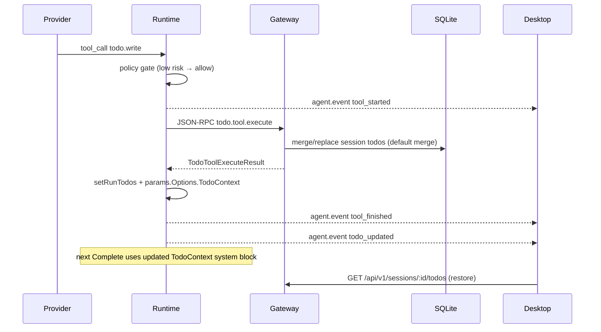
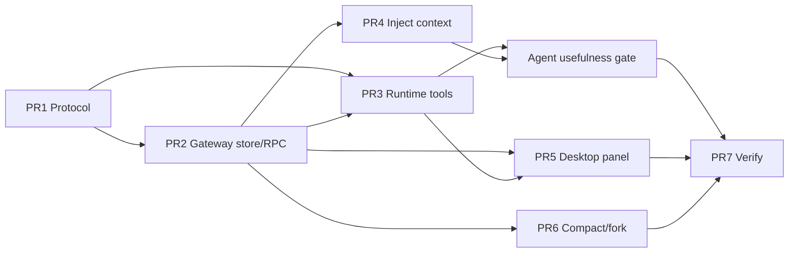

# Design: TODO / Task List Feature for red_panda

| Field | Value |
| --- | --- |
| **Title** | TODO / Task List Feature |
| **Author** | _(TBD)_ |
| **Date** | 2026-07-11 |
| **Status** | Draft (revised after design review) |
| **Related docs** | `docs/02-functional-design.md`, `docs/13-session-fork-compact-design.md`, `docs/14-memory-history-design.md`, `docs/15-memory-runtime-tools-design.md`, `docs/12-current-execution-plan.md` |
| **Repo copy** | `docs/30-todo-feature-design.md` |

---

## Overview

Agent multi-step work in `red_panda` currently has no first-class, structured work queue. The functional design already lists a built-in MVP tool `todo_write` (“维护任务列表”), and session compaction already has an `open_tasks` string field in summary payloads—but neither is implemented as an operational TODO system. Memory supports `kind=task`, but that is durable knowledge (facts about tasks), not a live work checklist for the current agent run.

This design adds an end-to-end **session-scoped TODO list**: the agent creates/updates/completes/cancels/reorders items during a run via Runtime tools; Gateway owns durable state (SQLite, no cgo); Desktop shows a Chinese-localized **collapsible task strip above the chat input**; tool events remain auditable in the run timeline; and compact/fork can populate `open_tasks` from real structured todos.

The transport and ownership model deliberately mirrors the proven **memory tools** path (`memory.tool.execute` over stdio JSON-RPC, Gateway service validation/persistence, normal `tool_*` events, plus a first-class `todo_updated` projection event for UI).

**Canonical tool names in v1 are dotted** (`todo.write` / `todo.list`), matching implemented tools (`memory.create`, `workspace.read_file`), not the older snake_case table in `docs/02-functional-design.md` (which also lists `read_file` vs real `workspace.read_file`). See [Naming vs docs/02](#naming-vs-docs02).

---

## Background & Motivation

### Current state

```text
Desktop (Wails v3 + React)
    ↕ HTTP / WebSocket
Gateway (Gin / GORM / SQLite no-cgo)
    ↕ stdio JSON-RPC
Agent Runtime (provider loop, tools, permission gate)
```

Relevant existing pieces:

| Area | What exists today | Gap for TODO |
| --- | --- | --- |
| Functional MVP tools | `todo_write` listed in `docs/02-functional-design.md` §6.2 | Not implemented in Runtime tool registry (`modules/agent/internal/runtime/tools.go`) |
| Memory | Gateway `memory_records`, Runtime `memory.list/create/update/delete`, internal RPC `memory.tool.execute` | `kind=task` is long-lived memory, not a work queue; high risk + permission friction |
| Compact | `CompactSummary.OpenTasks []string` in `modules/gateway/internal/gateway/service/session.go` | Always empty in `summarizeMessages`; no structured source |
| Events | `tool_started` / `tool_output` / `tool_finished` / `tool_failed`, projections on `tool_calls` | No dedicated todo panel data path |
| Desktop | Chat composer at bottom of conversation; right tabs: 工作区 / 子代理 / 活动 / 记忆 | No TODO surface near the composer; todos would be buried in `ToolCallCard` only |
| Context injection | `RunService.applyMemoryContext` → `ReplyOptions.MemoryContext`; `openAICompatibleMessages` injects as `role: "system"` | No equivalent for active todos mid multi-step work |

### Pain points

1. Multi-step agent plans live only in free-text reasoning or tool args; users cannot scan progress.
2. Session restore loses ephemeral plan state unless it was written into messages or memory.
3. Compaction’s `open_tasks` has no authoritative producer.
4. Reusing Memory for operational checklists would force high-risk permission prompts on every progress tick and pollute durable knowledge.

---

## Goals & Non-Goals

### Goals

1. Provider tool loop can **create, update, complete, cancel, and reorder** structured todos during a root run.
2. Desktop shows current todos in a **first-class surface above the chat input**, collapsible, with Chinese labels (not only inside tool cards or a far right tab).
3. Todo mutations are **auditable** via the existing run event / tool projection pipeline.
4. Clear scope split: **TODO = operational work-queue for the session**; **Memory = durable knowledge/preferences**.
5. Ownership fits the three-layer model: Gateway persists; Runtime executes tools and keeps a run-local snapshot; Desktop renders.
6. Reuse proven patterns (memory tools, event projection, risk/permission, standardized tool results).
7. Session **compact** can populate `open_tasks` from incomplete structured todos; **fork** behavior is explicit.
8. Subagent interaction is safe (no shared write races by default).

### Non-Goals

1. MCP tools/call, marketplace, or remote todo sync.
2. Vector search or natural-language “todo retrieval.”
3. Cross-session / user-global task boards (project-wide kanban).
4. User drag-and-drop editing in Desktop v1 (read-focused panel; optional later).
5. Replacing Memory `kind=task` (it remains for durable facts about work).
6. Automatic hidden todo inference without an agent tool call.
7. Gateway CGO / Runtime non-JSON-RPC stdout.

---

## Proposed Design

### High-level architecture



### Ownership decision: **Hybrid (Gateway-persisted + Runtime run snapshot)**

| Option | Summary | Verdict |
| --- | --- | --- |
| A. Runtime-only ephemeral | Todos live in Runtime process memory for the run | Rejected: lost on process exit / session switch / restore; Desktop cannot list without parsing tool events; compact has no source |
| B. Gateway-only, no Runtime snapshot | Every read/list hits Gateway mid-loop | Workable but adds latency and couples every provider turn to a list RPC; harder mid-turn injection after `todo.write` |
| **C. Hybrid (chosen)** | Gateway is source of truth; Runtime keeps last-known list for the active run and injects into subsequent provider turns | Matches memory pattern; survives restart via Gateway; fast in-loop; Desktop list API + live events |

**Rationale (aligned with `docs/15-memory-runtime-tools-design.md`):**

- Gateway already owns SQLite, validation, Desktop inspection, and session lifecycle.
- Runtime has no repository access and must not open SQLite or call Gateway HTTP.
- Internal stdio JSON-RPC (`callGateway` / `onRequest` in `runtimeclient.Client`) already supports Runtime→Gateway requests (`memory.tool.execute` in `modules/gateway/internal/gateway/app/app.go`).
- A run-local snapshot after each successful write avoids re-fetching for context injection on the next tool-loop turn.

```text
Source of truth:  Gateway SQLite table todo_items (session-scoped)
Run working copy: Runtime map[runID] todo snapshot after each successful todo.write
Desktop views:    sessionRuntime.todos + HTTP list + live todo_updated
```

---

## Data Model

### Table: `todo_items`

Gateway model (GORM, no-cgo SQLite), registered in `modules/gateway/internal/gateway/infra/database/migrate.go` alongside `MemoryRecord`, `RunEvent`, etc.

| Column | Type | Notes |
| --- | --- | --- |
| `id` | string **PK** | **Always Gateway-generated** (`todo_<unixnano>` / same style as `mem_…`). Never agent-supplied. |
| `client_key` | string | Agent-supplied stable key for merge matching (e.g. `"1"`, `"todo_1"`). Empty if agent omitted. |
| `session_id` | string index | **Scope boundary** — todos belong to a session, not a single run |
| `content` | string | Required non-empty after trim; max 2_000 runes |
| `status` | string index | `pending` \| `in_progress` \| `completed` \| `cancelled` |
| `sort_order` | int | 0-based display/execution order within session |
| `priority` | string optional | `low` \| `medium` \| `high` (default `medium`); UI hint only |
| `active_form` | string optional | Present continuous form for UI (“正在读取文件…”) — Claude-compatible optional field |
| `source_run_id` | string index | Last run that mutated this row |
| `source_tool_call_id` | string | Last tool call id for audit correlation |
| `created_at` | time | |
| `updated_at` | time | |
| `completed_at` | *time | Set when status → `completed` or `cancelled` |

**Indexes:**

- unique `(session_id, client_key)` where `client_key != ''` (SQLite partial unique index, or enforce uniqueness in service when `client_key` non-empty)
- `(session_id, sort_order)`
- `(session_id, status)`

### ID / merge matching strategy (Key Decision 13)

```text
Gateway row PK "id"     → always todo_<generated> (never agent-controlled as PK)
Agent client key        → column client_key (session-local)
Tool arg todos[].id     → ambiguous on purpose (agent key OR echoed Gateway PK)
Tool arg todos[].client_key → optional explicit client key (preferred when present)
```

**Why not agent id as global PK:** models emit short keys (`"1"`, `"2"`) that would collide across sessions. Existing Gateway models use gateway-generated globally unique ids.

**Why PK fallback on merge is required:** tool results return both `id` (Gateway PK) and `client_key`. Models routinely re-send the field named `id` from the previous result as the next write’s stable key. Matching only on `client_key` would INSERT duplicates when `payload.id == "todo_1710…"`.

**Frozen match order** (per payload item, within `session_id`):

1. If payload provides explicit non-empty `client_key` → match existing row by `(session_id, client_key)`.
2. Else if `trim(payload.id)` matches an existing row’s **`client_key`** → update that row.
3. Else if `trim(payload.id)` matches an existing row’s Gateway **PK** (`id`) → update that row (**preserve** existing `client_key`).
4. Else **insert** with new Gateway PK; set `client_key` = `payload.client_key` if set, else `payload.id` if non-empty **and** not already used as another row’s `client_key` in this session, else empty.

DTO always exposes:

- `id` = Gateway PK (stable for HTTP/Desktop)
- `client_key` = agent key when known

Tool schema: keep `todos[].id` as the primary model-facing field (Claude-compatible). Optionally accept `todos[].client_key` for explicit disambiguation. Tool **result `text`** should list items as `client_key=… id=todo_…` so models that read text still see the agent key; implementers must still implement the PK match fallback—do not rely on prompt alone.

### Scope rules

- **Session-scoped**, not run-scoped: a multi-turn session keeps one living checklist across runs.
- **Not workspace-scoped** in v1 (avoids collision across concurrent sessions in the same workspace).
- Soft-delete of individual todos is **not** required for v1: cancelled items remain for audit; `merge=false` hard-deletes rows missing from payload.
- Max items per session: **50** (reject write with clear error if exceeded).
- At most **one** item with `status=in_progress` after a successful write (enforce by service validation; demote extras to `pending` with a note in tool result).

### Session / workspace soft-delete cascade

Todos must not orphan when sessions disappear. **Two** Gateway paths soft-delete sessions:

| Path | Code | Cascade requirement |
| --- | --- | --- |
| Single session delete | `SessionService.Delete` → `Sessions.SoftDelete` | Hard-delete `todo_items` for that `session_id` |
| Workspace remove with sessions | `WorkspaceService.Remove(deleteSessions=true)` → `Sessions.SoftDeleteByWorkspace` | Hard-delete todos for **all** soft-deleted session ids under that workspace root |

**v1 implementation options** (either is fine; pick one in PR2):

1. **Service-level (preferred for clarity):** `SessionService.Delete` calls `Todos.DeleteBySession(id)`; `WorkspaceService.Remove` after soft-delete collects deleted session ids (or queries by workspace root) and calls `Todos.DeleteBySessions(ids)` / `DeleteByWorkspaceRoot(root)`.
2. **Repository hooks:** `SoftDelete` / `SoftDeleteByWorkspace` also delete todos by session_id(s) in the same DB operation.

List APIs require a live session id; never list across soft-deleted sessions.

### DTO (HTTP / JSON-RPC / events)

```json
{
  "id": "todo_1710000000000000000",
  "client_key": "2",
  "session_id": "session_...",
  "content": "实现 todo.write 工具",
  "status": "in_progress",
  "sort_order": 0,
  "priority": "high",
  "active_form": "正在实现 todo.write 工具",
  "source_run_id": "run_...",
  "updated_at": "2026-07-11T12:00:00Z"
}
```

### Relationship to Memory `kind=task`

| | TODO (`todo_items`) | Memory `kind=task` |
| --- | --- | --- |
| Purpose | Operational checklist for current session work | Durable fact (“we decided task X is blocked”) |
| Lifetime | Session; compact/fork rules apply | Until user/agent deletes |
| Mutation rate | High (every plan step) | Low |
| Risk | `low` | `high` (mutations) |
| UI | 输入框上方可展开任务条 | 右侧「记忆」面板 |

Agents may still write Memory facts *about* work; they must not treat Memory as the work queue.

---

## Runtime Tools

### Naming vs docs/02

| Source | Name | Status |
| --- | --- | --- |
| `docs/02-functional-design.md` §6.2 | `todo_write` (snake_case “read” class) | **Historical / aspirational** — same table also lists `read_file` while code uses `workspace.read_file` |
| Implemented tool style | dotted namespaces (`memory.create`, `web.search`) | **Canonical** |
| **v1 canonical** | `todo.write`, `todo.list` | Implement these |
| Optional alias (one release) | `todo_write` → dispatch as `todo.write` in `ToolRunner` | Accept if present; do not advertise in tool schema after alias sunset |
| Docs follow-up | Mark `todo_write` as historical alias in `docs/02`, status in `docs/10` / `docs/12` | PR7 |

### Tool surface (v1)

| Tool | Risk | Purpose | Permission (`risk_based`) |
| --- | --- | --- | --- |
| `todo.write` | **low** | Full-list write / merge of the session TODO list | Auto-allow (same as low-risk workspace reads) |
| `todo.list` | **low** | List current session todos | Auto-allow |

Optional alias registration (not in `AvailableTools` schema, only in dispatch):

```go
case "todo.write", "todo_write":
  // normalize name to todo.write for events/results
case "todo.list":
```

**Why not high risk:** todos only mutate session-local checklist state, not filesystem, shell, network, or durable cross-session memory. Permission spam would defeat the feature for multi-step plans. Users can still denylist via `tool_denylist` / `tool_policy=deny_all`.

**Why full-list write + merge rather than granular CRUD in v1:**

- Matches Claude Code `TodoWrite` semantics that models are already trained on.
- One tool call can reorder, complete, and add items atomically.
- Fewer permission/tool events per plan tick.
- Granular `todo.create/update/delete` can be added later without breaking the table.

### `todo.write` arguments

```json
{
  "todos": [
    {
      "id": "1",
      "content": "读取现有设计文档",
      "status": "completed",
      "priority": "medium"
    },
    {
      "id": "2",
      "content": "实现 Gateway 持久化",
      "status": "in_progress",
      "priority": "high",
      "active_form": "正在实现 Gateway 持久化"
    },
    {
      "id": "3",
      "content": "添加 Desktop 任务面板",
      "status": "pending",
      "priority": "medium"
    }
  ],
  "merge": true
}
```

| Field | Required | Notes |
| --- | --- | --- |
| `todos` | yes | Array; empty array clears list only when `merge=false` |
| `todos[].id` | recommended | Agent client key **or** Gateway PK from a prior tool result (matched per KD 13 order) |
| `todos[].client_key` | no | Explicit client key when disambiguating from Gateway PK |
| `todos[].content` | yes | Non-empty after trim; else tool error |
| `todos[].status` | yes | enum; invalid → tool error with allowed values |
| `todos[].priority` | no | default `medium`; invalid → default `medium` + note |
| `todos[].active_form` | no | optional UI form |
| `merge` | no | default **`true`** |

### Merge semantics (frozen algorithm)

```text
merge=true (default):
  1. Load existing session todos ordered by sort_order.
  2. Build maps: byClientKey[client_key] → row; byPK[id] → row (session-scoped).
  3. For each payload item in order (index i):
     a. Normalize status/content; reject empty content; normalize status enum or error.
     b. Resolve match (first hit wins) using Key Decision 13 order:
          (1) explicit payload.client_key → byClientKey
          (2) trim(payload.id) → byClientKey
          (3) trim(payload.id) → byPK
          (4) no match → INSERT
     c. On UPDATE: preserve created_at and Gateway PK; preserve existing client_key
        unless payload provides a new non-empty client_key that does not collide.
     d. On INSERT: Gateway-generated id; client_key from explicit field or payload.id
        when non-empty and not colliding; else empty.
     e. Set sort_order = i; add row to "listed" set (by Gateway PK).
  4. Existing rows NOT in listed set → KEEP; reassign sort_order from len(listed)
     preserving their prior relative order (append after payload items).
  5. Normalize in_progress: if >1, keep the last payload-listed in_progress;
     demote others to pending (note in tool result).
  6. If total rows > 50 → reject entire write (transaction rollback).
  7. Commit; return full ordered list (id + client_key + fields).

merge=false:
  1. Hard-delete all session todos.
  2. Insert payload items in order (sort_order = 0..n-1) with new Gateway ids
     using the same client_key assignment rules as INSERT above.
  3. Same validation / single in_progress / max 50.
```

**Required Gateway unit test:** write with `id: "1"` → result includes `id: "todo_…"` and `client_key: "1"` → second write with `id: "todo_…"` (Gateway PK only) **updates the same row** (no duplicate). Also cover second write with `id: "1"` still updates.

**Agent guidance:** prefer `merge=true` and always send the full active list. Omitting an item with `merge=true` does **not** delete it—use `status=cancelled` or `merge=false`.

Duplicate keys in a single payload (same client_key or same resolved row): last occurrence wins; earlier duplicates ignored with note.

### `todo.list` arguments

```json
{
  "status": "all",
  "limit": 50
}
```

`status`: `all` (default) | `pending` | `in_progress` | `completed` | `cancelled` | `open` (pending+in_progress).

### Tool result envelope

Use existing `red_panda.tool_result.v1` (`modules/agent/internal/runtime/tool_result.go`):

```json
{
  "schema": "red_panda.tool_result.v1",
  "tool": "todo.write",
  "status": "completed",
  "ok": true,
  "text": "Todos updated: 1 completed, 1 in_progress, 1 pending",
  "data": {
    "action": "write",
    "merge": true,
    "items": [ /* full list after write; each has id + client_key */ ],
    "open_count": 2,
    "completed_count": 1
  },
  "meta": { "duration_ms": 12 }
}
```

Gateway `TodoToolExecuteResult.Output` should already be this JSON (or compact human text that Runtime standardizes). Prefer Gateway returning structured `Items` **and** a JSON `Output` so Runtime can both snapshot and standardize without double-parsing failures.

### Definition snippets (Runtime registry)

Add to `DefaultToolDefinitions` in `modules/agent/internal/runtime/tools.go` (alongside memory tools ~L362):

```go
{
  Name:        "todo.write",
  DisplayName: "Update todos",
  Description: "Create or update the session task list for multi-step work. Prefer sending the full list each time. Field todos[].id may be your short key or the id returned from a prior todo.write. Optional todos[].client_key sets the short key explicitly. Use status pending|in_progress|completed|cancelled. Keep at most one in_progress item.",
  Risk:        tools.RiskLow,
  // parameters as above
},
{
  Name:        "todo.list",
  DisplayName: "List todos",
  Description: "List the current session task list.",
  Risk:        tools.RiskLow,
  // parameters as above
},
```

### Dispatch and snapshot ownership (mirrors MemoryExecutor carefully)

`runMemoryTool` only returns `result.Output` string; structured `Items` are available inside the executor. Snapshot update **must** happen in a Runtime-owned wrapper, not by hoping `ToolRunner` sees `TodoToolExecuteResult`.

```go
// runtime.go New / wiring
rt.tools.TodoExecutor = rt.todoExecutor

// Per-run state (cleared on run finish / cancel)
// r.mu protects runTodos map[string][]methods.TodoItemDTO  // key = root/run id

func (r *Runtime) todoExecutor(ctx context.Context, req methods.TodoToolExecuteParams) (methods.TodoToolExecuteResult, error) {
  res, err := r.executeTodoTool(ctx, req) // callGateway TodoToolExecute
  if err != nil {
    return res, err
  }
  if req.ToolName == "todo.write" || req.ToolName == "todo_write" {
    r.setRunTodos(req.RunID, res.Items)
    // Side channel for mid-loop: runProviderLoop reloads Options.TodoContext
    // from getRunTodos(runID) at the start of each turn / after tool batch.
  }
  return res, nil
}

func (runner ToolRunner) runTodoTool(...) (string, error) {
  result, err := runner.TodoExecutor(...)
  // return result.Output (or marshal Items into standardized envelope)
}
```

**Where `runTodos` lives:** `Runtime` field `runTodos map[string][]TodoItemDTO` keyed by `params.RunID` (root run). Clear entry when the run finishes/cancels (`finishRun` / cancel paths). Concurrent `executeToolBatch` only runs non-subagent tools serially, so `todo.write` does not race with itself; still take `r.mu` for map access.

Echo provider: add `/todo` test helpers in `provider.go` similar to memory list/create keywords for local smoke without a real LLM.

---

## Protocol

### New JSON-RPC method (Runtime → Gateway)

```text
todo.tool.execute
```

Constants / DTOs in `modules/protocol/methods/methods.go` (parallel to memory):

```go
const TodoToolExecute = "todo.tool.execute"

type TodoToolExecuteParams struct {
  RunID         string         `json:"run_id"`
  SessionID     string         `json:"session_id"`
  WorkspaceRoot string         `json:"workspace_root,omitempty"` // ignored for scope in v1; accepted for parity/logging only
  ToolCallID    string         `json:"tool_call_id"`
  ToolName      string         `json:"tool_name"` // todo.write | todo.list (| alias todo_write)
  Arguments     map[string]any `json:"arguments,omitempty"`
}

type TodoItemDTO struct {
  ID         string `json:"id"`                   // Gateway PK
  ClientKey  string `json:"client_key,omitempty"` // agent key
  Content    string `json:"content"`
  Status     string `json:"status"`
  SortOrder  int    `json:"sort_order"`
  Priority   string `json:"priority,omitempty"`
  ActiveForm string `json:"active_form,omitempty"`
}

type TodoToolExecuteResult struct {
  Status    string        `json:"status"` // completed | failed
  Output    string        `json:"output,omitempty"`
  Items     []TodoItemDTO `json:"items,omitempty"`
  OpenCount int           `json:"open_count,omitempty"`
}
```

Gateway `app.go` `onRequest` switch adds `case methods.TodoToolExecute:` → `services.Todo.ExecuteRuntimeTool(req)`.

### Events

| Event | v1 required? | Purpose |
| --- | --- | --- |
| `tool_started` / `tool_finished` / `tool_failed` | **Yes** | Existing audit + `tool_calls` projection (`RunService.HandleRuntimeEvent`) |
| `todo_updated` | **Yes** | First-class Desktop `sessionRuntime.todos` refresh without parsing tool output |
| `permission_required` | No for default risk_based | Only if policy forces ask |

Add to `modules/protocol/events/events.go`:

```go
EventTodoUpdated EventType = "todo_updated"
```

Payload:

```json
{
  "session_id": "session_...",
  "run_id": "run_...",
  "tool_call_id": "tool_...",
  "action": "write",
  "items": [ /* full list after mutation */ ],
  "open_count": 2,
  "completed_count": 1,
  "cancelled_count": 0
}
```

**Emission ownership:** Runtime emits `todo_updated` after a successful `todo.write` (not after list). Gateway `HandleRuntimeEvent` persists the envelope in `run_events` like any other type; no separate projection table beyond `todo_items`.

### Protocol version

Additive event type under current `ProtocolVersion` (`2026-07-09` in `events.go`). Backward-compatible; Desktop ignores unknown types today.

### ReplyOptions context injection

```go
// methods.ReplyOptions
TodoContext *TodoContext `json:"todo_context,omitempty"`

type TodoContext struct {
  Items   []TodoItemDTO `json:"items,omitempty"`
  Context string        `json:"context,omitempty"` // preformatted block for provider system message
}
```

---

## Gateway APIs

### List todos (Desktop restore / panel)

```text
GET /api/v1/sessions/:id/todos?status=open&limit=50
```

Response envelope:

```json
{
  "ok": true,
  "data": {
    "items": [ /* TodoItemDTO + timestamps */ ],
    "open_count": 2,
    "total": 5
  }
}
```

### Write path

**No public HTTP write API in v1.** Mutations go through Runtime tools only (agent-driven).

### Service layout

| Layer | Files (new / touched) |
| --- | --- |
| Model | `model.TodoItem` in `models.go` |
| Repository | `repository/todo.go` — ListBySession, ReplaceSession, UpsertMerge, CopySessionTodos, DeleteBySession |
| Repository set | `repository/set.go` — register `Todos` on `NewSet` **and** `NewSet(tx)` used inside Fork/Compact transactions |
| Service | `service/todo.go` — validation, ExecuteRuntimeTool, List, ListOpenContents, FormatTodoContext |
| Controller | extend `session.go` or new `todo.go` |
| App wiring | migrate, `service.Set`, routes, runtime `onRequest` |
| Run start | `RunService.applyTodoContext` parallel to `applyMemoryContext` |
| Session delete | cascade delete todos |

### `ExecuteRuntimeTool` validation rules

Align with `MemoryService.ExecuteRuntimeTool` / `validateRuntimeMemoryOwnership` style:

1. `run_id`, `session_id`, `tool_call_id`, `tool_name` required.
2. Load session by `params.SessionID`; reject if not found or soft-deleted.
3. **Ownership:** if run record exists for `run_id`, require `run.SessionID == params.SessionID`; reject mismatches. Do not trust tool **arguments** for session/run identity.
4. `workspace_root` is **ignored for authorization and scope** in v1 (accepted for logging/parity only). Todos are session-scoped only.
5. Status enum validation; content non-empty and ≤ 2_000 runes; max 50 items after merge/replace.
6. Single `in_progress` normalization.
7. Stamp `source_run_id` / `source_tool_call_id` on mutated rows.
8. Return full list + counts in result for Runtime snapshot update.
9. Transactional write for merge/replace.

---

## Desktop UX

### Placement (Key Decision 17)

**v1 primary surface: collapsible strip above the chat input**, not a right-panel tab.

```text
┌─────────────────────────────────────────────┐
│  ChatConversation (messages / tools / perms) │
│                                             │
├─────────────────────────────────────────────┤  ← sticky bottom stack
│  TodoComposerStrip  (可展开 / 收缩)          │  ← NEW, above input
│  ChatComposer       (textarea + send)       │
└─────────────────────────────────────────────┘
```

Wire into the conversation column (not `rightPanelTabs`):

| File | Change |
| --- | --- |
| `ConversationView.jsx` | When `showComposer`, render `TodoComposerStrip` **above** `ChatComposer` |
| `ChatPanel.jsx` / `App.jsx` | Pass `todos`, `todoOpenCount`, `todosExpanded`, expand toggle, hydrate state into `ConversationView` |
| **Do not** add a `rightPanelTabs` entry for 任务 in v1 | Right tabs stay 工作区 / 子代理 / 活动 / 记忆 |

Why above the composer (product constraint):

1. Task list is operational **plan state for the next send** — same visual stack as input, not a distant side panel.
2. Expand/collapse keeps the conversation viewport large when idle; open work stays one click away while typing.
3. Subagent conversation tabs that use `ConversationView` with `showComposer=false` never show the strip (root session only).

### Collapse / expand behavior

| State | When | UI |
| --- | --- | --- |
| **Hidden** | `items.length === 0` after hydrate (and not loading) | Render **nothing** — no empty chrome above the input |
| **Collapsed** (default after first non-empty list) | `items.length > 0` and `todosExpanded === false` | One-row bar: chevron · **任务** · open-count chip · optional in-progress one-liner (truncated) |
| **Expanded** | User clicks the bar (or keyboard activation) | Bar + scrollable list (max height ~160–220px) |

Rules:

1. **Default expanded = false** on session switch / first hydrate with items. User preference is session-local UI only (`sessionRuntime.todosExpanded`); do not persist to Gateway in v1.
2. **Auto-expand once** when open count goes from `0 → >0` during a run (first plan appears), so the user sees the new list without hunting. Subsequent `todo_updated` **do not** force re-expand if the user has collapsed.
3. **Do not auto-collapse** when all items complete — leave collapsed/expanded as the user left it; collapsed bar still shows `0 待办 · N 已完成` style summary until items are cleared by a future write.
4. Keyboard: bar is a `<button type="button">` (or `role="button"` + Enter/Space); list is not focus-trapping.
5. `data-testid`: `todo-composer-strip`, `todo-composer-toggle`, `todo-composer-list`.

Collapsed bar content (Chinese):

```text
▶ 任务  ·  进行中 1  ·  待办 2     [optional: first in_progress content truncated]
```

Expanded header (same toggle row, chevron rotated):

```text
▼ 任务  ·  进行中 1  ·  待办 2                    [刷新]
```

### Strip content (`TodoComposerStrip.jsx`)

Component lives under `modules/desktop/frontend/src/components/chat/TodoComposerStrip.jsx` (chat stack, not right panel).

Chinese status badges:

| Status | Badge |
| --- | --- |
| `pending` | 待办 |
| `in_progress` | 进行中 |
| `completed` | 已完成 |
| `cancelled` | 已取消 |

Expanded body:

- Ordered read-only list (status icon/badge + content + optional `active_form` as muted subline).
- Max height with internal scroll; conversation still scrolls independently above.
- Empty state only if still loading: **加载任务…**. After hydrate with zero items: strip unmounts (see Hidden).
- No “只读 footer” chrome in the strip (space is premium above composer); tool-tip or collapsed-bar title attribute: **由代理通过 todo 工具维护**.
- Optional compact refresh icon on the expanded header only (calls same hydrate as before).

### Layout integration sketch

```jsx
// ConversationView.jsx
{showComposer ? (
  <>
    <TodoComposerStrip
      items={todos}
      openCount={todoOpenCount}
      expanded={todosExpanded}
      loading={todosLoading}
      onToggleExpanded={onTodosExpandToggle}
      onRefresh={onTodosRefresh}
    />
    <ChatComposer /* existing props */ />
  </>
) : /* readonly hint */ null}
```

CSS (`app.css`):

- `.conversation-view` bottom stack: strip + composer share the sticky/footer region already used by `.chat-composer`.
- `.todo-composer-strip` full width of conversation column; border-top subtle; background match composer shell.
- Expanded list: `max-height: min(220px, 30vh); overflow-y: auto`.
- Do not push the entire app chrome; only consume vertical space inside the chat column.

### Session runtime state (required)

Extend `createEmptySessionRuntime` in `modules/desktop/frontend/src/lib/sessionRuntime.js`:

```js
export function createEmptySessionRuntime(overrides = {}) {
  return {
    // ...existing fields...
    todos: [],              // TodoItem[] for current session
    todoOpenCount: 0,
    todosVersion: 0,        // increment on each successful projection
    todosHydrated: false,
    todosExpanded: false,   // UI-only; default collapsed
    todosAutoExpandedOnce: false, // first 0→>0 open count auto-expand gate
    ...overrides,
  };
}
```

### Data flow (concrete hooks)

1. **Session hydrate** (same place messages/tools are restored in `App.jsx`):  
   `GET /api/v1/sessions/:id/todos` → `patchSessionRuntimeMap(sessionId, { todos, todoOpenCount, todosHydrated: true, todosExpanded: false, todosAutoExpandedOnce: false })`.

2. **Live WS path** — inside existing `useGatewayConnection` / `onEvent` in `App.jsx`. Wire format is `{ type: 'event', payload: <agent Envelope> }` (`wsClient` → `onEvent(message)`). Handlers today do `const payload = event.payload` (the **envelope**) and read event-type body from **`payload.payload`** (e.g. `tool_call_id`). There is **no** panel-level WS subscription; `MemoryPanel` is HTTP-only—todos intentionally improve with live projection.

   ```js
   // App.jsx onEvent(event):
   const envelope = event.payload || {}; // agent events.Envelope
   const sessionId = resolveEventSessionId(envelope, map, currentSessionIdRef.current);

   if (envelope.type === 'todo_updated') {
     const body = envelope.payload || {}; // EventTodoUpdated fields
     const items = Array.isArray(body.items) ? body.items.map(normalizeTodo) : [];
     const openCount = Number(body.open_count ?? countOpen(items));
     const prevOpen = next.todoOpenCount || 0;
     const shouldAutoExpand =
       openCount > 0 && prevOpen === 0 && !next.todosAutoExpandedOnce;
     next = {
       ...next,
       todos: items,
       todoOpenCount: openCount,
       todosVersion: (next.todosVersion || 0) + 1,
       todosHydrated: true,
       todosExpanded: shouldAutoExpand ? true : next.todosExpanded,
       todosAutoExpandedOnce: shouldAutoExpand ? true : next.todosAutoExpandedOnce,
     };
   }
   ```

   Nesting reminder: `event.payload` = envelope; `event.payload.payload` = todo body (`items`, `open_count`, `tool_call_id`). Do **not** read `event.payload.items`.

3. **Fallback `tool_finished` parse** in `modules/desktop/frontend/src/lib/todos.js`:

   ```js
   // tool_finished payload shape (Gateway projection of Runtime event):
   // payload.tool_name | payload.name
   // payload.output = stringified red_panda.tool_result.v1
   export function todosFromToolFinishedPayload(payload) {
     const name = payload?.tool_name || payload?.name || '';
     if (name !== 'todo.write' && name !== 'todo.list' && name !== 'todo_write') return null;
     const envelope = parseToolResultV1(payload?.output); // JSON.parse if string
     if (!envelope?.ok) return null;
     const items = envelope?.data?.items;
     if (!Array.isArray(items)) return null;
     return {
       items: items.map(normalizeTodo),
       openCount: Number(envelope.data.open_count ?? countOpen(items)),
     };
   }
   ```

   Wire fallback only when `todo_updated` was not already applied for the same `tool_call_id` (avoid double-increment). Prefer `todo_updated` as primary. Apply the same auto-expand-once rule when patching from fallback.

4. **`TodoComposerStrip` props** (root composer path only):

   ```jsx
   <TodoComposerStrip
     items={sessionRuntime.todos}
     openCount={sessionRuntime.todoOpenCount}
     expanded={sessionRuntime.todosExpanded}
     loading={!sessionRuntime.todosHydrated && sessionRuntime.todos.length === 0}
     onToggleExpanded={() =>
       patchSessionRuntimeMap(sessionId, {
         todosExpanded: !sessionRuntime.todosExpanded,
       })
     }
     onRefresh={() => hydrateTodos(sessionId)}
   />
   ```

5. **Activity kind** — extend `classifyRunEventKind` in `activityEvents.js` (Activity right tab still lists todo events; the **live checklist** is the composer strip):

   ```js
   if (type === 'todo_updated') return 'todo';
   // tool_name starts with 'todo.' → still 'tool' for tool_* events
   ```

   Add `todo: '任务'` to `eventKindLabel` / Activity filters.

6. Tool cards: existing `ToolCallCard`; `buildToolSummary` → `N 项任务` or first in_progress content.

---

## Provider / Context Injection

### Decision: **Yes — inject todos each root turn with a hard char budget**

### Message role and order

In `openAICompatibleMessages` (`provider.go` ~551–561), inject as a separate **`role: "system"`** message (same as Memory/Skills—not a `developer` role). Order:

```text
1. current time system
2. root orchestration policy (if subagent.run available)
3. MemoryContext system (if any)
4. TodoContext system (if any)    ← NEW
5. SkillsContext system (if any)
6. conversation + user + tool rounds
```

### Character budget (Key Decision 14)

Mirror `memoryContextLimit = 4000` in `MemoryService.PreviewRun`:

```go
const todoContextLimit = 3000 // runes/bytes of formatted Context string, excluding header
```

`FormatTodoContext(items) (context string, selected []TodoItemDTO)`:

1. Prefer **open** items only (`pending` + `in_progress`) first, in `sort_order`.
2. If budget remains and open items used &lt; 1500 chars, append up to 5 most recently updated `completed` items (skip `cancelled` unless no open items and budget remains).
3. Stop when next line would exceed `todoContextLimit`.
4. Header: `Session todos (operational checklist; update via todo.write):\n`
5. Line format: `- [x]|[>]|[ ] {content} ({status})` optionally ` key={client_key}`

Do **not** inject all 50 × 2000-rune worst case. Per-item content in the **injected** line is truncated to **200 runes** even if DB allows 2000.

### Gateway run start

`RunService.applyTodoContext` (next to `applyMemoryContext`):

```go
func (r RunService) applyTodoContext(params *methods.ReplyParams) error {
  items, err := NewTodoService(r.repos).ListForSession(params.Session.ID, "all", 50)
  // format with todoContextLimit
  params.Options.TodoContext = &methods.TodoContext{Items: selected, Context: ctx}
  return nil
}
```

Call from `Start` after memory apply. Unit test like `TestRunServiceApplyMemoryContext`.

### Runtime mid-loop (implementable against `runProviderLoop`)

**Fact:** `runProviderLoop` takes `params methods.ReplyParams` **by value** and builds `ProviderRequest{ Options: params.Options }` each turn. A free-floating `runTodoState` that never updates `params.Options.TodoContext` will **not** affect the next `Complete`.

**Required steps:**

1. **Seed** on run start: after Gateway injects `TodoContext`, first turn already has it in `params.Options`. Also `r.setRunTodos(params.RunID, params.Options.TodoContext.Items)` at reply start so Runtime map is warm.

2. **After successful `todo.write`**, Runtime `todoExecutor` calls `r.setRunTodos(runID, res.Items)`.

3. **In `runProviderLoop`**, at the **start of each turn** (before `provider.Complete`) **and** immediately after `executeToolBatch` returns:

   ```go
   if items, ok := r.getRunTodos(params.RunID); ok {
     params.Options.TodoContext = formatTodoContextFromItems(items) // applies todoContextLimit
   }
   ```

   Because `params` is a **local** variable in `runProviderLoop`, reassignment of `params.Options.TodoContext` persists across subsequent loop iterations without converting the whole function to a pointer. No need to change `executeToolBatch` signatures if the reload happens in the loop body.

4. **Provider branch** in `openAICompatibleMessages`:

   ```go
   if req.Options.TodoContext != nil && strings.TrimSpace(req.Options.TodoContext.Context) != "" {
     messages = append(messages, map[string]any{
       "role":    "system",
       "content": strings.TrimSpace(req.Options.TodoContext.Context),
     })
   }
   ```

5. **Tests:** `provider_test.go` assert TodoContext system message present; runtime test: mock Gateway todo.write → second Complete request includes updated checklist text (acceptance for PR3).

6. **Clear** `r.clearRunTodos(runID)` on finish/cancel.

Optional `todo_injected` event: **not required for v1**.

### Subagent start

Always clear parent injection (see Subagents):

```go
childParams.Options.TodoContext = nil
```

---

## Interaction with Session Fork / Compact (`open_tasks`)

### Compact — concrete hooks into `SessionService`

Today `Compact` only regenerates summary when `summary.Summary == ""` (`session.go` ~271–278). Client-supplied summary with empty `open_tasks` would leave tasks blank without an explicit fill.

**v1 helpers:**

```go
// Always fill open_tasks when empty (even if free-text Summary is present).
func (s SessionService) ensureOpenTasks(summary *CompactSummary, sessionID string) {
  if summary == nil || len(summary.OpenTasks) > 0 {
    return
  }
  summary.OpenTasks = s.repos.Todos.ListOpenContents(sessionID) // pending+in_progress, ordered
}

// Embed open tasks into transcript text for the synthetic message.
func formatCompactSummaryMessage(summary CompactSummary) string {
  body := strings.TrimSpace(summary.Summary)
  if len(summary.OpenTasks) == 0 {
    return body
  }
  var b strings.Builder
  b.WriteString(body)
  b.WriteString("\n\nOpen tasks:\n")
  for _, t := range summary.OpenTasks {
    b.WriteString("- ")
    b.WriteString(t)
    b.WriteByte('\n')
  }
  return b.String()
}
```

**Call sites:**

| API | Behavior |
| --- | --- |
| `CompactPreview` | After `summarizeMessages` (or using client-less path), `ensureOpenTasks`; return summary with open_tasks; preview UI may show them |
| `Compact` | After resolving summary (client or generated), `ensureOpenTasks(&summary, sessionID)`; marshal full summary JSON; **message text** = `formatCompactSummaryMessage(summary)` not bare `summary.Summary` |
| Client-supplied `open_tasks` non-empty | Preserve client list (no overwrite) |

**Copy policy (Key Decision 16):**

- Compact target session: copy rows with `status in (pending, in_progress)` only; new Gateway PKs; preserve `client_key`/content/status/order.
- Do not copy completed/cancelled (history remains in summary JSON + message text).

**Transactionality:**

Inside existing `s.repos.DB.Transaction`:

```go
txRepos := repository.NewSet(tx) // must include Todos
// ... create target session, summary message, copy tail ...
if err := txRepos.Todos.CopySessionTodos(source.ID, target.ID, CopyOpenOnly); err != nil {
  return err
}
```

`SessionService` currently only holds `repository.Set` — no new service field required if copy is on the repository/set used inside the transaction. If preview needs `ListOpenContents` outside tx, use `s.repos.Todos`.

### Fork

- Deep-copy **all** `todo_items` (every status) into the forked session with new PKs, same `client_key`/content/status/order.
- Same transactional pattern inside Fork’s `Transaction` + `NewSet(tx)`.

### Relationship summary

```text
todo_items (structured)  ──ensureOpenTasks──►  CompactSummary.open_tasks ([]string)
                         ──format message──►  synthetic transcript includes "Open tasks:"
                         ──CopySessionTodos─►  forked (all) / compacted (open-only) sessions
open_tasks remains a lossy string projection for summary JSON / human reading
```

Do **not** treat `open_tasks` as the source of truth.

---

## Interaction with Subagents

### Decision: **Root-owned session todos; deny both tools for all subagents in v1**

| Agent | `todo.write` | `todo.list` | TodoContext injection |
| --- | --- | --- | --- |
| Root | yes | yes | yes (budgeted session list) |
| General subagent (`subagent.run`) | **deny** | **deny** | **`TodoContext = nil`** |
| Model-directed managed skill read | **allow read-only tools** | **deny skill management writes** | **`TodoContext = nil`** |

**v1 chooses deny-both** for general delegated Workers (Key Decision 8 + 15). No “optional list” ambiguity.

```go
// subagent_tools.go — subagentRunDenylist
"todo.write",
"todo.list",
"todo_write",
```

**Child option stripping (required — Key Decision 15):**

Delegated Worker execution does `childParams := params` then overwrites some fields. It must also:

```go
childParams.Options.TodoContext = nil
// existing: MemoryContext overwrite, ToolDenylist append, SpawnSubAgents=false, ...
```

Without this, children inherit parent `TodoContext` once PR4 lands.

**Tests:** assert denylist membership and `TodoContext == nil` in delegated Worker tests.

**Rationale:** avoid concurrent write races; root owns the plan; subagents get a focused task string.

**Future (not v1):** private subagent lists or read-only `todo.list` for general workers.

---

## Permission / Risk Policy

| Setting | Behavior for `todo.*` |
| --- | --- |
| `tool_policy=risk_based` + low risk | Allow without permission (`policy.go` riskBasedDecision) |
| `permission_mode=strict` | Still allow low risk without card |
| `tool_policy=ask_all` | Permission card for every todo tool |
| `tool_policy=deny_all` / denylist | Deny → `tool_failed` |
| Allowlist mode | Only if `todo.write` / `todo.list` listed |

No new permission kinds. No changes to `permission.resolve`.

---

## Alternatives Considered

### 1. Runtime-only ephemeral todos

- **Pros:** Zero schema migration; simplest Runtime PR.
- **Cons:** Lost on `per_run_process` exit; no Desktop restore; compact `open_tasks` empty; contradicts “auditable + visible” goals.
- **Verdict:** Rejected for product goals.

### 2. Reuse Memory `kind=task`

- **Pros:** No new table; Memory panel already exists.
- **Cons:** High-risk tools → permission fatigue; soft-delete/confidence semantics wrong; mixes durable knowledge with volatile checklist.
- **Verdict:** Rejected.

### 3. Granular CRUD only (`todo.create/update/delete/reorder`)

- **Pros:** Explicit ops; easier per-item audit.
- **Cons:** More tool calls per plan update; models often botch multi-call reorder.
- **Verdict:** Defer. Full-list `todo.write` first.

### 4. Tool events only, no `todo_updated`, no table

- **Pros:** Minimal protocol.
- **Cons:** Reconstructing latest list from tool history is fragile.
- **Verdict:** Rejected as sole approach.

### 5. Gateway HTTP mutation API in v1

- **Pros:** Desktop could edit todos.
- **Cons:** Dual writers without conflict UX.
- **Verdict:** Deferred.

### 6. Agent-supplied global primary key

- **Pros:** Simpler merge key = PK.
- **Cons:** Cross-session collisions on `"1"` / `"2"`.
- **Verdict:** Rejected; use Gateway PK + `client_key` (Issue 1).

---

## Security & Privacy Considerations

| Threat | Severity | Mitigation |
| --- | --- | --- |
| Todo content leaks secrets into provider context | Medium | User-visible; inject line truncate 200 runes; total `todoContextLimit=3000`; no cross-session inject |
| Prompt injection via todo content | Medium | Agent-authored; untrusted in UI; no eval/exec |
| Cross-session read | High if bug | Filter by `session_id` from Runtime params only |
| Cross-session write | High if bug | `ExecuteRuntimeTool` uses params.SessionID/RunID ownership checks; ignore session in tool args |
| Agent id collision | High if global PK | Gateway-generated PK; `client_key` unique per session only |
| DoS via huge lists | Low | Max 50 items; content 2_000 runes; inject budget |
| Subagent contamination | Medium | Denylist both tools; `TodoContext = nil` on child params |
| Orphan rows after session/workspace delete | Low | Cascade delete todos on `SessionService.Delete` **and** `WorkspaceService.Remove` (`SoftDeleteByWorkspace`) |
| SQLite integrity | Low | GORM migrations; transactional merge/replace |

Privacy: local SQLite only; no telemetry. CGO remains disabled.

---

## Observability

### Logging (v1)

- Gateway: structured log fields on `todo.tool.execute` — `tool_name`, `session_id`, `run_id`, `item_count`, `merge`, `duration_ms` (no full content at info level).
- Runtime: existing tool event pipeline is the primary audit trail.

### Metrics

**No metrics registry exists** in Gateway/Runtime today. Do **not** invent `todo_write_total` counters in v1.

Optional later: counters only if a shared metrics package is introduced. Until then, rely on logs + Activity + `tool_calls` projections.

### Activity timeline

- `todo_updated` → kind `todo` / label **任务**.
- Tool projections show `todo.write` / `todo.list` under tool filter.

---

## Rollout Plan

1. Tools registered once Runtime ships them (no feature flag required for local product).
2. Staged PRs: protocol → gateway → runtime → inject → desktop → compact/fork → verification.
3. Old Gateways reject `todo.tool.execute` → Runtime `tool_failed`; Desktop empty 任务 list.
4. Rollback: stop registering tools/routes; table unused is harmless.

**Degraded usefulness note:** Runtime tools (PR3) without Gateway `applyTodoContext` (PR4) still work after the first `todo.write` in a run (mid-loop snapshot), but **turn 0 has no checklist** until PR4. Treat PR4 as hard dependency for “agent usefulness” gate.

---

## Key Decisions

| # | Decision | Rationale |
| --- | --- | --- |
| 1 | **Gateway is source of truth**; Runtime keeps run-local snapshot | Survives process restart; Desktop restore; mirrors memory ownership |
| 2 | **Session scope**, not run or workspace | Multi-turn continuity; no cross-session leakage in same workspace |
| 3 | Tools named **`todo.write` / `todo.list`**, risk **low**; `todo_write` optional alias | Align with implemented dotted tools; avoid permission spam |
| 4 | **Full-list write with merge default** | Claude-compatible; atomic reorder/status updates |
| 5 | Internal RPC **`todo.tool.execute`** (not HTTP from Runtime) | Preserve stdio JSON-RPC discipline; reuse `callGateway` / `onRequest` |
| 6 | Emit **`todo_updated`** plus normal tool events | First-class UI; full audit |
| 7 | **Inject TodoContext** each root turn + mid-loop after write via `params.Options` | Models forget checklists otherwise; matches real `runProviderLoop` |
| 8 | **Subagents denylisted from both `todo.write` and `todo.list`** | Avoid races; root owns the plan |
| 9 | Compact **`open_tasks` from structured open todos**; copy policy in KD 16 | Real producer for `open_tasks` |
| 10 | **Separate from Memory `kind=task`** | Operational queue vs durable knowledge |
| 11 | **No public HTTP write** in v1 | Single writer path (agent tools) |
| 12 | Max **50** items; **≤1** `in_progress` after normalize | Bounded context + clear UI focus |
| 13 | **Gateway-generated PK + `client_key`**; merge match order: explicit `client_key` → payload.id as client_key → payload.id as Gateway PK → insert | Prevent cross-session collisions **and** multi-turn duplicates when models echo Gateway `id` from tool results |
| 14 | **`todoContextLimit = 3000`**; open-first; inject line ≤200 runes; `role: system` after memory | Mirror memory budget; prevent context blow-up |
| 15 | **Always `childParams.Options.TodoContext = nil`** for subagents | Parent options are value-copied today |
| 16 | **Fork copies all todos; compact copies open-only** | Branch fidelity vs compact “continue work” without noise |
| 17 | **Desktop: collapsible 任务 strip above chat input** (not right-tab). Hidden when empty; default collapsed; auto-expand once on first open items | Plan sits next to send; preserves message viewport; matches product UX |

---

## API / Interface Changes (summary)

### Protocol

- `methods.TodoToolExecute`, params/result/item (`ClientKey`)/context types
- `methods.TodoContext` on `ReplyOptions`
- `events.EventTodoUpdated`

### Runtime

- Tool definitions + `TodoExecutor` wrapper that updates `runTodos`
- `runProviderLoop` reloads `params.Options.TodoContext` each turn / after batch
- `openAICompatibleMessages` TodoContext system branch
- Subagent denylist + TodoContext clear
- Optional `todo_write` alias dispatch

### Gateway

- Model/repo/service/controller/migrate; `repository.Set` + `NewSet(tx)`
- `onRequest` handler; ownership validation
- `GET /api/v1/sessions/:id/todos`
- `applyTodoContext` on run start
- Compact/fork ensureOpenTasks + format message + CopySessionTodos
- Session delete cascade

### Desktop

- `sessionRuntime.todos` / `todoOpenCount` / `todosVersion` / `todosExpanded` / `todosAutoExpandedOnce`
- `TodoComposerStrip` above `ChatComposer` in `ConversationView` (expand/collapse; no right tab)
- WS `todo_updated`, hydrate GET; `todos.js` parse helpers; `activityEvents` kind `todo`
- ToolCallCard summary tweak

---

## Data Model Changes / Migration

1. Add `TodoItem` model with `client_key`; AutoMigrate.
2. No backfill: empty lists for existing sessions.
3. Partial unique index on `(session_id, client_key)` when non-empty (service-enforced if SQLite dialect awkward).

---

## Open Questions

None that block implementation. Defaults above are intentional:

- User-editable todos deferred.
- Subagent-private lists / read-only list deferred.
- `todo_injected` event deferred.

---

## Risks

| Risk | Severity | Mitigation |
| --- | --- | --- |
| Models call Memory instead of todos | Medium | Tool descriptions + TodoContext system nudge |
| Merge=true orphans if model drops keys | Medium | Tool description “send full list”; cancel or merge=false |
| Context token growth | Low | `todoContextLimit`, open-first, 200-rune lines |
| Dual emission noise in Activity | Low | Filters (`todo` vs `tool`) |
| PR3 without PR4 weak turn-0 | Medium | Document degraded mode; gate usefulness on PR4 |
| Protocol skew | Medium | Ordered PRs; focused tests |

---

## References

- `docs/02-functional-design.md` — historical MVP name `todo_write`
- `docs/13-session-fork-compact-design.md` — `open_tasks` in compact summary
- `docs/14-memory-history-design.md` — Memory ownership & injection
- `docs/15-memory-runtime-tools-design.md` — Gateway-mediated Runtime tools pattern
- `docs/12-current-execution-plan.md` — active slice context
- Code:
  - `modules/protocol/methods/methods.go` — MemoryToolExecute, ReplyOptions
  - `modules/protocol/events/events.go` — event types
  - `modules/agent/internal/runtime/tools.go` — tool registry / memory dispatch
  - `modules/agent/internal/runtime/policy.go` — risk_based decisions
  - `modules/agent/internal/runtime/runtime.go` — `callGateway`, `runProviderLoop`, `executeToolBatch` (params by value)
  - `modules/agent/internal/runtime/provider.go` — `openAICompatibleMessages` system blocks
  - `modules/agent/internal/runtime/worker_tools.go` — delegated Worker denylist + childParams
  - `modules/gateway/internal/gateway/app/app.go` — `onRequest` switch
  - `modules/gateway/internal/gateway/service/run.go` — `applyMemoryContext`, `HandleRuntimeEvent`
  - `modules/gateway/internal/gateway/service/memory.go` — `memoryContextLimit`, ownership validation
  - `modules/gateway/internal/gateway/service/session.go` — Compact summary path, `NewSet(tx)`
  - `modules/desktop/frontend/src/App.jsx` — WS onEvent, session hydrate
  - `modules/desktop/frontend/src/components/chat/ConversationView.jsx` — composer stack
  - `modules/desktop/frontend/src/components/chat/ChatComposer.jsx` — input below strip
  - `modules/desktop/frontend/src/lib/sessionRuntime.js` — per-session state
  - `modules/desktop/frontend/src/lib/activityEvents.js` — `classifyRunEventKind`
  - `modules/desktop/frontend/src/components/MemoryPanel.jsx` — contrast: HTTP right panel (todos use composer strip + live WS)

---

## PR Plan

Ordered, independently reviewable and mergeable PRs. Each should leave main green (`go test` on touched modules; protocol-compat when protocol constants change).

### PR1 — Protocol: TODO DTOs, method, event, ReplyOptions

- **Title:** `protocol: add todo.tool.execute contracts and todo_updated event`
- **Files/components:**
  - `modules/protocol/methods/methods.go` — `TodoToolExecute`, params/result/item (`ClientKey`)/`TodoContext`, `ReplyOptions.TodoContext`
  - `modules/protocol/events/events.go` — `EventTodoUpdated`
- **Dependencies:** none
- **Description:** Additive protocol surface only. No Runtime/Gateway behavior change.

### PR2 — Gateway: persistence, runtime RPC, list API

- **Title:** `gateway: persist session todos and handle todo.tool.execute`
- **Files/components:**
  - `model/models.go` — `TodoItem` (PK + `client_key`)
  - `infra/database/migrate.go`
  - `repository/todo.go`, `repository/set.go` (+ tests) — `DeleteBySession` / `DeleteBySessions`
  - `service/todo.go` — merge algorithm (client_key → agent key → Gateway PK), ownership validation, FormatTodoContext (+ tests)
  - `service/session.go` — cascade todos on single-session delete
  - `service/workspace.go` — cascade todos when `Remove(deleteSessions=true)` soft-deletes sessions
  - controller + routes; `app.go` `onRequest` case
- **Dependencies:** PR1
- **Description:** Gateway SoT. `GET /api/v1/sessions/:id/todos`. Does **not** yet require Runtime.
- **Acceptance criteria:**
  1. Merge sort order + client_key uniqueness + run/session ownership tests.
  2. **Multi-turn id echo:** write `id=1` → second write with returned Gateway PK updates same row (no duplicate).
  3. Cascade: `SessionService.Delete` and `WorkspaceService.Remove(deleteSessions=true)` leave zero `todo_items` for deleted sessions.

### PR3 — Runtime: tools, snapshot, provider branch, denylist, events

- **Title:** `agent: implement todo.write/list with mid-loop TodoContext updates`
- **Files/components:**
  - `tools.go` — definitions, dispatch, optional `todo_write` alias
  - `runtime.go` — `TodoExecutor`, `runTodos` map, `set/get/clearRunTodos`, emit `todo_updated`, seed on reply start, **reload `params.Options.TodoContext` in `runProviderLoop` each turn / after batch**
  - `provider.go` — TodoContext `system` message after memory; echo `/todo` helpers
  - `worker_tools.go` — denylist both tools; **`TodoContext = nil`**
  - tests: risk low; write updates second Complete system text; child denylist + nil context
- **Dependencies:** PR1 (compile); PR2 for real Gateway e2e
- **Acceptance criteria:**
  1. After `todo.write`, the **next** `provider.Complete` sees updated TodoContext system content.
  2. Subagent child params have `TodoContext == nil` and denylist contains `todo.write`/`todo.list`.
  3. `todo_updated` emitted once per successful write.
- **Degraded note:** Without PR4, turn 0 has empty todos until first write—still mergeable.

### PR4 — Gateway: inject TodoContext on run start

- **Title:** `gateway: inject session TodoContext into agent.reply options`
- **Files/components:**
  - `service/run.go` — `applyTodoContext` with `todoContextLimit`
  - `run_test.go` — assert open todos / budget truncation
- **Dependencies:** PR1, PR2
- **Description:** **Hard dependency for agent usefulness** (checklist visible before first tool). Can merge before or right after PR3; gate “feature complete for agents” on PR3+PR4.

### PR5 — Desktop: 输入框上方可展开任务条 + sessionRuntime + live updates

- **Title:** `desktop: collapsible todo strip above chat composer`
- **Files/components:**
  - `sessionRuntime.js` — `todos`, `todoOpenCount`, `todosVersion`, `todosHydrated`, `todosExpanded`, `todosAutoExpandedOnce`
  - `lib/todos.js` + unit tests (`todosFromToolFinishedPayload`, normalize, open-count helpers)
  - `activityEvents.js` — kind `todo` for `todo_updated`
  - `displayLabels.js` — status + event kind
  - `components/chat/TodoComposerStrip.jsx` — collapse bar + expanded list
  - `ConversationView.jsx` — render strip **above** `ChatComposer` when `showComposer`
  - `ChatPanel.jsx` / `App.jsx` — props + WS onEvent + hydrate (no `rightPanelTabs` entry)
  - `ToolCallCard.jsx` summary
  - `app.css` — strip layout / max-height
  - Playwright: expand/collapse, hidden when empty, auto-expand once on first items
- **Dependencies:** PR2 (list API); PR3 optional for live events (fallback parse)
- **Description:** Chinese UI above input; multi-session safe via sessionRuntime.
- **Acceptance criteria:**
  1. Empty todos → no strip DOM above composer.
  2. Non-empty → collapsed bar by default; click expands list; click again collapses.
  3. First `0 → >0` open count during a run auto-expands once; later updates respect user collapse.
  4. Subagent tabs without composer do not show the strip.

### PR6 — Compact / fork integration

- **Title:** `gateway: open_tasks from todos; transactional copy on fork/compact`
- **Files/components:**
  - `service/session.go` — `ensureOpenTasks`, `formatCompactSummaryMessage`, call sites in Preview/Compact/Fork
  - `repository/todo.go` — `CopySessionTodos`, `ListOpenContents`
  - `repository/set.go` — ensure Todos on `NewSet(tx)`
  - `session_test.go` — preview open_tasks; apply with client summary missing open_tasks still fills; fork deep-copy new ids; compact open-only
- **Dependencies:** PR2
- **Acceptance:** Fork copies all statuses; compact copies open-only; synthetic message text includes `Open tasks:` when non-empty; all inside DB transaction.

### PR7 — Verification & docs status

- **Title:** `chore: todo feature verification and status docs`
- **Files/components:**
  - Gateway service tests + Runtime unit tests already in PR2–PR4 (no assumption that `protocol-compat.ps1` has a memory.tool.execute deep fixture to clone)
  - Optional: extend `scripts/ws-smoke.ps1` or gateway-backed Playwright `@gateway-backed` for list API after `/todo` echo path
  - `docs/02-functional-design.md` — note `todo_write` historical → `todo.write`
  - `docs/10-development-status.md` / `docs/12-current-execution-plan.md` — slice status
- **Dependencies:** PR1–PR6 for full gate; backend gate can stop at PR4
- **Verification matrix:**
  | Layer | Command / check |
  | --- | --- |
  | Unit | `go test ./modules/protocol/... ./modules/agent/... ./modules/gateway/...` |
  | Frontend unit | todos.js / activityEvents / sessionRuntime tests |
  | Protocol-compat | constant/method presence only if script already scans methods; else skip deep RPC |
  | Optional e2e | Playwright gateway-backed or ws-smoke |

### Suggested merge order graph


