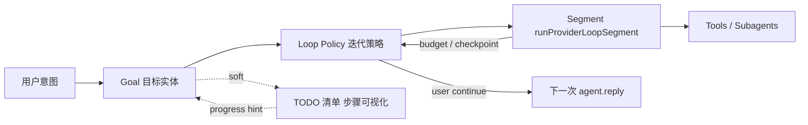
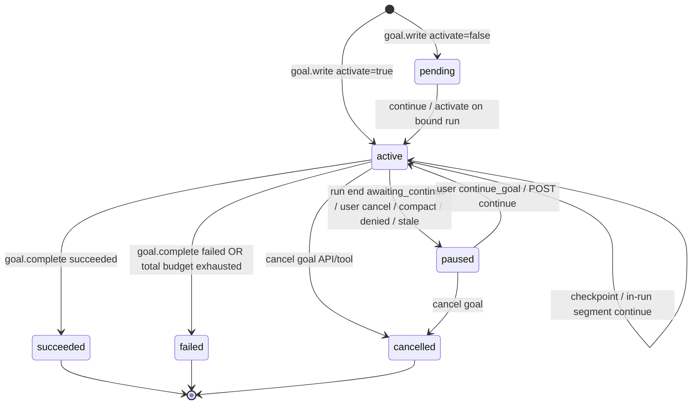
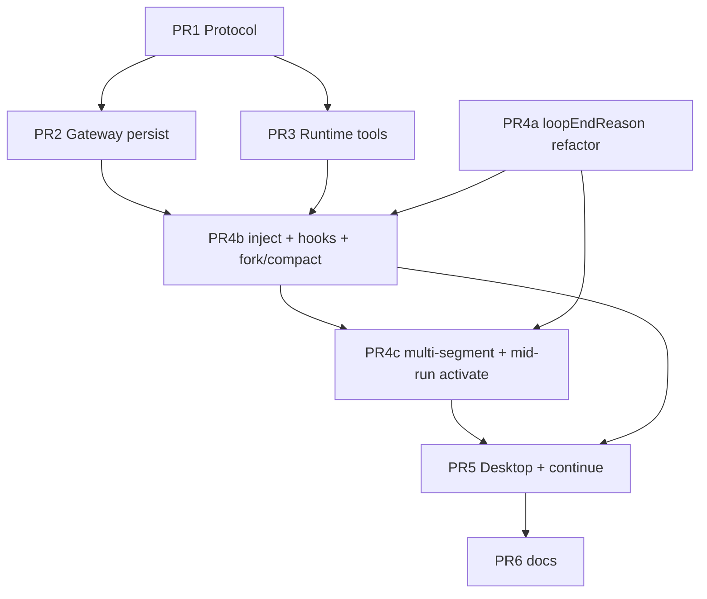

# Design: Goal / Loop Feature for red_panda

| Field | Value |
| --- | --- |
| **Title** | Goal / Loop — 长程目标与受控多轮迭代 |
| **Author** | _(TBD)_ |
| **Date** | 2026-07-12 |
| **Status** | Draft (revised after design review) |
| **Related docs** | `docs/02-functional-design.md`, `docs/04-agent-runtime-design.md`, `docs/13-session-fork-compact-design.md`, `docs/15-memory-runtime-tools-design.md`, `docs/30-todo-feature-design.md`, `docs/12-current-execution-plan.md` |
| **Implementation design** | [`docs/32-goal-loop-development-design.md`](32-goal-loop-development-design.md)（含标准流水线：分析→步骤→执行验证→终评报告） |
| **Repo path** | `docs/31-goal-loop-design.md` |

---

## Overview

`red_panda` 今天已有两类「多步」能力，但都不够覆盖**长程目标**：

1. **单次 root run 的 provider↔tool 内环** — `Runtime.runProviderLoop`（`modules/agent/internal/runtime/runtime.go`）顺序执行 provider 轮次，直到无 tool calls 或触达 `MaxToolTurns`（默认 12，硬顶 48，见 `effectiveProviderToolTurns`）。
2. **会话级 TODO 清单** — `todo.write` / `todo.list`，Gateway 持久化、Runtime 注入 `TodoContext`、Desktop 输入框上方任务条（`docs/30-todo-feature-design.md`）。TODO 是**工作队列**，不是「目标是否达成」的权威状态机，也不能在 `MaxToolTurns` 耗尽后自动再进入。

本设计引入分层产品模型：

| 层 | 英文标识 | 产品含义 | 技术职责 |
| --- | --- | --- | --- |
| **Goal（目标）** | `Goal` | 目标描述 + 成功标准 + 生命周期状态 | Gateway 持久化的会话级权威实体 |
| **Loop（迭代策略）** | `GoalLoop` / loop policy | 受控 re-entry、分段预算、检查点 | Runtime 段内环 + Gateway 跨 run 续跑编排 |
| **TODO（任务条）** | existing | 步骤清单 / 进度可视化 | 进度辅助；**无硬 FK 绑定**（v1）；不替代 Goal 状态 |

**推荐产品命名：对外称「目标（Goal）」；「Loop」作为实现术语与策略字段，不作为用户主概念。** Desktop 中文标签用 **目标**；Activity 等技术面可出现 `goal` / `goal_updated`。

一句话方案：**Gateway 持久化 Goal；Runtime 按标准流水线「分析用户输入 → 生成 goal/步骤 → 逐步执行并验证 → 终评与完成报告」推进；单次 run 内可用 segment 突破 `MaxToolTurns`；未完成则 `paused/awaiting_continue` 由用户继续；Desktop 展示阶段/步骤与报告；安全预算与取消贯穿全路径。**

---

## Background & Motivation

### 三层架构（不变）

```text
Desktop (Wails v3 + React)
    ↕ HTTP / WebSocket
Gateway (Gin / GORM / SQLite no-cgo)
    ↕ IPC 默认 (winio named pipe / unix socket) 或 stdio JSON-RPC
      环境变量 RED_PANDA_RUNTIME_IPC
Agent Runtime (provider loop, tools, permission, subagents)
```

约束（继承全项目）：

- Runtime **不得**向 IPC/stdio 通道写非 JSON-RPC 协议内容（日志走 stderr）。
- Desktop **不**直连 Runtime。
- Gateway SQLite **无 CGO**。
- 多会话并发默认 `runtime_mode=per_run_process`（`RunService` / `defaultRuntimeMode` in `run.go`）。  
  **注：** 部分 README 仍写 single_core 默认；**以代码为准**。
- 会话 compact 前会 `pauseSessionForCompact`：取消 active root runs + subagents，再摘要（`session.go`）。
- 会话内 **串行 root run**：`CountActiveBySession` + `startMu`；并发再发返回中文错误「会话已有任务在运行中…」。

### 现状与缺口

| 能力 | 现状 | 长程目标缺口 |
| --- | --- | --- |
| `runProviderLoop` | 单次 reply 内最多 `MaxToolTurns` 轮 tool 交换；出口几乎都 `clearRunTodos`；max turns 后常返回 `"completed"`（可能 `recovered`） | 无 outer segment；出口清理与 stringly 状态会破坏多段包装 |
| TODO | 会话 checklist + `todo_updated` + 注入 | 无 success criteria；无跨 run 续跑语义 |
| Subagent | 父代理 spawn worker，独立 `MaxToolTurns`（可随 file_count 放大） | 子任务完成后父环仍受父预算；子 turns **不计入** root MaxToolTurns |
| Compact | 暂停 run、摘要；`open_tasks` 可来自 todos | 不保留目标状态机；force-finish 可能无 Runtime event |
| Cancel | `activeRuns` context cancel；`emitCancelled` 仅 `{"status":"cancelled"}` **无 reason** | 无 Goal 级 pause/resume；cancel 原因不在 finish payload |
| Memory `kind=task` | 持久知识 | 高权限摩擦；非运行态目标 |

### 痛点

1. **预算墙**：默认 12 轮对中等实现偏紧；盲目调高会放大成本，且单 run 事件流过重。
2. **语义缺失**：TODO 完成 ≠ 用户目标达成；模型常提前总结停下。
3. **续跑无一等公民**：用户只能再发「继续」；无权威 Goal 状态与预算。
4. **重启/进程退出**：`per_run_process` 结束后 Runtime 内存清零。
5. **安全**：无限环、自动续跑、成本失控需要硬预算；cancel 必须可区分用户 vs compact。

---

## Goals & Non-Goals

### Goals

1. 提供会话级 **Goal** 实体：目标描述、成功标准、状态、预算与检查点。
2. 提供受控 **Loop policy**：仅在 **显式绑定 Goal 的 root run** 内用 segments 突破单次 `runProviderLoop` 硬停；跨 run 通过 **用户 continue**（默认）或受限 `auto_continue`。
3. 明确与 `agent.reply`、TODO、subagents、compact、user cancel 的关系与优先级。
4. 所有权：**Gateway 持久化 + 跨 run 编排**；**Runtime 段循环 + 工具 + 事件**；**Desktop 投影与中文 UX**。
5. 复用 memory/todo 路径：`*.tool.execute`、`ReplyOptions.*Context`、`*_updated`、session hydrate GET、composer 附近条带。
6. 安全：硬预算（段数、**root** tool turns、wall time）、无限环防护、cancel 优先、默认不自动跨 run 续跑、**不默认把 active Goal 绑到每次发送**。
7. 可增量落地：有序 PR；每 PR 可独立 review。

### Non-Goals

1. 跨会话 / 全局项目看板、多用户协作目标。
2. 向量检索或自动从自然语言推断 Goal（v1 仅显式 tool 创建；**无** Desktop/HTTP 通用创建表单；**无** `run.start.create_goal` 快捷创建）。
3. 替换 TODO 或 Memory；不把 Goal 做成第二套 checklist。
4. Desktop 用户拖拽编辑成功标准的完整表单编辑器（v1：只读 + 继续/取消目标）。
5. 改变 Runtime 写协议通道纪律，或让 Desktop 直连 Runtime。
6. 引入 CGO、新 metrics 注册中心、云端 goal sync。
7. 子代理拥有独立 Goal 写权限（v1 root-owned）。
8. 完全透明的「无限 agent」；必须有可配置上限。
9. v1 将 subagent 内部 tool turns 计入 Goal 的 `used_tool_turns`（见 KD 22；wall time 作为成本后盾）。

---

## Key Decisions

| # | Decision | Rationale |
| --- | --- | --- |
| 1 | **产品主概念 = Goal；Loop = 策略/机制** | 用户关心结果；工程师需要 re-entry 策略。 |
| 2 | **分层循环：Inner = `runProviderLoopSegment`；Outer = Goal segments；Cross-run = Gateway continue** | 最小改动复用内环；跨 `per_run_process` 由 Gateway 持状态。 |
| 3 | **默认每会话至多 1 个 `active` Goal** | 降低并行目标与 UI 复杂度。 |
| 4 | **Gateway 是 Goal 权威源；Runtime 持 run 内 snapshot + 段控制器** | 与 todo/memory 一致。 |
| 5 | **同 run 多段 history 唯一默认 = `carry_summarized`**（K=6，每 output ≤500 runes，规则截断，无 LLM 摘要） | 同 run 内 Gateway `messages` **不**投影 tool rounds；`fresh_segment` 会丢轨迹。Cross-run 仅 conversation + GoalContext。 |
| 6 | **跨 run 续跑默认 manual**；`auto_continue` 默认 off | 避免静默烧钱。 |
| 7 | **工具：`goal.write` / `goal.update` / `goal.checkpoint` / `goal.complete` / `goal.list`**；RPC `goal.tool.execute` | 对齐 todo/memory。 |
| 8 | **Goal tools risk = low** | 只改会话目标状态。 |
| 9 | **事件 `goal_updated` + 常规 tool 事件**；`goal.list` **不** emit `goal_updated` | 与 todo 一致（仅 mutation）。 |
| 10 | **注入 `GoalContext` + 每 turn `goalContextForRun` 刷新 + `rootAgentGoalPolicy`** | 镜像 TodoContext / todo policy。 |
| 11 | **TODO 无硬 FK（v1）**；可选 `goal_id` 列 post-MVP | UI 文案不暗示强制绑定；terminal Goal **不**自动改 todos。 |
| 12 | **Subagent：denylist 全部 `goal.*`；`GoalContext = nil`** | 与 todo v1 一致。 |
| 13 | **Compact：`pauseSessionForCompact` 内权威 pause Goal**（`pause_reason=session_compact`）；摘要可选 `active_goal` 投影；不删 Goal 行 | force-finish 可能无 Runtime event。 |
| 14 | **User cancel：`RunService.Cancel` 权威 pause Goal**（`user_cancel`）；finish 事件幂等 | `emitCancelled` 无 reason 字段。 |
| 15 | **Desktop：目标条在 TODO 条上方**；中文标签 | 与 TODO strip 同栈。 |
| 16 | **安全预算默认**：`max_segments_per_run=4`，`max_tool_turns_per_segment=12`，`max_total_tool_turns=96`（**仅 root-loop turns**），`max_wall_time=30m`，`max_auto_continues=0` | 可配置有硬顶；subagent 成本靠 wall time。 |
| 17 | **成功判定：必须 `goal.complete` 或用户取消目标**；纯文本「做完了」不关 Goal | 可审计。 |
| 18 | **v1 不 silent auto_continue** 除非 goal.loop 字段开启且预算允许；权限 pending 时禁止 | 审计清晰。 |
| 19 | **run 绑定 Goal 必须显式**：`goal_id` 或 `continue_goal=true` 或本 run 内 agent `goal.write(activate)` / `goal.update(activate)`；**禁止**每次发送默认绑定 active Goal | 避免短问被长程外环劫持。 |
| 20 | **run 自然结束且 Goal 仍 active → `paused` + `awaiting_continue`**（非保持 active）；**每 run 段 cap 用尽但总预算仍 OK → 同样 `awaiting_continue`** | 下次普通发送不带 outer loop。 |
| 21 | **`run_records.goal_id` 可空**，Start 绑定时写入；finish 查找：`goal_id` on run **或** `goals.active_run_id` / `last_run_id` | 避免 finish hook 丢绑定。 |
| 22 | **`used_tool_turns` = root provider↔tool 轮次 only**；权威来源 = Runtime `segment_end` 上报的 `delta_tool_turns`（单调 CAS 累加）；**禁止**用 `RunRecord.ToolCount` 对账（tool_count = tool **调用次数**，≠ loop turns） | 子代理内部 turns 不计入；成本后盾 = wall time。 |
| 23 | **`runProviderLoop` 重构为 segment API**：返回 `loopEndReason`；**禁止**段内 `clearRunTodos`/`clearRunGoals`/`EventFinish`；root terminal 仅一次 finish | 否则多段必坏。 |
| 24 | **Goal 创建面：v1 仅 Runtime tool `goal.write`**；HTTP 仅 list/get/continue/cancel；**无** `run.start.create_goal` | 与 Non-Goals 一致。 |
| 25 | **stale active 恢复**：Start/hydrate 时若 `active` 但 `active_run_id` 指向非 active run → force `paused` + `stale_run` | 进程崩溃后可续。 |
| 26 | **run `denied` / permission 拒绝导致结束 → Goal `paused` + `permission_denied`** | 非 failed，允许用户改权限后继续。 |
| 27 | **settings `goals_enabled` 默认 true**；false 时 Gateway Start：**不** `applyGoalContext`、**拒** bind/continue_goal、把 `goal.*` 并入 `ToolDenylist`（可选 `ReplyOptions.GoalsEnabled=false`）；Runtime 据此省略 goal 工具/policy/outer loop | 开关只走 Gateway→ReplyOptions，Runtime 不读独立 settings 文件。 |
| 28 | **每会话最多 20 条 goals**；超出拒绝新建（不自动归档） | 防表膨胀。 |
| 29 | **`goal.write` = insert-only**：已有 active 则 error，**禁止**静默 replace | 语义清晰。 |
| 30 | **cancel-goal vs complete 竞态：cancel 优先**（若 cancel 已 terminalise，后到的 complete 被拒） | 用户意图优先。 |
| 31 | **auto_continue 仅 finish 投影完成后异步 `Start`**；continue 输入为**可见 user 模板消息**（审计）；不可经裸 HTTP 绕过 goal.loop 字段 | 会话串行 + 审计。 |
| 32 | **`segment_end` / 计数 delta = 内部 RPC action**，非 provider 可见工具 | 避免模型乱调。 |
| 33 | **Mid-run activate 启用同 run 多段（推荐产品路径）**：成功 `goal.write/update(activate)` 后 Runtime 置 `BoundToThisRun=true`、写 `run_records.goal_id`；outer loop **始终**走 segment `for`；段结束后若已 bound 且预算 OK 可续段。首段在 activate 前消耗的 turns 计入该 run 的 segment 预算 | agent 创建后可在同一次 reply 内多段执行。 |
| 34 | **总预算耗尽 terminal：`failed` + `pause_reason`/`fail_reason=budget_exhausted`**（`used_tool_turns >= max_total` **或** wall time 超限）。**仅**「本 run `max_segments_per_run` 用尽而总预算仍 OK」→ `paused` + `awaiting_continue` | 消除 failed/paused 二义；硬预算不可静默续。 |
| 35 | **Start `goal_id` 可激活 `pending` 或 `paused`（→ active）**；`continue_goal` 绑定最近 **paused**（若无 paused 可回退到最近 **pending**） | 避免 pending 永远卡死。 |
| 36 | **Goal 标准流水线（强制产品路径）**：`analyze` → `plan`（goal + todo 步骤）→ 逐步 `execute`→`verify` → `evaluate` → `report` + `goal.complete`。禁止跳过分析/规划直接大改；禁止仅靠口头「做完了」关闭 Goal | 用户要求：先分析输入，再生成步骤，再持续执行验证，最后终评与完成报告。实现细则见 `docs/32` §2。 |
| 37 | **按阶段预设子代理（默认）**：`goal-analyst` / `goal-planner` / `goal-implementer` / `goal-verifier` / `goal-evaluator`。Root 编排并独占 `goal.*`/`todo.*`/完成报告；子代理无 Goal/TODO 写权限、不嵌套 subagent。多步 Goal 默认委派；trivial 可 root 内联 | 阶段职责清晰、验证与实施分离；复用现网 `subagent.run`。细则见 `docs/32` §2.10。 |

---

## Proposed Design

### Goal 标准流水线（用户可见业务路径）

绑定 Goal 的工作必须按阶段推进（细节与字段见开发设计 `docs/32-goal-loop-development-design.md` §2）：

```text
用户输入
  → ① 分析（意图 / 范围 / 约束 / 成功信号）     ← 预设子代理 goal-analyst
  → ② 规划（goal.write + todo 步骤清单）       ← goal-planner 出草案，root 落盘
  → ③ 执行当前步骤                             ← goal-implementer
  → ④ 验证当前步骤（证据）→ 下一步或重试         ← goal-verifier
  → ⑤ 全部步骤完成后终评                       ← goal-evaluator
  → ⑥ 完成报告（用户可见）+ goal.complete        ← root 发布
```

| 阶段 | 产出 | 预设子代理 |
| --- | --- | --- |
| 分析 | `analysis_summary`；trivial 则可不建 Goal | `goal-analyst`（只读） |
| 规划 | `objective` + `success_criteria` + todos | `goal-planner`（只读草案）→ **root** `goal/todo` |
| 执行 | 步骤实现产物 | `goal-implementer` |
| 验证 | pass/fail + evidence | `goal-verifier` |
| 终评/报告 | `report_json` / 报告消息 + terminal | `goal-evaluator` 草稿 → **root** complete |

TODO = 步骤载体；Goal = 目标与终态权威。Loop/segment = 预算与 re-entry。  
**子代理 = 阶段专家**；**不是** Goal 状态的权威源。

### 概念模型

```text
Session
  ├── Goal? (0..N historical; ≤1 active)
  │     ├── objective, success_criteria, status, budgets, checkpoint
  │     └── loop_policy (segments, auto_continue, stop rules)
  ├── todo_items[]  (v1: no required goal_id FK)
  └── runs[]  (run_records.goal_id nullable; many runs per goal)
```

**Goal vs Loop vs TODO：**



| | Goal | Loop policy | TODO |
| --- | --- | --- | --- |
| 问什么 | 要达成什么？是否成功？ | 何时再进入？预算？ | 下一步做什么？ |
| 状态机 | 是 | 策略参数 + 计数器 | item status |
| UI | 目标条 | 预算 chips / 高级字段 | 任务条 |
| 跨 run | 是 | 是（计数器持久） | 是（已有） |

### 与单次 `agent.reply` / root run 的关系

```mermaid
sequenceDiagram
  participant Desktop
  participant Gateway
  participant Runtime
  participant Provider

  Desktop->>Gateway: run.start (goal_id OR continue_goal OR plain)
  alt explicit goal bind
    Gateway->>Gateway: bind run_records.goal_id; activate if paused+continue
    Gateway->>Runtime: agent.reply (GoalContext, MaxToolTurns=segment)
    loop segments while active and budget and reason allows
      Runtime->>Runtime: runProviderLoopSegment (no clear, no finish)
      Runtime->>Provider: Complete × N root tool turns
      alt goal.complete terminal
        Runtime->>Gateway: goal.tool.execute complete
      else segment boundary
        Runtime->>Gateway: goal.tool.execute action=segment_end (internal)
        Runtime->>Runtime: carry_summarized history + continuation
      end
    end
    Runtime-->>Gateway: single EventFinish
    Gateway->>Gateway: if goal still active → paused awaiting_continue
  else no bind
    Gateway->>Runtime: agent.reply (no Goal outer loop)
    Runtime->>Runtime: single segment legacy path
  end
```

**冻结语义：**

1. **一个 root run** = 一次 `agent.reply`（一个 `run_id`）。
2. **一个 segment** = 一次 `runProviderLoopSegment`（`MaxToolTurns` = `max_tool_turns_per_segment`，默认 12）。
3. **一个 Goal 生命周期** ⊆ 多个 segments ⊆ 可能多个 runs。
4. **无绑定 Goal**：与今天完全一致（单次内环，无 outer loop）。
5. **有绑定 Goal**：启用 outer segment loop；受 `max_segments_per_run` 与 goal 级总预算限制。
6. **run 结束且 Goal 仍 active：** 总预算耗尽 → **`failed` + `budget_exhausted`**（KD 34）；否则（段 cap / 自然结束）→ **`paused` + `awaiting_continue`**；user cancel / compact / denied / run_failed 用各自 pause_reason。

### 架构与所有权

| 层 | 职责 | 不负责 |
| --- | --- | --- |
| **Gateway GoalService** | SQLite；`goal.tool.execute`；HTTP list/get/continue/cancel；`applyGoalContext`；**RunService.Cancel / pauseSessionForCompact / finish 三路径**状态迁移；可选 auto_continue；compact/fork/delete | 不执行 provider |
| **Runtime GoalLoopController** | 段循环；`loopEndReason`；刷新 Goal/Todo context；tools；emit `goal_updated`；**单次** root finish | 不写 SQLite |
| **Desktop** | 目标条、继续/取消、hydrate、WS | 不直连 Runtime |

```text
Source of truth:  Gateway goals + run_records.goal_id
Run working copy: Runtime map[runID] GoalSnapshot + segment counters + todo snapshot
Desktop views:    sessionRuntime.goal + HTTP + goal_updated
```

---

### Lifecycle



| 动作 | 触发 | 行为 |
| --- | --- | --- |
| **create** | `goal.write` only | insert；已有 active → **error**（KD 29）；≤20/session |
| **bind/activate** | `run.start` with `goal_id`（pending/paused）/ `continue_goal`；或 run 内 `goal.write|update(activate=true)` | 写 `run_records.goal_id`；status→`active`；`active_run_id`；Runtime `BoundToThisRun=true` → **同 run 可多段**（KD 33） |
| **checkpoint** | `goal.checkpoint` 或 segment 边界 auto | 持久化 summary；emit `goal_updated` |
| **continue (segment)** | Runtime outer loop | 同 run；`carry_summarized`；continuation system |
| **continue (run)** | 用户「继续目标」/ `continue_goal` / POST continue | 新 `run_id`；Goal→active；**显式绑定** |
| **succeed/fail** | `goal.complete` | terminal；清 `active_run_id`；写 `last_run_id`；停 outer loop |
| **cancel run** | Desktop 停止 / `RunService.Cancel` | cancel runtime；**Goal→paused `user_cancel`**（权威在 Cancel API） |
| **compact pause** | `pauseSessionForCompact` | cancel runs；**Goal→paused `session_compact`**（权威在 compact 路径） |
| **cancel goal** | POST cancel / `goal.update status=cancelled` | 先 cancel active run（若有），再 Goal `cancelled`；**优先于 complete** |
| **resume after restart** | hydrate 显示 paused/stale 修复 | 用户 continue 开新 run |

#### Segment end decision table（冻结）

| Segment `loopEndReason` | Goal status after tools | Outer-loop action |
| --- | --- | --- |
| `no_tools` | `active` | 若 **总预算 OK** 且 `segments_this_run < max_segments_per_run` → checkpoint + **next segment**；若总预算 **exhausted** → stop，Gateway → **`failed` + `budget_exhausted`**；若仅本 run 段 cap 用尽而总预算 OK → stop，Gateway → **`paused` + `awaiting_continue`** |
| `max_turns` | `active` | **永不**视为 goal 成功；同上一行（checkpoint 后按总预算 vs 段 cap 分支） |
| `cancelled` | (any non-terminal) | 停 outer loop；**不**在 Runtime 改 Goal（Gateway Cancel/compact 已改或 finish 幂等） |
| `failed` (provider/runtime) | (any non-terminal) | 停 outer loop；单次 `EventError`；Gateway：若仍 active → **`paused` + `run_failed`**（可续）；**不**与 budget_exhausted 混淆 |
| `failed` (budget, outer) | active | 停 outer loop；Gateway → **`failed` + `budget_exhausted`**（KD 34） |
| `goal_terminal` | succeeded/failed/cancelled | 停 outer loop；正常 `EventFinish` |
| any | already terminal | 停；finish；不改状态 |

**验收：** 模型仅返回 text、从不 `goal.complete` → 最多 N 段后 pause，**永不** `succeeded`。

**UX：** 同 run 多段期间 Desktop 保持「进行中」+ 预算 chips；用户可见多条 assistant 消息属预期；条带显示段进度。

---

### Goal ↔ TODO concurrency & ownership

| 规则 | 冻结 |
| --- | --- |
| 写路径 | Root tool 串行执行非 subagent 工具 → 同 run 内 `goal.*` 与 `todo.*` 不并行 |
| HTTP cancel-goal | **先** `RunService.Cancel`（若 `active_run_id` 有 active run），**再**事务内 Goal→`cancelled`；并发 `goal.complete`：**cancel 优先**（complete 见 terminal/cancelled → error） |
| HTTP continue | 要求 Goal `paused`（或 stale 修复后 paused）；`Start` 在 `startMu` 下；session 已有 active run → 返回既有会话串行错误 |
| Terminal goal | **不**自动改 todos（`in_progress` 可残留）；UI 文案：「目标已结束；任务列表可仍显示历史步骤」 |
| Continue goal | **不**强制 demote stale `in_progress` todos；agent 应在下一段 `todo.write` 自愈；可选 tool note |
| `goal.write` | insert-only；禁止 replace；更新用 `goal.update` / checkpoint / complete |
| `todo_items.goal_id` | **v1 不实现**；UI 不得写「绑定到目标 #…」式硬 FK 文案 |
| 双写 Goal 状态 | Mutation：**仅** `goal.tool.execute` + Cancel/compact/finish 服务钩子；禁止 Desktop 任意 PATCH 字段 |

**幂等矩阵（Goal 状态迁移）：**

| 当前 \ 事件 | complete(succeeded) | cancel-goal | Cancel run | compact | finish natural |
| --- | --- | --- | --- | --- | --- |
| active | succeeded | cancelled | paused user_cancel | paused session_compact | paused awaiting_continue |
| paused | **reject** | cancelled | no-op | no-op | no-op |
| succeeded/failed/cancelled | no-op / reject | no-op | no-op | no-op | no-op |

---

### Loop 策略细节（Runtime）— 必须重构内环

#### 为什么不能直接包今天的 `runProviderLoop`

当前 `runProviderLoop`（`runtime.go`）存在三处与 multi-segment **不兼容**的行为：

1. **每个出口**调用 `clearRunTodos(runID)` — 段间会抹掉 todo/goal snapshot。
2. **max turns** 在 `retryFinalAnswer` / synthesize 后返回 **`"completed"`**（payload 可带 `recovered`），与 `no_tools` 的 `"completed"` 无法区分。
3. **provider error** 立即 `EventError`；Gateway `ProjectEvent` 会结束 run — outer loop 不得在 error 后继续。
4. Root **`EventFinish` / `emitCancelled`** 今天在 `emitRun` 路径上与 loop 返回值耦合；多段时必须 **只在全部段结束后 emit 一次**。

#### 目标 API（PR4a 行为保持重构）

```go
type loopEndReason string
const (
    loopEndNoTools      loopEndReason = "no_tools"
    loopEndMaxTurns     loopEndReason = "max_turns"
    loopEndCancelled    loopEndReason = "cancelled"
    loopEndFailed       loopEndReason = "failed"
    loopEndGoalTerminal loopEndReason = "goal_terminal" // set by outer when snapshot terminal
)

// runProviderLoopSegment: NO clearRunTodos/clearRunGoals; NO EventFinish/EventError for cancel
// (cancel: return cancelled; failed: may emit EventError ONLY if outer will not continue — outer owns terminal emit policy)
// Returns reason + rounds for carry_summarized + turnsUsed this segment.
func (r *Runtime) runProviderLoopSegment(...) (reason loopEndReason, rounds [][]ToolExchange, turnsUsed int)
```

**Snapshot 清理时机（冻结）：**

- `clearRunTodos` / `clearRunGoals` **仅**在 `emitRun` 的 **root terminal** 路径（defer 或 finish 前一次），**永不**在 segment 返回时。
- 无 Goal 绑定的 legacy 路径：segment 跑完一次后同样在 root terminal 清理（行为对外等价：run 结束后 snapshot 不在）。

**Terminal 事件（冻结）：**

- Outer loop 结束后由 `emitRun` **恰好一次** `EventFinish` 或 `EventError`（failed）。
- Segment 内 **禁止** `EventFinish`。
- Segment 内 provider hard fail：outer 停止并向上返回 failed，由 `emitRun` 发 **一次** `EventError`（segment 内不再发，或 PR4a 改为只 return failed、由 emitRun 统一发 — **冻结：统一由 emitRun 发**，segment 只 return reason，避免双 emit）。

#### Outer loop 伪代码（修订）— 始终 segment `for`，支持 mid-run activate

**KD 33 冻结：** 即使 Start 时未 bind，也进入 segment 循环（`maxSeg` 在 unbound 时为 **1**；activate 后提升为 policy 的 `MaxSegmentsPerRun`）。首段内 `goal.write(activate)` 成功后：

1. GoalExecutor 更新 Runtime snapshot：`BoundToThisRun=true`，seed GoalContext；
2. Gateway RPC 已写 `run_records.goal_id` + goal `active` / `active_run_id`；
3. 本段结束后 outer 看到 bound → 可开后续段（受段 cap 与总预算约束）。

```go
func (r *Runtime) runWithGoalLoop(ctx context.Context, params methods.ReplyParams, input string, history []ToolExchange, messageID, streamID string, streamSeq *uint64) loopEndReason {
    // Always use segment loop. Unbound runs: maxSeg=1 (legacy single-segment).
    // Mid-run activate sets BoundToThisRun and raises maxSeg to policy.MaxSegmentsPerRun.
    rounds := historyAsRounds(history)
    seg := 0
    for {
        snap := r.goalSnapshot(params.RunID) // may become non-nil after goal.write mid-segment
        maxSeg := 1
        maxTurnsSeg := effectiveProviderToolTurns(params.Options) // legacy default when unbound
        if snap != nil && snap.BoundToThisRun {
            maxSeg = snap.LoopPolicy.MaxSegmentsPerRun
            maxTurnsSeg = snap.LoopPolicy.MaxToolTurnsPerSegment
        }
        if seg >= maxSeg {
            return loopEndNoTools // or last reason; Gateway: awaiting_continue if still active
        }
        if ctx.Err() != nil {
            return loopEndCancelled
        }
        if snap != nil && snap.BoundToThisRun {
            if r.goalSnapshotTerminal(params.RunID) {
                return loopEndGoalTerminal
            }
            if !r.goalTotalBudgetOK(snap) { // total turns OR wall — hard fail
                _ = r.internalGoalSegmentEnd(ctx, params, segmentEndBudgetExhausted)
                return loopEndFailed // Gateway → failed + budget_exhausted (KD 34)
            }
        }
        params.Options.MaxToolTurns = maxTurnsSeg
        reason, segRounds, turns := r.runProviderLoopSegment(ctx, params, input, flatten(rounds), messageID, streamID, streamSeq)
        snap = r.reloadGoalSnapshot(params.RunID)
        if snap != nil && snap.BoundToThisRun {
            _ = r.internalGoalSegmentEnd(ctx, params, turns, seg, reason) // action=segment_end; CAS used_tool_turns += turns
        }
        seg++

        switch reason {
        case loopEndCancelled, loopEndFailed, loopEndGoalTerminal:
            return reason
        case loopEndNoTools, loopEndMaxTurns:
            // Re-read bind: first segment may have activated mid-run (KD 33).
            snap = r.goalSnapshot(params.RunID)
            if snap == nil || !snap.BoundToThisRun || snap.Status != "active" {
                return reason // unbound legacy path OR already terminalized
            }
            if !r.goalTotalBudgetOK(snap) {
                return loopEndFailed // Gateway → failed + budget_exhausted
            }
            if seg >= snap.LoopPolicy.MaxSegmentsPerRun {
                return reason // Gateway → paused + awaiting_continue (soft per-run cap)
            }
            rounds = summarizeToolRounds(append(rounds, segRounds...), carrySummaryOpts{
                MaxExchanges: 6,
                MaxOutRunes:  500,
            })
            input = r.goalContinuationInput(snap)
            continue
        default:
            return reason
        }
    }
}
```

**验收（PR4c）：** plain `run.start`（无 goal_id）→ 首段内 `goal.write(activate=true)` → 同 run 内可进入第 2+ 段（预算允许时），**不必**先用户点继续。

#### 段间 history：唯一 v1 默认 `carry_summarized`

| 模式 | v1 | 说明 |
| --- | --- | --- |
| **`carry_summarized`** | **唯一默认** | 下一段 `ToolHistory`/`rounds` 种子 = 规则截断摘要 |
| `fresh_segment` | **非 v1** | 会丢同 run tool 轨迹（Gateway messages 不投影 tool rounds） |
| `carry_tool_rounds` full | **非 v1** | 易爆 context |

**规则（冻结）：**

| 参数 | 值 |
| --- | --- |
| `K` (保留 exchanges) | **6** 最近 |
| 每条 output 截断 | **500** runes |
| 摘要方式 | **仅规则截断**（name + status + truncated text）；**无** LLM 再摘要 |
| 存储 | **仅 Runtime 内存** `[]ToolExchange` / rounds 作为下一段种子；同时 `segment_end`/`checkpoint` 把 **短 progress_note** 写入 Gateway `checkpoint_summary`（≤4_000）供跨段/跨 run GoalContext |
| Cross-run | **不**携带 Runtime rounds；仅 session conversation（message_delta 文本）+ GoalContext |

---

### Provider / Context Injection

#### 完整 system 消息顺序（对齐 `openAICompatibleMessages`）

```text
1. current time system
2. rootAgentOrchestrationPolicy (if subagent.run available)
3. rootAgentPostDelegationPolicy (if successful subagent in history)
4. rootAgentTodoPolicy (if todo.write available)
5. rootAgentGoalPolicy (if goal.write available)          ← NEW
6. MemoryContext (Gateway Start)
7. GoalContext (Gateway Start + mid-loop goalContextForRun) ← NEW
8. TodoContext (Gateway Start + mid-loop todoContextForRun)
9. SkillsContext (Runtime emitRun buildSkillsContext — not Gateway)
10. conversation + user + tool rounds
```

**Skills** 仍由 Runtime `emitRun` 构建（`buildSkillsContext`），Gateway `Start` 不注入 Skills。

**Mid-loop：** 每个 segment 的每一 turn 开始时（同 todo）：

```go
if g := r.goalContextForRun(params.RunID); g != nil {
    params.Options.GoalContext = g
}
if t := r.todoContextForRun(params.RunID); t != nil {
    params.Options.TodoContext = t
}
```

**GoalContext 预算：** `goalContextLimit = 2000` runes（formatted `Context` 字符串，不含 header）。优先 objective 截断线 + success_criteria + checkpoint + 预算余量一行。字段 DB 可 4000，**注入必须再截断**。

**`rootAgentGoalPolicy` 要点：** 多阶段结果用 goal；todos 管步骤；checkpoint 大阶段；仅 criteria 满足时 `goal.complete`；goal active 且本 run 已绑定则勿过早停工。

---

### Persistence（Data Model）

#### Table: `goals`

| Column | Type | Notes |
| --- | --- | --- |
| `id` | string PK | `goal_<unixnano>` |
| `session_id` | string index | |
| `title` | string | ≤200 runes；可空则从 objective 截断生成 |
| `objective` | string | required；≤4_000 |
| `success_criteria` | string | required on activate；≤4_000 |
| `status` | string index | enum |
| `pause_reason` | string optional | `user_cancel` \| `session_compact` \| `awaiting_continue` \| `run_failed` \| `permission_denied` \| `stale_run` \| `fork` \| （terminal 时亦可记）`budget_exhausted` — **不用** `segment_budget`（段 cap → `awaiting_continue`） |
| `fail_reason` | string optional | terminal failed 时：`budget_exhausted` \| `goal.complete` 文案等 |
| `checkpoint_summary` | string | ≤4_000 |
| `progress_note` | string | optional |
| `loop_*` 预算字段 | int/bool | 见 KD 16 |
| `used_tool_turns` | int | **root-loop only** |
| `used_segments` | int | |
| `used_auto_continues` | int | |
| `used_wall_time_sec` | int | sum of bound runs' durations |
| `active_run_id` | string | 当前 run；terminal/pause 时清空 |
| `last_run_id` | string | 最近绑定/完成 run（finish 查找后备） |
| `source_run_id` / `source_tool_call_id` | string | 审计 |
| timestamps | time | started_at / finished_at / created_at / updated_at |

**约束：** ≤1 active per session（服务层）；≤20 rows/session；级联删。

#### `run_records.goal_id`（nullable）

| 时机 | 行为 |
| --- | --- |
| Start 显式 bind | 写入 `goal_id` |
| run 内 `goal.write(activate)` | Runtime RPC 成功后 Gateway 更新 **当前** run 的 `goal_id` + goal.active_run_id |
| finish 查找顺序 | 1) `run.goal_id` 2) `goals.active_run_id = run.id` 3) `goals.last_run_id = run.id` AND status 需迁移 |

#### 计数器与 wall time

| 字段 | 算法 |
| --- | --- |
| `used_tool_turns` | **仅** Runtime `segment_end`（及 run 结束时 outer 汇总）上报的 `delta_tool_turns` = 该段 root **provider loop 迭代次数**（`runProviderLoopSegment` 的 turn 计数）。Gateway `UPDATE goals SET used_tool_turns = used_tool_turns + :delta WHERE id=?`（单调 CAS）。进程崩溃：接受可能少计；**禁止**用 `RunRecord.ToolCount`（那是 tool **调用**次数，一次 Complete 可多 tool） |
| `used_segments` | 每段 +1（同 segment_end） |
| `used_wall_time_sec` | 每个绑定 run finish：`+= max(0, finished_at - started_at)` 秒；为 subagent 成本后盾 |
| subagent turns | **不计入** `used_tool_turns`；依赖 wall time + 用户 cancel |

---

### Cancel / Compact / Finish hooks（权威路径）

> **不要**依赖 `EventFinish{status:cancelled}` 的 reason（今日 `emitCancelled` **不带** reason）。

| 路径 | 代码落点 | Goal 动作 | pause_reason |
| --- | --- | --- | --- |
| 用户停止 | `RunService.Cancel` **先** `GoalService.PauseByRun(runID, user_cancel)` **再** `runtime.Cancel` | paused | `user_cancel` |
| Compact | `pauseSessionForCompact` 在 cancel 前后 **`GoalService.PauseBySession(sessionID, session_compact)`** | paused | `session_compact` |
| Compact force-finish | `repos.Runs.Finish(..., "paused for session compact")` — **无 Runtime event**；依赖上列 session pause，**不**依赖 HandleRuntimeEvent | 已 paused | `session_compact` |
| 自然完成 / **本 run 段 cap 用尽**（总预算仍 OK） | `OnRootRunTerminal` | 若仍 active → **paused** | `awaiting_continue` |
| **总预算耗尽**（turns ≥ max_total **或** wall 超时） | segment_end / outer `loopEndFailed` / finish | **failed**（terminal） | `fail_reason=budget_exhausted`（KD 34） |
| provider/runtime fail（非预算） | finish error | 若仍 active → **paused** | `run_failed` |
| permission denied run | finish status denied/error path | paused | `permission_denied` |
| goal.complete RPC | ExecuteRuntimeTool | terminal；清 active_run_id | — |

**幂等：** 所有 Pause/Terminal 服务方法 `UPDATE ... WHERE status='active'`（或 CAS）；重复调用 no-op。

**合成事件：** Gateway 在 Pause 成功后可 publish/save `goal_updated`（action=`paused`），保证无 tool 时 Desktop 刷新。

---

### Runtime Tools

| Tool | Risk | 目的 | Emits `goal_updated`? |
| --- | --- | --- | --- |
| `goal.write` | low | **insert** 新 goal | yes |
| `goal.update` | low | 更新 title/objective/criteria；或 cancel | yes |
| `goal.checkpoint` | low | 进度摘要 | yes |
| `goal.complete` | low | succeeded \| failed | yes |
| `goal.list` | low | 列表 | **no** |

**内部-only**（`goal.tool.execute` 的 `tool_name` 可为内部 action，**不**进 `AvailableTools`）：

| Action | 用途 |
| --- | --- |
| `segment_end` | 上报 turns/segments；可选 auto checkpoint 文本 |
| （可选）`bind_run` | run 内 activate 后对齐 run_records — 或并入 write/update |

#### 参数 / 校验（精简表）

**`goal.write`**

| Field | Required | Rules |
| --- | --- | --- |
| `title` | no | ≤200；空则从 objective 取前 40 runes |
| `objective` | **yes** | non-empty；≤4_000 |
| `success_criteria` | if `activate=true` | non-empty；≤4_000 |
| `activate` | no | default **false** → `pending`；true → 需无其它 active 否则 error |
| `loop` | no | 覆盖默认预算；受硬顶裁剪 |

错误：`active goal exists`；`session goal limit 20`；`goals_enabled=false`；validation。

**`goal.complete`**

| Field | Required | Rules |
| --- | --- | --- |
| `status` | yes | `succeeded` \| `failed` |
| `summary` | yes | non-empty；≤4_000 → checkpoint_summary |

错误：goal not active；already terminal；**cancelled wins** if racing.

**`goal.checkpoint`**

| Field | Required |
| --- | --- |
| `summary` | yes ≤4_000 |
| `progress_note` | no |

**`goal.list`**

| Field | Default |
| --- | --- |
| `status` | `all` \| `active` \| `paused` \| … |
| `limit` | 20 |

#### Tool result

`red_panda.tool_result.v1`；`data.goal` = GoalDTO + remaining budget fields。

---

### Protocol

```go
const GoalToolExecute = "goal.tool.execute"

// ReplyOptions
GoalContext *GoalContext `json:"goal_context,omitempty"`

type GoalContext struct {
    Goal    GoalDTO `json:"goal,omitempty"`
    Context string  `json:"context,omitempty"`
}
```

```go
EventGoalUpdated EventType = "goal_updated"
```

**`goal_updated` payload：** `session_id`, `run_id`, `tool_call_id?`, `action` (`write|update|checkpoint|complete|paused|segment_end` — **无 list**), `goal` GoalDTO。

#### `run.start` options（v1）

```json
{
  "goal_id": "goal_...",
  "continue_goal": true,
  "max_tool_turns": 12
}
```

| 字段 | v1 |
| --- | --- |
| `goal_id` | 绑定指定 goal：允许 **`pending` / `paused`**（→ `active`），或 **`active` + stale repair** 后；terminal → error；→ outer multi-seg 可用（KD 35） |
| `continue_goal` | true：绑定 session 中最近 **paused**；若无 paused 则最近 **pending**；皆无 → error |
| ~~`create_goal`~~ | **不提供**（KD 24） |
| 默认无字段 | **不绑定**；agent 可 mid-run `goal.write(activate)` 绑定并启用后续段（KD 33） |

**Stale 修复（Start 与 hydrate）：**  
`status=active` AND (`active_run_id` empty OR run not active) → `paused` + `stale_run`，再决定是否 continue。

#### `goals_enabled` 下发（KD 27）

| 层 | `goals_enabled=true`（默认） | `=false` |
| --- | --- | --- |
| Gateway 配置 | 桌面 settings / env → Gateway | 同左 |
| `RunService.Start` | 可 bind；`applyGoalContext` | **跳过** GoalContext；若请求 `goal_id`/`continue_goal` → **error**；`ToolDenylist` 追加 `goal.write|update|checkpoint|complete|list`；`ReplyOptions.GoalsEnabled=false`（若采用显式字段） |
| Runtime | 注册 goal 工具；policy；outer loop per KD 33 | denylist / `GoalsEnabled=false` → **不**暴露 goal 工具、不注入 goal policy/context、outer 保持 maxSeg=1 且不 segment_end |
| HTTP goal APIs | 可用 | list/get 可读（只读审计可选）；continue/cancel/write RPC → **403/error** |

Runtime **不**读取独立 settings 文件或 Desktop 配置；开关只经 Gateway 注入的 ReplyOptions / denylist。

---

### Gateway APIs

| Method | Path | 说明 |
| --- | --- | --- |
| GET | `/api/v1/sessions/:id/goals` | list |
| GET | `/api/v1/sessions/:id/goals/:goalId` | detail |
| POST | `/api/v1/sessions/:id/goals/:goalId/continue` | → `RunService.Start` with bind；**response 含新 `run_id`** |
| POST | `/api/v1/sessions/:id/goals/:goalId/cancel` | cancel-goal（先 cancel run） |

**Continue response：**

```json
{
  "ok": true,
  "data": {
    "run_id": "run_...",
    "session_id": "session_...",
    "goal_id": "goal_...",
    "accepted": true
  }
}
```

**Continue 用户可见输入模板（写入 conversation 的 user 消息）：**

```text
[继续目标] {title}
目标：{objective}
成功标准：{success_criteria}
上次检查点：{checkpoint_summary}
请从检查点继续，完成后调用 goal.complete。
```

（不用纯 system-only，便于审计与用户理解费用触发点。）

**auto_continue 编排（PR5，默认仍 off）：**

1. 仅当 `loop_auto_continue=true` 且 `used_auto_continues < max` 且 pause 将为 `awaiting_continue`。
2. 在 `OnRootRunTerminal` **完成 ProjectEvent / Finish 行**之后异步触发（**不**跨 await 持有 `startMu`）。
3. 再入 `Start` 时取 `startMu`；若 session 仍 busy → 跳过并 log。
4. 若 run 结束时仍有 pending permissions → **禁止** auto_continue（KD 18）。
5. 输入同 continue 模板；`used_auto_continues++`。
6. 客户端/HTTP **不能**在 continue 请求上单独把 auto_continue 打开；只能通过 `goal.write`/`goal.update` 的 loop 字段。

---

### Desktop UX（中文）

```text
┌─────────────────────────────────────────────┐
│  ChatConversation                           │
├─────────────────────────────────────────────┤
│  GoalComposerStrip  目标 · 已暂停 · 继续/取消 │
│  TodoComposerStrip  任务 · …                 │
│  ChatComposer                               │
└─────────────────────────────────────────────┘
```

| 状态 | 展示 |
| --- | --- |
| 无 goal / 仅 terminal 且折叠 | 可不渲染或折叠历史 |
| active（run 进行中） | `● 目标 · 进行中` + 预算 `段 x/y · 工具轮 a/b` |
| paused | `❚❚ 目标 · 已暂停` + **继续** / **取消目标** |
| succeeded / failed | **已达成** / **未达成** |

**PR5 文件清单（对齐 docs/30 粒度）：**

| 文件 | 变更 |
| --- | --- |
| `components/chat/GoalComposerStrip.jsx` | 新建 |
| `components/chat/ConversationView.jsx` | strip 在 Todo 之上 |
| `App.jsx` | hydrate、WS `goal_updated`、continue/cancel handlers |
| `lib/sessionRuntime.js` | `goal`, `goalHydrated`, `goalExpanded` |
| `lib/goals.js` | normalize、parse fallback |
| `lib/activityEvents.js` | `goal_updated` → kind `goal` |
| `lib/displayLabels.js`（或既有 label map） | `goal: '目标'` |
| `app.css` | `.goal-composer-strip` |
| `*.test.js` | 并行 todos 测试风格 |

---

### Interaction with Subagents / Compact / Fork

**Subagents：** denylist `goal.write|update|checkpoint|complete|list`；`childParams.Options.GoalContext = nil`。

**Compact（与 PR4b 同批生命周期钩子，非拖到最后）：**

1. `pauseSessionForCompact` → Pause goals `session_compact`。
2. CompactSummary 可选 `active_goal: {id,title,status,objective_preview}`。
3. **不删** goal 行；todos open_tasks 策略仍按 docs/30。

**Fork：**

- 深拷贝所有 goals，新 PK；**`active`→`paused`**（`pause_reason=fork`）；terminal 保持。
- 避免双会话双 active 烧钱。

---

## API / Interface Changes

### Protocol
- `GoalToolExecute`, DTOs, `GoalContext`, `EventGoalUpdated`

### Runtime
- `runProviderLoopSegment` + `loopEndReason`；clear-on-terminal-only
- `runWithGoalLoop` + `carry_summarized`
- Goal tools + snapshot + `goalContextForRun`
- provider order + `rootAgentGoalPolicy`
- subagent denylist

### Gateway
- `goals` 表；`run_records.goal_id`
- GoalService；hooks on Cancel / compact / finish
- HTTP list/get/continue/cancel
- `applyGoalContext`；auto_continue optional

### Desktop
- Goal strip + sessionRuntime + activity + CSS + tests

---

## Data Model Changes / Migration

1. AutoMigrate `goals`；`run_records.goal_id` nullable column。
2. 无 backfill。
3. `todo_items.goal_id` **post-MVP**。
4. Session/workspace delete 级联 goals。

---

## Alternatives Considered

### 1. 仅提高 `MaxToolTurns`
- **Verdict：** 拒绝作产品方案；可作 segment 参数。

### 2. 仅 Gateway 连环 `run.start`
- **Verdict：** 仅作 cross-run；同 run 多段仍需 Runtime outer loop。

### 3. Runtime-only Goal 内存
- **Verdict：** 拒绝。

### 4. TODO 冒充 Goal
- **Verdict：** 拒绝。

### 5. Memory `kind=goal`
- **Verdict：** 拒绝。

### 6. Desktop-only「继续」宏
- **Verdict：** 拒绝作主方案。

### 7. **Baseline：抬高 root MaxToolTurns + 更重 subagent 分解（无 Goal 产品）**
- **Pros：** 零新表；subagent 已一等公民，子 `MaxToolTurns` 可随 file_count 放大。
- **Cons：** 无 success criteria / 跨 run resume / 用户目标 UX / 预算状态机；子 turns 成本不透明；短问答与长任务无法结构化切换。
- **Verdict：** **互补战术**，不能替代 Goal；长程产品仍要 Goal。实现期可与 Goal 并存（Goal 内仍可 spawn subagents）。

---

## Security & Privacy Considerations

| Threat | Severity | Mitigation |
| --- | --- | --- |
| 无限 segment 烧钱 | **High** | 硬预算；auto_continue off；**不默认 bind** |
| 短问答被 active goal 劫持 | **High** | KD 19–20；run 结束 → awaiting_continue |
| Subagent 成本绕过 root turns | **Medium** | 明示 root-only 计数；wall time 后盾；用户 cancel |
| Prompt injection via objective | Medium | 注入截断 2000；UI 可见 |
| 跨会话读写 | High if bug | session ownership 校验 |
| Cancel 无效 | High | Cancel/compact 权威 hook + 幂等 |
| cancel vs complete 竞态 | Medium | cancel 优先 |
| 双 active | Medium | 唯一 active + startMu |

---

## Observability

- Gateway log：`action`, `goal_id`, `status`, `used_tool_turns`, `pause_reason`。
- Runtime stderr：`segment_index`, `loopEndReason`, `run_id`。
- Activity：`goal_updated` → **目标**（`activityEvents.js`）。
- v1 无 metrics 框架。

---

## Rollout Plan

1. `goals_enabled` 默认 true（KD 27）。
2. 有序 PR（见 **PR Plan**）；**PR4 拆 a/b/c**；compact/fork 钩子随 **PR4b**。
3. 降级：旧 Gateway → tool_failed；无 bind → 旧路径。
4. 回滚：停工具注册；表闲置无害。

---

## Open Questions

1. `carry_summarized` 的 K=6 / 500 runes 是否需在 alpha 后用真实 trace 再调 — **不阻塞**；已冻结默认。
2. Desktop 是否 v1.1 增加创建对话框 — **不阻塞**；v1 tool-only create。
3. ~~active 默认绑定~~ — **已关闭**：不默认绑定（KD 19）。
4. complete 是否 warning 未完成 todos — soft note only。
5. ~~auto_continue + pending permission~~ — **已关闭**：禁止（KD 18）。

---

## Risks

| Risk | Severity | Mitigation |
| --- | --- | --- |
| 未重构 clear/finish 导致多段损坏 | **Critical** | PR4a 先落地；验收无 Goal 路径 golden |
| max_turns 当 completed 误续或误成功 | **High** | `loopEndReason=max_turns`；decision table |
| finish 丢 goal 绑定 | High | `run_records.goal_id` + last_run_id |
| 上下文膨胀 | Medium | carry_summarized + goalContextLimit 2000 |
| 用户误解多段多条消息 | Low | 预算 chips + 文案 |

---

## References

- `docs/30-todo-feature-design.md`
- `docs/15-memory-runtime-tools-design.md`
- `docs/13-session-fork-compact-design.md`
- `docs/04-agent-runtime-design.md`
- Code:
  - `modules/agent/internal/runtime/runtime.go` — `runProviderLoop`, `clearRunTodos`, `emitCancelled`, `emitRun`
  - `modules/agent/internal/runtime/provider.go` — `openAICompatibleMessages` order
  - `modules/agent/internal/runtime/subagent_tools.go` — child MaxToolTurns, denylist
  - `modules/gateway/internal/gateway/service/run.go` — Start serial, Cancel, HandleRuntimeEvent（messages 仅 delta）
  - `modules/gateway/internal/gateway/service/session.go` — `pauseSessionForCompact` force-finish
  - `modules/gateway/internal/gateway/repository/run_record.go` — ProjectEvent, tool_count

---

## PR Plan

Ordered；每 PR 可独立合入且 main 绿色。

### PR1 — Protocol: Goal contracts

- **Title:** `protocol: add goal.tool.execute, GoalContext, and goal_updated event`
- **Files:** `methods.go`, `events.go`
- **Dependencies:** none
- **Description:** 纯加法协议；**无** `create_goal` 字段。

### PR2 — Gateway: persist + RPC + cancel API + lifecycle stubs

- **Title:** `gateway: persist goals, goal.tool.execute, cancel API`
- **Files:** model/migrate/`run_records.goal_id`、repository、`service/goal.go`、`onRequest`、routes list/get/**cancel**（**continue 不做**，留给 PR5）、session/workspace cascade、`goals_enabled` 读配置
- **Dependencies:** PR1
- **Acceptance:** 唯一 active；insert-only write；cancel-goal 事务；ownership；limit 20；**无** continue→Start。

### PR3 — Runtime: goal tools + snapshot + events（单段，无 outer）

- **Title:** `agent: implement goal.* tools with snapshot and goal_updated`
- **Files:** tools、GoalExecutor、provider GoalContext + policy、subagent denylist、tests with **mock** Gateway
- **Dependencies:** PR1 compile；持久化 e2e 需 PR2
- **Acceptance:** mutation emit `goal_updated`；list 不 emit；child GoalContext nil。

### PR4a — Runtime: loopEndReason + clear-on-terminal（行为保持）

- **Title:** `agent: refactor provider loop end reasons; clear snapshots only on root terminal`
- **Files:** `runtime.go` — extract `runProviderLoopSegment`；`loopEndReason`；remove per-exit `clearRunTodos`；`emitRun` 统一 finish/error + clear；tests：无 Goal 时对外行为与现网一致（含 cancel/fail/max_turns recovered text）
- **Dependencies:** **none**（Goal-independent；可与 PR1–3 **完全并行**，建议尽早合入以降低 PR4c 风险）
- **Acceptance:** golden path 无回归；segment API 不 emit Finish；max_turns ≠ 与 no_tools 同 reason。

### PR4b — Gateway inject + finish/cancel/compact hooks（无 multi-segment）

- **Title:** `gateway: GoalContext inject, run.goal_id bind, cancel/compact/finish goal hooks`
- **Files:** `applyGoalContext`；Start **仅**在 `goal_id`/`continue_goal` 时 bind（continue_goal 可先只写 bind 标志，HTTP continue 仍 PR5）；`RunService.Cancel` pause；`pauseSessionForCompact` pause；`OnRootRunTerminal` → awaiting_continue；fork copy goals active→paused；stale repair；denied→paused
- **Dependencies:** PR2, PR3, **PR4a**
- **Acceptance:** cancel→`user_cancel`；compact→`session_compact` 且 force-finish 不丢 pause；自然 finish→`awaiting_continue`；无 bind 无 GoalContext outer；fork 无双 active。

### PR4c — Runtime multi-segment + carry_summarized

- **Title:** `agent: multi-segment goal loop with carry_summarized history`
- **Files:** `runWithGoalLoop`；segment_end RPC；continuation；decision table；budget；tests：text-only ≤N segments 后停且 goal 非 succeeded；max_turns 续段；complete 停环
- **Dependencies:** PR4a, PR4b
- **Acceptance:** 见 segment decision table；snapshot 段间保留；单次 EventFinish；**mid-run activate → 同 run 第 2+ 段**；总预算耗尽 → goal `failed`+`budget_exhausted`；段 cap 用尽 → `awaiting_continue`；**不用** tool_count 更新 used_tool_turns。

### PR5 — Desktop + continue API + optional auto_continue

- **Title:** `desktop+gateway: goal strip, continue API, optional auto_continue`
- **Files:** POST continue→Start；auto_continue finish 后异步；GoalComposerStrip；sessionRuntime；`activityEvents.js`；`displayLabels.js`；CSS；tests
- **Dependencies:** PR4c（或至少 PR4b 若先做无多段的 continue UX）
- **Acceptance:** hydrate+WS；继续新 run_id；auto_continue 默认 off 不变式；pending permission 不 auto。

### PR6 — Docs + polish

- **Title:** `docs: add 31-goal-loop-design and cross-links`
- **Files:** `docs/31-goal-loop-design.md`、docs/30/02 交叉链接；可选 todo.goal_id 备注 post-MVP；集成测试补强
- **Dependencies:** PR5（文档可与实现并行，合入在后）
- **Description:** 设计入库；compact/fork **逻辑已在 PR4b**，此处补文档与边角测试。

### PR 依赖图



**Note:** PR4a 无上游 Goal 依赖，可与 PR1/2/3 并行；PR4c 依赖 PR4a（segment API）+ PR4b（bind/hooks）。

---

## Revision Summary

- **2026-07-12 initial draft**
- **2026-07-12 review revision：** 冻结 `carry_summarized`；`runProviderLoopSegment`/`loopEndReason`/单 Finish/terminal clear；Cancel 与 compact 权威 pause_reason；**禁止默认 bind**，自然结束→`awaiting_continue`；Goal↔TODO 竞态与 cancel 优先；root-only turns + wall time；segment decision table；`run_records.goal_id`；完整注入序与 goal policy；PR4→4a/4b/4c 且 compact/fork 入 4b；补齐 KD 19–32；tool schema；auto_continue 编排；Desktop 文件清单；Alternative 7；README 默认模式脚注。
- **2026-07-12 re-review residual：** KD 33 mid-run activate → 同 run 多段；KD 22/计数器禁止 `tool_count` 对账；KD 34 总预算 → `failed`+`budget_exhausted`，段 cap → `awaiting_continue`；KD 27 `goals_enabled` 经 denylist/ReplyOptions 下发；KD 35 pending 可经 `goal_id`/`continue_goal` 激活；`pause_reason` 含 `fork`；PR4a 图上独立。
