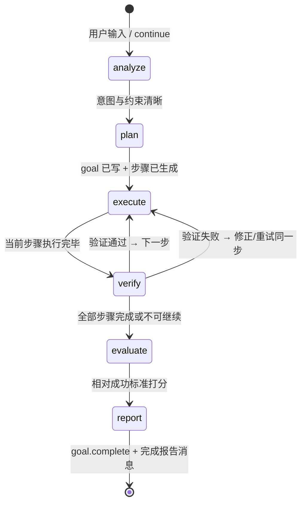
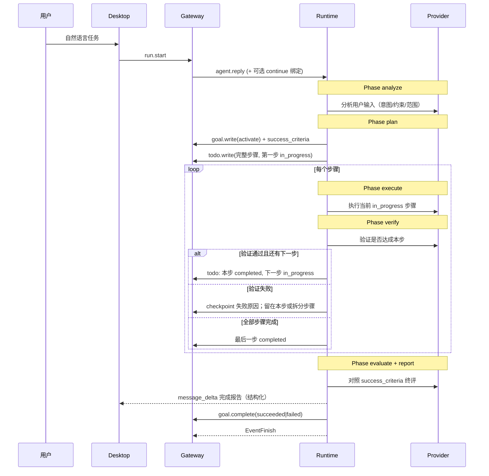
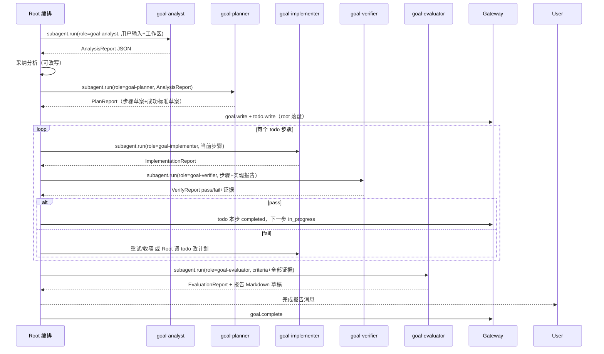
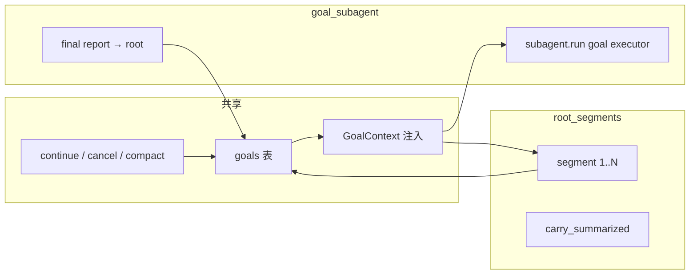
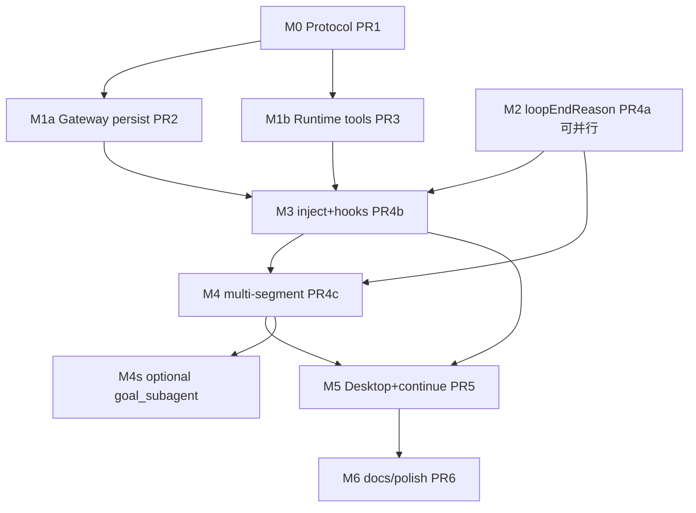

# Goal / Loop 开发设计文档

| Field | Value |
| --- | --- |
| **Title** | Goal / Loop 开发设计（实现规格） |
| **Date** | 2026-07-12 |
| **Status** | Ready for implementation |
| **Product design** | [`docs/31-goal-loop-design.md`](31-goal-loop-design.md)（权威产品与契约；评审 0 open issues） |
| **Related** | `docs/30-todo-feature-design.md`、`docs/15-memory-runtime-tools-design.md`、`docs/13-session-fork-compact-design.md` |
| **Audience** | Gateway / Runtime / Desktop 工程师 |

---

## 1. 文档目的

本文是 **实现向** 开发设计，回答「怎么拆、改哪些文件、验收什么」。  
产品语义、状态机、KD 冻结值以 **`docs/31-goal-loop-design.md` 为准**；若冲突以 31 为准，并在本文件修订记录中注明。

本开发设计额外冻结：

1. **Goal 标准流水线（Pipeline）**：分析用户输入 → 生成步骤 → 逐步执行并验证 → 终评与完成报告。  
2. **实现切片（M0–M5）** 与依赖图（可并行路径）。  
3. **与现有代码的挂载点**（函数 / 路由 / 前端组件）。  
4. **可选执行器：`goal_subagent`**（Goal 实体不变，执行路径可委派子代理）。  
5. **测试矩阵与回归门禁**。

---

## 2. Goal 标准流水线（核心业务流）

> **产品硬要求：** 绑定 Goal 的 root run **不得**跳过分析与规划直接乱执行。  
> 流水线由 Runtime **策略 + 阶段字段** 约束，步骤清单复用 **TODO**，终态用 **goal.complete + 完成报告**。

### 2.1 阶段定义



| 阶段 `pipeline_phase` | 中文 | 必须完成的产出 | 主要工具 / 动作 | 进入下一阶段的条件 |
| --- | --- | --- | --- | --- |
| `analyze` | 分析 | 意图摘要、约束、范围、风险、是否值得开 Goal | 只读工具（读文件/搜代码可选）；**禁止**大范围写操作 | `goal.write` 或判定为 trivial 不走 Goal |
| `plan` | 规划步骤 | 可执行步骤列表 + 成功标准 | `goal.write/update`（objective + success_criteria）；`todo.write` 全量步骤 | 至少 1 个 pending/in_progress 步骤；success_criteria 非空 |
| `execute` | 执行当前步 | 针对 **唯一** `in_progress` 步骤的工作产出 | workspace/shell/subagent 等；可选 `goal.checkpoint` | 认为本步做完 → 进入 verify |
| `verify` | 验证当前步 | 可核对的证据（测试结果、diff、读回确认） | 只读验证 + 必要时小修；`todo.write` 将本步 completed 或退回 execute | 通过 → 下一步 execute；失败 → 同步 re-execute；无下一步 → evaluate |
| `evaluate` | 终评 | 对照 success_criteria 的结论（达成/部分/未达成） | `goal.checkpoint`（终评摘要） | 进入 report |
| `report` | 完成报告 | 用户可见的结构化完成报告 + Goal 终态 | **先**发 message 报告；**再** `goal.complete` | Goal `succeeded` / `failed`；流水线结束 |

### 2.2 与用户输入的时序（一次 Goal 生命周期）



### 2.3 分析阶段（analyze）最低检查单

Runtime `rootAgentGoalPipelinePolicy` 要求模型在 `goal.write` **之前**至少覆盖：

1. **用户目标复述**（1–3 句，用户语言）。  
2. **范围内 / 范围外**（避免越权改无关模块）。  
3. **约束**（语言、测试、不可破坏项、权限）。  
4. **成功可观察信号**（如何证明做完，写入 `success_criteria`）。  
5. **是否 multi-step**：若 trivial 单步 Q&A → **不**创建 Goal，直接答。

分析阶段允许只读探索；**默认禁止** `workspace.write_file` / `apply_patch` / 高风险 shell（除非分析结论是「必须先探测」且 risk 已授权）。

### 2.4 规划阶段（plan）与 TODO 步骤

| 规则 | 说明 |
| --- | --- |
| 步骤载体 | **TODO 列表**（已有 `todo.write`）；v1 **不强绑** `todo.goal_id`，但 GoalContext 注入时附带「当前步骤来自 session todos」 |
| 粒度 | 每步可验证；禁止「做完全部功能」单步糊弄 |
| 顺序 | 一次仅 **一个** `in_progress`（沿用 todo 规则） |
| 与 Goal | `goal.objective` = 总体目标；`success_criteria` = 终评标准；todos = 过程步骤 |
| 持久化 | plan 结束必须已有：`goal` active + todos 非空 |

推荐首轮 `todo.write` 形态：

```json
{
  "merge": false,
  "todos": [
    {"id": "1", "content": "分析并确认改动范围", "status": "completed"},
    {"id": "2", "content": "实现核心逻辑", "status": "in_progress"},
    {"id": "3", "content": "补充/跑测试验证", "status": "pending"},
    {"id": "4", "content": "对照成功标准做终评并写报告", "status": "pending"}
  ]
}
```

> 步骤 1 可在 analyze 末标记 completed；若分析与规划同轮完成，允许合并。

### 2.5 执行 → 验证闭环（每一步）

对 **当前** `in_progress` 步骤：

```text
execute(step) → produce artifacts
       ↓
verify(step):
  - 有可检查证据？(测试输出 / 文件内容 / 命令退出码 / diff)
  - 若否 → 继续 execute 或缩小步骤
  - 若是且通过 → todo: step=completed; next=in_progress
  - 若是且失败 → checkpoint 记录原因；重试或改 plan（todo 调整）
```

**验证不得只靠模型口头说「搞定了」**；policy 要求至少一类证据（工具结果摘要写入 checkpoint 或 tool 历史）。

### 2.6 终评与完成报告（evaluate + report）

**终评**对照 `success_criteria` 逐条：`met` / `partial` / `not_met` / `blocked`。

**完成报告**（用户可见 assistant 消息，建议固定结构）：

```markdown
## 目标完成报告
**目标：** …
**结论：** 已达成 | 部分达成 | 未达成

### 对照成功标准
1. … — met/partial/not_met — 证据摘要
2. …

### 已完成步骤
- [x] …
- [ ] …（若有未完成说明原因）

### 关键变更
- 文件/行为 …

### 风险与后续
- …

### 建议
- …
```

然后调用：

```json
goal.complete({
  "status": "succeeded" | "failed",
  "summary": "一句话结论",
  "report": { "criteria": [...], "steps": [...], "risks": [...] }
})
```

Gateway 将 `report` JSON 存入 Goal（见数据模型扩展）；Desktop 可在目标条展开「查看报告」。

### 2.7 阶段字段与迁移

`goals.pipeline_phase`（string）：

`analyze` → `plan` → `execute` → `verify` → `evaluate` → `report` →（终态 Goal status，phase 可留 `report` 或清空）

| 事件 | phase 更新 |
| --- | --- |
| Goal 创建 pending | `analyze` 或创建时直接 `plan` 若已带 criteria+后续马上写 todo |
| `goal.write(activate)` 且尚无 todos | `plan` |
| 首个 todo in_progress 且非分析步 | `execute` |
| 模型/工具标记「本步待验证」 | `verify`（可由 Runtime 在策略上软约束；v1 允许 execute/verify 在同 segment 内交替） |
| 所有 todo 完成或 goal 将 complete | `evaluate` → `report` |
| `goal.complete` | Goal terminal；phase=`report` |

**跨 run continue：** 从上次 `pipeline_phase` + checkpoint + 未完成 todos 恢复；continue 提示词强制「不要重新分析整个问题，除非 checkpoint 标明范围已变」。

### 2.8 Runtime 策略注入（实现要点）

新增 `rootAgentGoalPipelinePolicy`（当 run 绑定 Goal 或工具含 `goal.write` 时注入），核心条文：

1. **先分析用户输入**，再 `goal.write`，再 `todo.write` 步骤。  
2. **禁止**在无步骤清单时进入大范围修改。  
3. 严格 **单步 in_progress**；每步结束必须 **verify** 再下一步。  
4. 全部步骤结束后必须 **evaluate + 完成报告消息 + goal.complete**。  
5. 用户 cancel / compact pause 后，continue 从 checkpoint/phase 恢复。

可选增强（M4+）：Runtime 轻量状态机拒绝「phase=analyze 时 goal.complete」等非法 RPC（Gateway 也可校验）。

### 2.9 与 multi-segment / continue 的关系

| 机制 | 在流水线中的作用 |
| --- | --- |
| Inner segment | 推进当前 phase 内的 tool 轮次 |
| Outer multi-segment | 同 run 内跨 MaxToolTurns 继续 execute/verify |
| continue | 跨 run 恢复未完成步骤，**不**重置已 completed 的 todos |
| checkpoint | 每步验证后 / 段结束时固化进度，供恢复与报告 |
| **阶段子代理** | 见 **§2.10**；root 编排，子代理只做本阶段专项 |

### 2.10 阶段预设子代理（Phase Specialists）

> **原则：** 流水线阶段由 **root 编排**；每个阶段可拉起 **预设角色子代理** 做专项工作。  
> 子代理 **禁止** `goal.*` / `todo.*` / 嵌套 `subagent.*`（与现网 denylist 一致）。  
> 写 Goal/TODO、发完成报告、`goal.complete` **永远在 root**。

#### 2.10.1 预设角色一览

| ID `specialist_id` | 中文名 | 主责阶段 | 工具权限画像 | 默认 `max_turns` 策略 |
| --- | --- | --- | --- | --- |
| `goal-analyst` | 目标分析师 | `analyze` | **只读**：list/read/grep/diff/stats/web.* | 小：8；有 stats 后 `file_count+summary` 封顶 24 |
| `goal-planner` | 目标规划师 | `plan` | **只读**（可再读分析产物）；不写盘 | 固定 8 |
| `goal-implementer` | 目标实施者 | `execute` | **读写**：workspace.* / shell（受权限）/ 无 web 默认 | `file_count+summary` 或步骤预算，硬顶 48 |
| `goal-verifier` | 目标验证者 | `verify` | **只读 + 验证向 shell**（test/build）；默认禁止写源码 | 固定 12 |
| `goal-evaluator` | 目标终评官 | `evaluate`→报告草稿 | **只读**；综合证据 | 固定 8 |

可选（不强制 v1）：

| ID | 场景 |
| --- | --- |
| `goal-researcher` | execute 前需要深挖未知代码时，只读调研，产出给 implementer |
| `goal-fixer` | verify 失败后的小范围修复（写权限收窄到失败相关路径）— v1.1 |

#### 2.10.2 与流水线协作



**Root 仍可自做 trivial 阶段**（单文件小改可不 spawn）；policy：**多步 Goal 默认走预设子代理**。

#### 2.10.3 调用约定（`subagent.run`）

扩展/约定参数（实现可用 `name` + `task` 前缀，无需新 RPC）：

| 字段 | 约定 |
| --- | --- |
| `name` | **必须**为上表 `specialist_id`（如 `goal-analyst`），便于 UI/事件识别 |
| `task` | 结构化任务包（见下各角色 Input） |
| `path` / `file_count` | analyst/implementer 按现网 stats 公式预算 |
| `max_turns` | 未传则用角色默认 |

Runtime 识别 `name` 前缀 `goal-` 时应用 **角色预设**（工具 allow/deny、系统提示、输出 schema 提示）。

#### 2.10.4 各角色 Input / Output 契约

**公共 Header（Root 填入 task 前缀）：**

```text
[goal_id] …
[pipeline_phase] analyze|plan|execute|verify|evaluate
[objective] …
[success_criteria] …   # plan 之后必有
[user_request] 原始用户输入
[analysis_summary] …   # plan 及之后
[current_step] …       # execute/verify
[constraints] …
```

---

##### A. `goal-analyst`（分析）

**系统角色摘要：** 只理解问题与代码现状，不改仓库，不编造未读文件。

**Input：** 用户原文、工作区根、可选已有 conversation 摘要。

**Output（最终消息，建议 JSON 围栏）：**

```json
{
  "intent": "用户要什么",
  "in_scope": ["..."],
  "out_of_scope": ["..."],
  "constraints": ["..."],
  "success_signals": ["可观察的完成信号"],
  "risks": ["..."],
  "suggested_approach": "一句话路线",
  "trivial": false,
  "key_paths": ["相关路径"]
}
```

**Root 后续：** `analysis_summary` ← 序列化；`trivial=true` → 可不建 Goal，root 直接答。

---

##### B. `goal-planner`（规划）

**系统角色摘要：** 把分析转为可验证步骤与成功标准；步骤粒度适中；不写盘。

**Input：** AnalysisReport + 用户原文。

**Output：**

```json
{
  "title": "短标题",
  "objective": "…",
  "success_criteria": "可逐条核对的标准（多行）",
  "steps": [
    {"id": "1", "content": "…", "verify_hint": "如何验证本步"}
  ],
  "notes": "可选"
}
```

**Root 后续：** `goal.write(activate)` + `todo.write(steps)`；可编辑后落盘（root 对方案负责）。

---

##### C. `goal-implementer`（执行）

**系统角色摘要：** 只做 **当前一步**；最小改动；结束时列改动与自检。

**Input：** objective、current_step、verify_hint、相关 analysis、可选前序失败反馈。

**Output：**

```json
{
  "step_id": "2",
  "done_claim": true,
  "changes": [{"path": "…", "summary": "…"}],
  "commands_run": ["…"],
  "blockers": [],
  "notes_for_verifier": "建议如何验证"
}
```

---

##### D. `goal-verifier`（验证）

**系统角色摘要：** 怀疑 implementer；用读文件/跑测试找证据；**默认不改业务代码**（可跑 test）。

**Input：** current_step、success 片段、ImplementationReport、仓库状态。

**Output：**

```json
{
  "step_id": "2",
  "passed": true,
  "evidence": [{"kind": "test|read|command", "detail": "…"}],
  "failures": [],
  "retry_suggestion": "失败时给 implementer 的精确建议"
}
```

**Root 后续：** `passed` → todo complete + 下一步；否则 checkpoint + 再派 implementer（或 planner 改步骤）。

---

##### E. `goal-evaluator`（终评 + 报告草稿）

**系统角色摘要：** 对照 **完整** success_criteria 与全部步骤证据；起草用户可见完成报告；不写盘。

**Input：** objective、success_criteria、全部 VerifyReport 摘要、checkpoint、todos 终态。

**Output：**

```json
{
  "verdict": "succeeded|partial|failed",
  "criteria": [{"item": "…", "result": "met|partial|not_met|blocked", "evidence": "…"}],
  "steps_summary": [{"id": "1", "status": "completed", "note": "…"}],
  "risks": ["…"],
  "followups": ["…"],
  "report_markdown": "## 目标完成报告\n…"
}
```

**Root 后续：** 发出 `report_markdown`（可润色）→ `goal.complete(status, summary, report)`。  
`partial` 时 root 默认 `failed` 或 `succeeded` 策略：**v1 冻结** — `succeeded` 仅当 verdict=`succeeded` 且关键 criteria 无 `not_met`；否则 `failed`（报告中说明 partial）。

#### 2.10.5 工具策略矩阵（Runtime 预设）

| specialist | allow（示意） | deny（额外） |
| --- | --- | --- |
| analyst | workspace.list/read/grep/diff_file/stats, web.search/fetch | write/edit/apply_patch/shell 写、skill.run、subagent.*、goal.*、todo.* |
| planner | 同 analyst（只读） | 同 analyst |
| implementer | workspace.*、shell.exec | web.*（默认）、subagent.*、goal.*、todo.*、skill.run |
| verifier | read/list/grep/diff/stats、shell.exec（test/build） | write/edit/apply_patch（v1）、subagent.*、goal.*、todo.* |
| evaluator | 只读 workspace + 无 shell 默认 | 一切写、shell、subagent、goal、todo |

具体名单实现时落在 `goal_specialists.go` 常量表，并单测 denylist。

#### 2.10.6 Desktop / 事件展示

- `subagent_update` 的 `name` 为 `goal-analyst` 等时，中文映射：  
  `目标分析师` / `目标规划师` / `目标实施者` / `目标验证者` / `目标终评官`  
- 目标条 phase 旁可显示「当前专家：…」  
- Activity kind 仍走 subagent，标签可带「目标/分析」前缀

#### 2.10.7 实现切片

| 项 | 里程碑 |
| --- | --- |
| 角色表 + 系统提示 + allowlist | **Gateway 智能体管理已落地**（`docs/33-agent-management.md` + `/api/v1/agents`）；Runtime 套用见 M4 |
| `goal_specialists.go` + 读 Gateway 定义 | M4 |
| Root pipeline policy 引用五角色 | M1b 文案；M4 行为验收 |
| Desktop 中文名 | M5 |
| goal-fixer / researcher | post-MVP |

#### 2.10.8 与「单一 goal_subagent」关系

| 模式 | 说明 |
| --- | --- |
| **阶段预设（推荐）** | 五角色分阶段，验证独立，更符合流水线 |
| 单一 `goal-executor` | 仅当 trivial multi-step 想省 spawn；**不**替代 analyst/planner/verifier |

v1 默认：**多步 Goal 使用 §2.10 五角色**；root 禁止把「分析+实现+验证」塞进一个 implementer。

---

## 3. 范围与交付边界

### 3.1 要交付

| 层 | 交付 |
| --- | --- |
| Protocol | `goal.tool.execute`、`GoalContext`（含 phase）、`goal_updated`；complete 携带 report |
| Gateway | `goals` 表（含 `pipeline_phase`、`report_json`）、GoalService、RPC/HTTP、hooks、continue |
| Runtime | 流水线 policy、**五阶段预设子代理**、goal/todo 协作、loop 重构、multi-segment |
| Desktop | 目标条 phase/步骤/当前专家、完成报告、继续/取消 |

### 3.2 不交付（本开发切片）

- 跨会话看板、向量检索、HTTP 通用创建表单（v1 tool-only create）。  
- 子代理独立写 Goal（denylist）。  
- 将 subagent 内部 turns 计入 `used_tool_turns`。  
- 默认 `auto_continue=true`。  
- 默认把 active Goal 绑到每一次 `run.start`。  
- 完全自动的「无需模型」硬状态机逐步推进（v1 以 policy + 工具约定为主，Gateway 做关键非法迁移校验）。

---

## 4. 总体架构（实现视图）

```text
┌──────────── Desktop ────────────┐
│ GoalComposerStrip（TODO 条上方） │
│ hydrate GET + WS goal_updated   │
│ 继续 → POST .../continue        │
└───────────────┬─────────────────┘
                │ HTTP / WS
┌───────────────▼─────────────────┐
│ Gateway                         │
│  GoalService（SQLite SoT）      │
│  goal.tool.execute（onRequest） │
│  Start bind / Cancel / Compact  │
│  OnRootRunTerminal 状态机       │
└───────────────┬─────────────────┘
                │ IPC JSON-RPC
┌───────────────▼─────────────────┐
│ Agent Runtime                   │
│  goal.* tools → goal.tool.exec  │
│  GoalContext + rootAgentGoalPolicy
│  runProviderLoopSegment         │
│  runWithGoalLoop（多段）        │
│  Phase specialists:             │
│    goal-analyst / planner /     │
│    implementer / verifier /     │
│    evaluator                    │
└─────────────────────────────────┘
```

### 4.1 执行策略（`execution_mode`）

| 模式 | 说明 | 默认 |
| --- | --- | --- |
| `root_segments` + **阶段预设子代理** | root 编排流水线；analyze/plan/execute/verify/evaluate 默认委派 §2.10 五角色；segment 管预算 | **v1 默认** |
| `root_inline` | root 自做各阶段（trivial） | 允许 |
| 单一 `goal-executor` | 一包到底 | **非默认**；不替代 verifier |

两种模式 **共享同一 Goal 实体与 Gateway 状态机**；差别只在 Runtime 如何消耗预算与产出进度。



---

## 4. 镜像现有模式（强制对齐）

实现必须 **抄** TODO/Memory 路径，禁止另起一套 RPC 风格。

| 能力 | 现有锚点 | Goal 对应 |
| --- | --- | --- |
| Runtime → Gateway 工具 | `methods.TodoToolExecute` / `MemoryToolExecute` | `methods.GoalToolExecute` |
| Gateway 分发 | `app.go` `onRequest` switch | 增加 `GoalToolExecute` case |
| Service | `TodoService.ExecuteRuntimeTool` | `GoalService.ExecuteRuntimeTool` |
| Context 注入 | `RunService` → `FormatTodoContext`；`provider.openAICompatibleMessages` | `FormatGoalContext`；Memory 与 Todo 之间 |
| Mid-loop 刷新 | `runProviderLoop` 内 `todoContextForRun` | `goalContextForRun` |
| 事件 | `EventTodoUpdated` | `EventGoalUpdated` |
| Desktop strip | `TodoComposerStrip.jsx` + `sessionRuntime.todos*` | `GoalComposerStrip` + `goal*` 字段 |
| 子代理隔离 | denylist `todo.*`；`TodoContext=nil` | denylist `goal.*`；`GoalContext=nil` |

---

## 5. 数据模型（实现规格）

### 5.1 新表 `goals`

在 31 文档字段基础上，流水线 **必加**：

| Column | Type | Notes |
| --- | --- | --- |
| `pipeline_phase` | string | `analyze` \| `plan` \| `execute` \| `verify` \| `evaluate` \| `report` |
| `analysis_summary` | string | 分析阶段产出（≤4_000）；continue 时注入 |
| `report_json` | string | `goal.complete` 时结构化报告 JSON |
| `report_markdown` | string | 可选：完成报告原文（≤16_000） |

其余字段与 31 一致（objective、success_criteria、budgets、checkpoint…）。

GORM 路径：

- `modules/gateway/internal/gateway/model/models.go` → `type Goal struct`
- `modules/gateway/internal/gateway/infra/database/migrate.go`
- `modules/gateway/internal/gateway/repository/goal.go`

**服务层强制：**

- 每 session ≤ 1 行 `status=active`。  
- 每 session ≤ 20 行。  
- 删 session 级联删 goals。  
- `goal.complete` **要求**非空 `summary`；**建议** `report` 对象（缺省时 Gateway 用 checkpoint + todos 合成最小报告）。

### 5.2 扩展 `run_records`

```text
goal_id  string  nullable  index
```

写入时机：

1. `RunService.Start` 在 `goal_id` / `continue_goal` 绑定成功后。  
2. run 内 `goal.write|update(activate=true)` 成功后，GoalService 更新 **当前** `active_run_id` 对应 run 的 `goal_id`。

### 5.3 索引建议

```text
idx_goals_session_status (session_id, status)
idx_goals_active_run (active_run_id)
idx_run_records_goal (goal_id)
```

---

## 6. 协议与接口

### 6.1 Protocol 新增（PR1）

**文件：** `modules/protocol/methods/methods.go`、`modules/protocol/events/events.go`

```go
// methods
const GoalToolExecute = "goal.tool.execute"

type GoalContext struct {
    GoalID            string `json:"goal_id"`
    Title             string `json:"title,omitempty"`
    Objective         string `json:"objective"`
    SuccessCriteria   string `json:"success_criteria,omitempty"`
    Status            string `json:"status"`
    PipelinePhase     string `json:"pipeline_phase,omitempty"` // analyze|plan|execute|verify|evaluate|report
    AnalysisSummary   string `json:"analysis_summary,omitempty"`
    CheckpointSummary string `json:"checkpoint_summary,omitempty"`
    ProgressNote      string `json:"progress_note,omitempty"`
    // Current step hint from open todos (optional convenience)
    CurrentStep       string `json:"current_step,omitempty"`
    // Budget snapshot for model (root-loop turns only)
    UsedToolTurns     int    `json:"used_tool_turns"`
    MaxTotalToolTurns int    `json:"max_total_tool_turns"`
    UsedSegments      int    `json:"used_segments"`
    MaxSegmentsPerRun int    `json:"max_segments_per_run"`
    Context           string `json:"context"` // preformatted system block, ≤ goalContextLimit
}

type GoalToolExecuteParams struct {
    RunID      string          `json:"run_id"`
    SessionID  string          `json:"session_id"`
    ToolCallID string          `json:"tool_call_id"`
    ToolName   string          `json:"tool_name"`
    Arguments  json.RawMessage `json:"arguments,omitempty"`
}

type GoalToolExecuteResult struct {
    OK     bool            `json:"ok"`
    Goal   json.RawMessage `json:"goal,omitempty"`
    Goals  json.RawMessage `json:"goals,omitempty"` // list
    Error  string          `json:"error,omitempty"`
}

// events
const EventGoalUpdated EventType = "goal_updated"
```

`ReplyOptions` 增加：

```go
GoalContext   *GoalContext `json:"goal_context,omitempty"`
GoalsEnabled  *bool        `json:"goals_enabled,omitempty"` // nil = true
// optional later:
// GoalExecutionMode string `json:"goal_execution_mode,omitempty"` // root_segments | goal_subagent
```

`run.start` / `ReplyParams` 侧绑定选项（Gateway 解析，写入 run + Goal）：

| 字段 | 行为 |
| --- | --- |
| `goal_id` | 激活 `pending` 或续跑 `paused` → `active`，写 `run.goal_id` |
| `continue_goal` | 绑定最近 paused（无则 pending）；**不要**静默绑 active |
| **禁止** `create_goal` | v1 不提供 |

### 6.2 Gateway HTTP（PR2 / PR5）

| Method | Path | 说明 |
| --- | --- | --- |
| GET | `/api/v1/sessions/:id/goals` | 列表 + 当前焦点 goal |
| GET | `/api/v1/sessions/:id/goals/:goalId` | 详情 |
| POST | `/api/v1/sessions/:id/goals/:goalId/cancel` | 用户取消目标 → `cancelled`；若有 active run 先 pause/cancel run |
| POST | `/api/v1/sessions/:id/goals/:goalId/continue` | **PR5**：构造 `run.start` 等价调用，返回 `run_id` |

**Continue 请求体（建议）：**

```json
{
  "input": { "text": "（可选）用户补充说明" },
  "options": {
    "provider_profile_id": "...",
    "goal_id": "<same>",
    "continue_goal": true
  }
}
```

Continue 系统可见 user 模板（审计，见 KD 31）由 Gateway 拼到 input 前缀，例如：

```text
[继续目标] <title>
检查点：...
成功标准：...
用户补充：...
```

### 6.3 Runtime 工具面

| Tool | Provider 可见 | 说明 |
| --- | --- | --- |
| `goal.write` | yes | insert-only；`activate` 可选 |
| `goal.update` | yes | 更新字段 / cancel |
| `goal.checkpoint` | yes | 进度 |
| `goal.complete` | yes | succeeded / failed |
| `goal.list` | yes | 不 emit `goal_updated` |
| `segment_end` | **no** | 内部 action only |

---

## 7. Runtime 核心改动

### 7.1 M2 前置：loop 出口契约（PR4a，可独立）

**文件：** `modules/agent/internal/runtime/runtime.go`

| 现状 | 目标 |
| --- | --- |
| `runProviderLoop` 返回 `"completed"\|"cancelled"\|"failed"` | 返回结构化 `loopEndReason` |
| 各出口 `clearRunTodos` | **仅** root terminal（`emitRun` 末尾）清理 todos/goals snapshot |
| max_turns 后仍常标 completed | `loopEndReasonMaxTurns` 与 `NoTools` 分离 |
| 可能多处 emit finish | 全 outer 结束后 **一次** `EventFinish` / `EventError` |

```go
type loopEndReason string

const (
    loopEndNoTools   loopEndReason = "no_tools"
    loopEndMaxTurns  loopEndReason = "max_turns"
    loopEndCancelled loopEndReason = "cancelled"
    loopEndFailed    loopEndReason = "failed"
    loopEndGoalDone  loopEndReason = "goal_terminal" // complete 后短路
)

// runProviderLoopSegment: 单段；禁止 clearRun*；禁止 EventFinish
func (r *Runtime) runProviderLoopSegment(...) (loopEndReason, int /*deltaTurns*/, error)
```

**验收：** 无 Goal 时对外行为与现网一致（golden：cancel / fail / max_turns recovered 文本）。

### 7.2 Outer loop（PR4c）

伪代码（与 31 一致，含 mid-run activate）：

```go
func (r *Runtime) runWithGoalLoop(ctx, params) status {
    bound := params has goal bind || snapshot active for run
    maxSeg := 1
    if bound { maxSeg = goal.MaxSegmentsPerRun } // default 4

    var seedHistory []ToolExchange
    for seg := 0; seg < maxSeg; seg++ {
        if ctx.Done() { return cancelled }
        // refresh GoalContext each segment
        reason, turns, err := r.runProviderLoopSegment(ctx, params, seedHistory, ...)
        r.reportSegmentEnd(params, turns) // internal goal.tool.execute segment_end
        if reason == loopEndGoalDone || goalTerminal(snapshot) {
            break
        }
        if reason == loopEndCancelled || reason == loopEndFailed {
            break
        }
        // mid-run activate may set bound mid-first-segment
        if !bound {
            bound = r.goalBoundToThisRun(params.RunID)
            if bound { maxSeg = max(maxSeg, goal.MaxSegmentsPerRun) }
        }
        if !bound {
            break // single segment only
        }
        if budgetTotalExhausted(...) {
            // Gateway will mark failed+budget_exhausted
            break
        }
        if reason == loopEndNoTools || reason == loopEndMaxTurns {
            if seg+1 >= maxSeg { break } // → awaiting_continue via Gateway
            seedHistory = carrySummarized(seedHistory, K=6, 500)
            injectContinuationHint(params) // 系统续写提示，不标记 succeeded
            continue
        }
        break
    }
    // single EventFinish + clear snapshots
}
```

**段间 history：** 仅 `carry_summarized`（规则截断，无 LLM）。

### 7.3 可选：`goal_subagent` 执行器（M4）

**动机：** 复用 process-pool / `subagent.run`，降低 root multi-segment 复杂度；适合「大块执行」类目标。

**规则：**

1. Goal 实体与 Gateway 状态机 **不变**。  
2. Root 在 bound 后调用内部路径（或模型调 `subagent.run` 但由 policy 引导）：  
   - name 固定前缀如 `goal-executor`  
   - 注入 **只读** GoalContext 文本到 child `MemoryContext`/`Input`（子进程 **无** `goal.*` 工具）  
   - child `MaxToolTurns` 使用独立配置（如 `goal_subagent_max_turns`，默认 24，硬顶 48）  
3. Child 结束后 root **必须** 再决策：`goal.checkpoint` / `goal.complete` / 或保持 active 等待用户 continue。  
4. **预算：** 子代理 turns **不**计入 `used_tool_turns`；该 run 对 Goal 计 **1 个 segment**（或 1 root turn + wall time）；与 KD 22 一致。  
5. Cancel run → 取消 root 与子代理；Goal pause `user_cancel` 仍由 Gateway Cancel hook 负责。

**不推荐：** 用「普通 subagent」冒充产品 Goal（无状态机 / 无目标条 / 无 continue）。

---

## 8. Gateway 核心改动

### 8.1 GoalService 职责

**文件建议：** `modules/gateway/internal/gateway/service/goal.go`

| 方法 | 用途 |
| --- | --- |
| `ExecuteRuntimeTool` | write/update/checkpoint/complete/list/segment_end |
| `FormatGoalContext` | Start 注入 |
| `BindToRun(sessionID, runID, goalID\|continue)` | Start 绑定 |
| `PauseByRun(runID, reason)` | Cancel 路径 |
| `PauseBySession(sessionID, reason)` | Compact 路径 |
| `OnRootRunTerminal(run, finishStatus)` | awaiting_continue / failed / 保持 terminal |
| `CancelGoal(sessionID, goalID)` | HTTP cancel |
| `ContinueGoal(...)` | PR5 → Start |
| `CopyForFork` / `OnFork` | active → paused + `fork` |
| `RepairStaleActive` | Start/hydrate |

### 8.2 挂载点

| 挂载 | 文件 | 改动 |
| --- | --- | --- |
| RPC | `app.go` onRequest | `case methods.GoalToolExecute` |
| Start | `service/run.go` `Start` | `RepairStaleActive`；可选 bind；`applyGoalContext`；`goals_enabled` → denylist |
| Cancel | `RunService.Cancel` | **先** `PauseByRun(..., user_cancel)` **再** runtime.Cancel |
| Compact | `session.go` `pauseSessionForCompact` | **`PauseBySession(..., session_compact)`**（覆盖 force-finish 无 event） |
| Finish | `HandleRuntimeEvent` ProjectEvent 后 | `OnRootRunTerminal`；幂等 |
| Routes | `app.go` | goals REST |
| Set | `service/set.go` | `Goal GoalService` |
| Fork | `SessionService.Fork` | 复制 goals，active→paused |

### 8.3 状态迁移（实现检查表）

| 触发 | from | to | reason 字段 |
| --- | --- | --- | --- |
| write activate | pending | active | — |
| natural run end, still active | active | paused | `awaiting_continue` |
| user cancel run | active | paused | `user_cancel` |
| compact | active | paused | `session_compact` |
| cancel goal HTTP/tool | active/pending/paused | cancelled | — |
| complete success | active | succeeded | — |
| complete fail / total budget | active | failed | `budget_exhausted` 等 |
| stale active_run | active | paused | `stale_run` |
| fork copy | active | paused (on target) | `fork` |

**竞态：** cancel-goal vs complete → **cancel 优先**（WHERE status 可迁移的 CAS）。

---

## 9. Desktop 开发规格

### 9.1 状态字段

扩展 `modules/desktop/frontend/src/lib/sessionRuntime.js`：

```js
goal: null,           // 焦点 goal DTO
goals: [],            // 可选列表
goalHydrated: false,
goalExpanded: false,
goalBusy: false,      // continue/cancel 中
```

### 9.2 组件

| 组件 | 位置 | 行为 |
| --- | --- | --- |
| `GoalComposerStrip.jsx` | TODO 条 **上方** | 标题、状态中文、预算 chips、继续/取消 |
| `App.jsx` | hydrate + WS | 与 todos 并行 hydrate；`goal_updated` 合并 |
| `activityEvents.js` | kind `goal` | 标签 **目标** |
| `displayLabels.js` | 状态文案 | `进行中` / `等待继续` / `已完成` / `已失败` / `已取消` |

### 9.3 交互

| 操作 | 条件 | API |
| --- | --- | --- |
| 继续 | `paused` + `awaiting_continue`（或 paused 可续） | `POST .../continue` |
| 取消目标 | 非 terminal | `POST .../cancel` |
| 发送消息 | `compacting` 或 `goalBusy` 时禁用 | 现有 sendTask |
| 创建目标 | v1 **无** UI 表单 | 仅 agent `goal.write` |

中文文案与 TODO 条风格一致（见 `TodoComposerStrip`）。

---

## 10. 开发切片（里程碑）



| 里程碑 | 对应 PR | 可合并标准 |
| --- | --- | --- |
| **M0** | PR1 | 协议编译；agent/gateway 依赖可引用类型 |
| **M1a** | PR2 | DB migrate；RPC list/write；唯一 active；cancel goal API；**无** continue Start |
| **M1b** | PR3 | Runtime tools + mock；pipeline policy；**五角色提示词草稿**；denylist |
| **M2** | PR4a | 无 Goal 回归全绿；segment API 不 finish |
| **M3** | PR4b | Start 注入/bind；hooks；phase 字段 |
| **M4** | PR4c | multi-segment + **goal_specialists 预设** + 流水线 E2E（分析师→规划师→实施→验证→终评→报告） |
| **M5** | PR5 | 目标条 + 专家中文名 + 报告 + continue |
| **M4s** | 可选 post-MVP | goal-researcher / goal-fixer |
| **M6** | PR6 | 文档交叉链接、补测 |

**并行建议：** M0 后同时开 M1a、M1b、M2；M3 等三者齐；M4 仅依赖 M2+M3。

---

## 11. 文件清单（按层）

### 11.1 Protocol

- `modules/protocol/methods/methods.go`
- `modules/protocol/events/events.go`

### 11.2 Gateway

- `model/models.go` — `Goal`、`RunRecord.GoalID`
- `infra/database/migrate.go`
- `repository/goal.go`（+ test）
- `repository/run_record.go` — goal_id 字段读写
- `service/goal.go`（+ `goal_test.go`）
- `service/run.go` — Start/Cancel/HandleRuntimeEvent
- `service/session.go` — compact pause + fork
- `service/set.go`
- `app/app.go` — routes + onRequest
- `controller/goal.go`（或 session 下）

### 11.3 Runtime

- `internal/runtime/runtime.go` — segment + outer + clear 时机
- `internal/runtime/provider.go` — tools + policy + message order
- `internal/runtime/tools.go` / goal handlers（可新建 `goal_tools.go`）
- `internal/runtime/subagent_tools.go` — denylist + GoalContext nil；识别 `goal-*` name 套预设
- `internal/runtime/goal_specialists.go` — 五角色系统提示、allow/deny、默认 turns
- `internal/runtime/goal_specialists_test.go`
- `internal/runtime/*_test.go`

### 11.4 Desktop

- `frontend/src/lib/sessionRuntime.js`
- `frontend/src/lib/goals.js` + `goals.test.js`
- `frontend/src/components/chat/GoalComposerStrip.jsx`
- `frontend/src/App.jsx`
- `frontend/src/lib/activityEvents.js` / `displayLabels.js`
- `frontend/src/styles/app.css`
- 可选 Playwright：`tests/goal-*.spec.js`

---

## 12. 默认配置与硬顶

| 参数 | 默认 | 硬顶 | 备注 |
| --- | --- | --- | --- |
| `max_segments_per_run` | 4 | 16 | 段 cap → paused awaiting_continue |
| `max_tool_turns_per_segment` | 12 | 48 | 与现网 MaxToolTurns 对齐 |
| `max_total_tool_turns` | 96 | 256 | **root-loop only** |
| `max_wall_time_sec` | 1800 | 7200 | subagent 成本后盾 |
| `max_auto_continues` | 0 | 3 | 默认 off |
| `goalContextLimit` | 2000 runes | — | FormatGoalContext |
| `carry_summarized K` | 6 | — | 每 output ≤500 runes |
| `goals_enabled` | true | — | Gateway settings |
| `execution_mode` | `root_segments` | — | 可选 `goal_subagent` |

---

## 13. 测试矩阵

### 13.1 Gateway unit

| 用例 | 期望 |
| --- | --- |
| write 第二 active | error |
| insert 第 21 个 | error |
| cancel vs complete 竞态 | cancel 赢 |
| PauseByRun 幂等 | 二次 no-op |
| compact pause 后 force-finish | goal 已 paused session_compact |
| OnRootRunTerminal active | paused awaiting_continue |
| total budget | failed budget_exhausted |
| segment_end 累加 turns | 不用 tool_count |
| fork | 目标 active→paused fork |
| stale active_run | Start 修复为 paused |

### 13.2 Runtime unit

| 用例 | 期望 |
| --- | --- |
| 无 Goal golden | 与重构前一致 |
| max_turns reason | ≠ no_tools |
| 段间不 clear todos | snapshot 保留 |
| mid-run activate | 同 run 可第 2 段 |
| text-only 不 complete | ≤N 段后停，goal 非 succeeded |
| child denylist goal.* | 无工具 |
| **goal-analyst 只读** | allowlist 拒绝 write |
| **goal-verifier 默认不写源码** | deny apply_patch/write |
| **五角色 name 预设加载** | name=goal-planner 注入 planner system 提示 |
| **流水线委派顺序** | 集成：analyst→planner→implementer→verifier→evaluator |
| **终评+报告+complete** | root 在 evaluator 后 complete |

### 13.3 集成 / Desktop

| 用例 | 期望 |
| --- | --- |
| hydrate goals | strip 显示 |
| goal_updated WS | 状态刷新 |
| 继续 | 新 run_id，绑定同一 goal |
| 摘要中 compact | goal pause + 可 continue |
| 多会话 | 仅本 session 目标条变化 |

### 13.4 回归门禁（每 PR）

```text
go test ./modules/protocol/...
go test ./modules/agent/internal/runtime/ -count=1
go test ./modules/gateway/internal/gateway/... -count=1
# Desktop（有 UI 变更时）
cd modules/desktop/frontend && npm test -- --run  # 或项目既有脚本
```

---

## 14. 风险与缓解（实现）

| 风险 | 级别 | 缓解 |
| --- | --- | --- |
| 未先合 PR4a 就做多段 | Critical | M2 门禁；CI golden 无 Goal |
| max_turns 当成功 | High | loopEndReason + 决策表测试 |
| finish 丢绑定 | High | run.goal_id + last_run_id |
| compact 无 event 丢 pause | High | PauseBySession 权威 |
| 默认 bind 劫持短问答 | High | 禁止；仅显式 bind |
| goal_subagent 成本爆炸 | Medium | wall time + 子 turns 硬顶 48 |
| 上下文膨胀 | Medium | carry_summarized + context limit |

---

## 15. 实现顺序（工程师 checklist）

1. [ ] **M0** 协议类型 + 事件常量（含 `pipeline_phase` / report）  
2. [ ] **M2** `runProviderLoopSegment`（可与 M0 并行，优先合入）  
3. [ ] **M1a** goals 表 + GoalService + RPC + cancel HTTP + phase 存储  
4. [ ] **M1b** Runtime `goal.*` + **pipeline policy** + denylist + mock 测  
5. [ ] **M3** Start 注入、Cancel/Compact/Finish/Fork hooks  
6. [ ] **M4** multi-segment + **端到端流水线验收**（分析→步骤→执行验证→报告）  
7. [ ] **M5** Desktop phase/步骤/报告 + continue  
8. [ ] **M4** 内落地 `goal_specialists.go` 五角色  
9. [ ] **M5** Desktop 专家中文名  
10. [ ] **M6** 交叉链接与补测  

---

## 16. 与 31 产品设计的关系

| 文档 | 角色 |
| --- | --- |
| `docs/31-goal-loop-design.md` | 产品语义、KD、状态机、协议字段、安全默认、评审结论 |
| **本文 `docs/32-goal-loop-development-design.md`** | 里程碑、挂载点、文件清单、测试、可选 goal 子代理执行器 |

实现争议：先改 **31 的 KD**，再同步本文。

---

## 17. Open 实现选择（已冻结默认）

| 项 | 默认 | 备注 |
| --- | --- | --- |
| 执行器 | `root_segments` | `goal_subagent` 为增强 |
| 创建面 | Runtime tool only | 无 Desktop 表单 |
| 续跑 | 手动 continue | auto_continue=0 |
| 预算单位 | root loop turns | 禁止 tool_count 对账 |

---

## 18. 实现进度（代码）

| 里程碑 | 状态 | 说明 |
| --- | --- | --- |
| M0 Protocol | **done** | `GoalToolExecute` / `GoalContext` / `GoalDTO` / `EventGoalUpdated` |
| M1a Gateway | **done** | `goals` 表、GoalService RPC/HTTP list/get/cancel、Bind/Pause/Finish hooks、segment_end 预算 |
| M1b Runtime | **done** | `goal.*` 工具、Gateway 回调、pipeline policy、GoalContext 注入、subagent denylist |
| 智能体管理 | **done** | `docs/33` + `/api/v1/agents` + Desktop 设置页 |
| M2 loopEndReason | **done** | `runProviderLoopSegment` + `loopEndReason`；clear 仅 root terminal；finish 带 `loop_end_reason` |
| M3 multi-segment | **done** | `runWithGoalLoop`；bound 多段 + mid-run activate；`segment_end` 上报；`carry_summarized` |
| M4 阶段子代理 | **done** | `goal_specialists.go` 五角色 allow/deny + 系统提示；`subagent.run` name=goal-* 自动套用；root policy 强制阶段委派 |
| M5 Desktop + continue | **done** | `POST .../goals/:id/continue`；`GoalComposerStrip`；hydrate + `goal_updated`；继续/取消 |

## 19. 修订记录

| Date | Change |
| --- | --- |
| 2026-07-12 | 初版：基于 31 评审定稿 + Goal 子代理可选执行器 + 里程碑/文件/测试规格 |
| 2026-07-12 | **§2 Goal 标准流水线**：分析用户输入 → 生成步骤 → 逐步执行验证 → 终评与完成报告；phase 字段与报告结构 |
| 2026-07-12 | **§2.10 阶段预设子代理**：goal-analyst / planner / implementer / verifier / evaluator；I/O 契约与工具矩阵 |
| 2026-07-12 | **代码开工**：M0 + M1a + M1b 落地；gateway/agent 单测通过 |
| 2026-07-12 | **M2**：`runProviderLoopSegment` / `loopEndReason` / `carrySummarizedHistory`；段内不清 snapshot |
| 2026-07-12 | **M3**：`runWithGoalLoop` 多段外环、segment_end、goal 快照、mid-run activate |
| 2026-07-12 | **M4**：五阶段预设子代理（analyst/planner/implementer/verifier/evaluator）工具策略与 policy |
| 2026-07-12 | **M5**：continue API + Desktop 目标条 + goal_updated 投影 |
