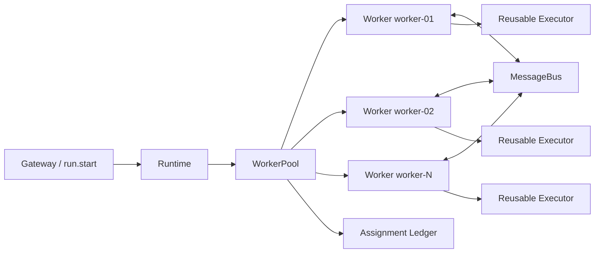
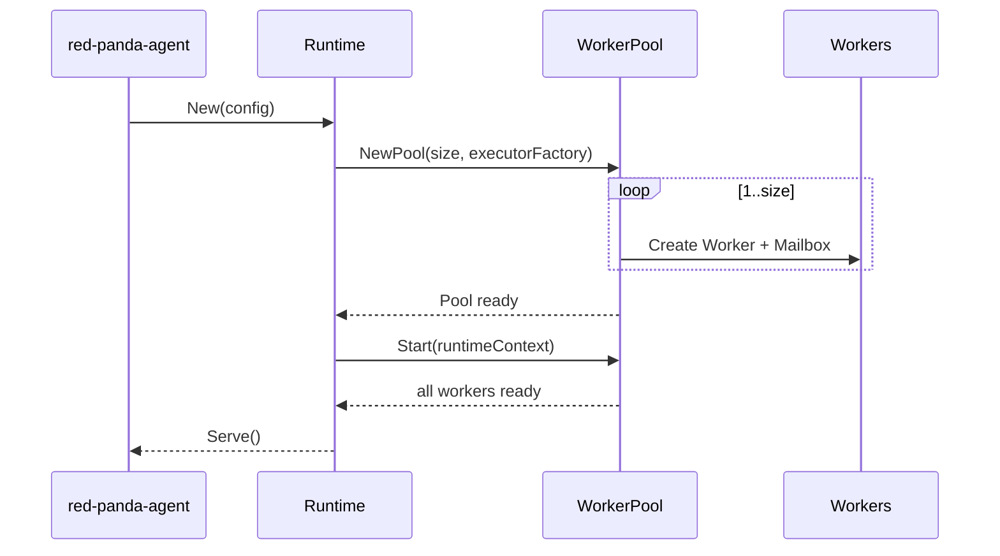

# v0.2.0 Worker Pool 重构设计

| 字段 | 值 |
| --- | --- |
| 目标版本 | `0.2.0` |
| 状态 | Proposed |
| 变更性质 | Breaking change，不提供 v0.1 子代理协议兼容层 |
| 日期 | 2026-07-13 |
| 替代范围 | `docs/04-agent-runtime-design.md` 的子代理模型、`docs/33-agent-management.md` 的 Agent 命名 |

## 1. 结论

v0.2.0 删除“主代理 / 子代理”领域模型，统一为对等的 `Worker`。Runtime 初始化时创建固定容量的 `WorkerPool`，并一次性创建所有 Worker 对象及其 Mailbox；操作系统进程可在 Worker 首次执行任务时延迟启动，以避免无任务时的进程开销。

一次用户运行仍用 `run_id` 表示，但运行中的工作拆分为 `Assignment`。某个 Worker 可以是本次运行的入口 Worker，也可以接受其他 Worker 委派；“入口”仅是 Assignment 的临时属性，不是 Worker 类型或权限等级。只有入口 Assignment 可以委派工作，被委托的 Assignment 禁止再次委派，从而保证调度始终为单层扇出。Worker 之间通过池内 `MessageBus` 直接通信，结果可靠性由 Assignment 状态账本保证，而不是依赖消息恰好送达。

本次重构同时合并现有 `Registry + Coordinator + ProcessPool` 三套重叠状态：

- `WorkerPool` 是 Worker 容量、占用、健康和 Assignment 状态的唯一真相源。
- 每个 Worker 槽位持有一个可复用 `Executor`，不再额外维护“子代理进程池”。
- `Assignment` 记录任务生命周期；Worker 只记录自身槽位状态，二者不混用。
- `WorkerProfile` 只描述提示词、工具和模型策略，不代表运行实例。

## 2. 背景与现状问题

当前实现已经有 `ProcessPool` 和部分 worker 命名，但上层仍围绕 root/subagent 建模：

1. `runtime.Runtime` 同时持有 `subagent.Registry`、`subagent.ProcessPool` 和 `subagent.Coordinator`，同一执行的状态、取消和释放分散在三处。
2. 普通委派、自动 planner、隔离 skill 分别维护相似的注册、事件、失败和完成路径。
3. 协议同时存在 `root_run_id`、`run_id`、`parent_run_id`、`child_run_id`、`agent_path` 和 `subagent_id`，多数值可互相推导。
4. `AgentDefinition`、运行中的 Agent、进程槽位和 UI 中的“智能体”含义不同，命名无法表达对象边界。
5. 现有 `ProcessPool` 在 Runtime 初始化时仅创建池容器，子进程按任务临时取得；系统中并不存在可寻址、可通信的长期 Worker 对象。
6. parent/child 关系将通信限制成树，未来的交叉审阅、协作验证和多方汇总需要额外旁路。

## 3. 目标与非目标

### 3.1 功能目标

- Runtime 初始化完成后，池内立即存在 `N` 个稳定 ID 的 Worker 对象。
- 所有 Worker 使用相同类型、状态机和能力接口，不存在 root/subagent 子类。
- 外部请求和内部委派都通过统一的 Assignment 调度路径执行。
- 只有入口 Assignment 可以提交委派；被委托 Worker 不能嵌套委派其他 Worker。
- Worker 可按 `worker_id` 定向发送消息，并可对请求进行关联和回复。
- 支持委派、异步执行、等待、取消、状态查询、权限等待和进程复用。
- Worker Profile 可在每个 Assignment 上绑定，同一 Worker 可先后承担不同 Profile。
- 删除旧模型后减少重复代码，而不是增加一层 Worker 包装旧 SubAgent。

### 3.2 非功能目标

- 默认池容量为 2，范围为 1–8；容量和背压行为可配置、可观测。
- 同一 `run_id` 内事件顺序单调，Worker 流之间通过 `worker_id + stream_id` 隔离。
- 取消 Run 后，相关 Assignment 在 5 秒内进入终态；Runtime 关闭不泄漏执行进程。
- Worker 消息有大小、TTL、目标和权限边界校验。
- 单 Worker 配置下仍能完成普通用户请求，不因内部委派产生死锁。

### 3.3 非目标

- v0.2.0 不实现跨 Runtime 节点的分布式 Worker 集群。
- 不引入第三方 Actor 框架、消息队列或持久化 mailbox。
- 不支持广播、主题订阅和 Worker 自行扩缩容。
- 不支持嵌套委派；被委托 Assignment 可以通信，但不能调用 `worker.delegate`。
- 不保留 `subagent.*` 工具、RPC、事件字段或 UI 兼容别名。
- 不允许 Worker 在运行时创建新的 Worker 对象；只能向池申请 Assignment。

## 4. 方案比较

| 方案 | 描述 | 优点 | 代价 | 结论 |
| --- | --- | --- | --- | --- |
| A. 对等 WorkerPool | 集中调度 Assignment，每个 Worker 有 mailbox 和可复用 Executor | 边界清晰；改动可控；可消除现有三套状态 | Pool 仍是中心协调点 | **采用** |
| B. 完整 Actor System | Worker 是 Actor，所有状态变更都经消息驱动 | 通信模型统一，扩展性高 | 需要监督树、投递保证和 Actor 生命周期；对单机项目过度设计 | 不采用 |
| C. 无状态任务池 | Worker 仅执行函数，通信全部经中心 Scheduler | 实现最简单 | Worker 无稳定身份，无法满足对象间直接通信 | 不采用 |

## 5. 领域模型



### 5.1 Worker

Worker 是 Runtime 生命周期内长期存在、可寻址的执行槽位。

```go
type Worker struct {
    ID       WorkerID
    mailbox  *Mailbox
    executor Executor
    state    WorkerState
}

type WorkerState string

const (
    WorkerReady     WorkerState = "ready"
    WorkerBusy      WorkerState = "busy"
    WorkerDraining  WorkerState = "draining"
    WorkerUnhealthy WorkerState = "unhealthy"
    WorkerStopped   WorkerState = "stopped"
)
```

约束：

- Worker ID 在单次 Runtime 生命周期内稳定，例如 `worker-01`。
- Worker 不保存“父 Worker”或“子 Worker”。
- Worker 完成 Assignment 后恢复 `ready`，不会变成 `completed`。
- Worker 不永久绑定 Profile，避免为每个专家复制运行对象。

### 5.2 Assignment

Assignment 是一次具体工作分配，也是取消、等待和结果查询的最小单位。

```go
type Assignment struct {
    ID             AssignmentID
    RunID          string
    WorkerID       WorkerID
    OriginWorkerID WorkerID
    ProfileKey     string
    Task           string
    Status         AssignmentStatus
    Result         string
    Error          string
    CreatedAt      time.Time
    StartedAt      *time.Time
    FinishedAt     *time.Time
}
```

`OriginWorkerID` 只表示谁发起委派，可为空；它用于回复路由和审计，不表达所有权或层级。Assignment 状态为 `queued | running | waiting_permission | completed | failed | cancelled`，终态不可被迟到事件覆盖。

是否允许委派不另存冗余字段，而由 Assignment 来源确定：`OriginWorkerID` 为空的入口 Assignment 可以委派，非空的被委托 Assignment 不可以委派。该规则限制的是本次 Assignment，不是 Worker 对象；同一个 Worker 在后续运行中获得入口 Assignment 时仍可执行委派。

### 5.2.1 单层委派不变量

系统必须始终满足 `delegation_depth <= 1`。委派资格只取决于调用方当前正在执行的 Assignment，不能由 Worker ID、Profile、提示词、工具参数或消息内容授予：

| 调用方 Assignment | `OriginWorkerID` | `worker.delegate` 工具 | Pool 判定 |
| --- | --- | --- | --- |
| Gateway/Runtime 创建的入口 Assignment | 空 | 暴露 | 允许创建一个或多个并列的被委托 Assignment |
| 由入口 Assignment 创建的被委托 Assignment | 非空 | 不暴露 | 返回 `nested_delegation_denied`，且不写入 Ledger |
| 跨进程恢复的受限 Assignment | 非空，由可信 IPC 上下文注入 | 不暴露 | 返回 `nested_delegation_denied`，且不写入 Ledger |
| 缺失、终态、跨 Run 或非当前执行 Assignment | 任意 | 不应暴露 | 分别返回身份、状态或 Run 边界错误，不创建 Assignment |

被委托 Worker 仍可使用 `worker.send`、`worker.receive`、查询和等待能力与同一 Run 内的 Worker 协作；禁止嵌套委派不等于禁止通信。若被委托 Assignment 需要进一步拆分工作，它只能自行完成，或向入口 Assignment 发送建议，由入口 Assignment 决定是否再创建一个并列 Assignment。

该不变量必须由两道独立边界共同保证：Runtime 构建工具集时移除 `worker.delegate`；WorkerPool 使用 Runtime 注入的 `CallerAssignmentID` 查询 Ledger 并再次校验。任何 Profile、permission flow 或模型提供的字段都不得覆盖该判定。

### 5.3 WorkerProfile

现有 `AgentDefinition` 重命名为 `WorkerProfile`：

- `key`、名称、描述、system prompt。
- provider/model 覆盖项。
- tool allowlist/denylist。
- 默认 max turns、phase 和启用状态。

Profile 是配置，不包含 Worker ID、运行状态或进程信息。内置 Goal 专家保留为 Profile；Goal 流水线申请 Worker 并绑定对应 Profile，不再“生成专家代理”。

### 5.4 Executor

`Executor` 隔离模型循环与进程实现：

```go
type Executor interface {
    Execute(context.Context, ExecuteRequest, EventSink) (ExecuteResult, error)
    Cancel(context.Context, AssignmentID, string) error
    Reset(context.Context) error
    Close(context.Context) error
    Healthy() bool
}
```

v0.2.0 默认使用 `ProcessExecutor`。Worker 对象在初始化时预创建，Executor 的子进程在首次执行时懒启动，成功完成后复用；进程异常时仅将对应 Worker 标为 unhealthy，重建 Executor 后恢复 ready。旧 `in_process` planner 分支删除。

## 6. 初始化与生命周期



初始化必须是 fail-fast 的：池容量非法、Worker ID 重复、Mailbox 无法创建时，Runtime 不进入 Serve。默认不预热操作系统进程；可通过 `RED_PANDA_WORKER_PREWARM=true` 进行显式预热，预热失败则标记单个 Worker unhealthy，不阻塞其他 Worker。

关闭顺序：停止接收外部 Run → 拒绝新 Assignment → 取消活动 Assignment → 等待 grace period → 关闭每个 Executor → 关闭 Mailbox。所有权固定为 Runtime owns Pool，Pool owns Worker，Worker owns Executor/Mailbox，各层只关闭自己的直接资源。

## 7. 调度与背压

### 7.1 调度规则

1. 外部 `run.start` 创建入口 Assignment，由 Pool 选择 ready Worker。
2. 入口 Worker 调用 `worker.delegate` 时提交被委托 Assignment，并写入 `OriginWorkerID`。
3. 被委托 Assignment 调用 `worker.delegate` 时，Pool 必须返回 `nested_delegation_denied`，不得创建 Assignment。
4. 默认选择最长空闲且健康的 Worker；不按 Profile 固定 Worker。
5. 同一 Worker 同时只执行一个 Assignment，Mailbox 接收不占执行槽。
6. 外部请求在池满时可进入有界队列；入口 Worker 委派时若无空闲 Worker，立即返回 `capacity_exhausted`，不得排队后同步等待。

最后一条用于消除池耗尽死锁。模型收到 `capacity_exhausted` 后应继续当前 Worker 内联完成、稍后重试或缩小并发。`worker.wait` 只允许等待已成功接纳的 Assignment。

### 7.2 容量调整

- 扩容：先创建完整 Worker 对象，再加入调度集合。
- 缩容：ready Worker 立即关闭；busy Worker 进入 draining，完成后关闭。
- 最小容量为 1；不允许缩容到活动 Assignment 数以下并强制取消任务。
- Pool status 直接从 Worker 槽位计算，不维护 `active/idle/in_use` 平行计数器。

## 8. Worker 通信

### 8.1 消息格式

```go
type WorkerMessage struct {
    ID            string
    RunID         string
    FromWorkerID  WorkerID
    ToWorkerID    WorkerID
    Kind          MessageKind // request | update | result | control
    CorrelationID string
    ReplyTo       string
    Payload       json.RawMessage
    CreatedAt     time.Time
    ExpiresAt     time.Time
}
```

`MessageBus.Send` 校验发送方、目标、Run 范围、消息大小和 TTL 后，写入目标 Worker 的有界 Mailbox。v0.2.0 使用单 Runtime 内存投递，语义为 at-most-once；发送成功仅代表进入 Mailbox，不代表业务完成。

Assignment 的完成结果始终写入 Pool Ledger，`worker.wait` 从 Ledger 获取终态。因此即使结果通知过期，调用方仍能取得结果。Mailbox 用于协作增量、追问和控制，不承担唯一结果存储职责。

### 8.2 通信约束

- 默认只允许同一 `run_id` 的 Worker 互发消息。
- 最大消息体建议 64 KiB，默认 TTL 5 分钟，Mailbox 默认容量 64。
- Mailbox 满时返回 `mailbox_full`，不得静默丢弃。
- 不支持广播；需要多方通知时由调用方显式逐个发送。
- 消息内容视为不可信输入，不会提升目标 Worker 的工具或网络权限。
- Worker 收到取消控制消息后仍以 Assignment context 的取消为最终真相源。

## 9. Runtime API 与模型工具

### 9.1 模型可见工具

| v0.1 | v0.2.0 | 语义 |
| --- | --- | --- |
| `subagent.run` | `worker.delegate` | 仅入口 Assignment 可向池提交单层委派，不创建 Worker |
| `subagent.list` | `worker.list` | 查询 Worker 和 Assignment |
| `subagent.message` | `worker.send` | 向指定 Worker 发送消息 |
| `subagent.wait` | `worker.wait` | 等待 Assignment 终态 |
| `subagent.cancel` | `worker.cancel` | 取消 Assignment |
| `subagent.reset` | 删除 | 由 `worker.cancel` + Pool 健康恢复替代 |
| `subagent.pool.*` | `worker.pool.*` | 池状态、调整和重建 unhealthy Worker |

`worker.delegate` 返回 `assignment_id` 和已分配的 `worker_id`。工具参数不再接受 `backend`；执行后端是部署配置，不应由模型逐次选择。

Runtime 必须按 Assignment 动态构建工具集：入口 Assignment 暴露 `worker.delegate`，被委托 Assignment 不注册该工具。Pool 的 `Submit` 同时接收不可由模型覆盖的调用方 `assignment_id`，从 Ledger 校验其 `OriginWorkerID`；即使调用方伪造工具请求，也必须返回 `nested_delegation_denied`。工具面限制和 Pool 校验缺一不可。

### 9.2 JSON-RPC

删除：

- `agent.subagents`
- `agent.subagent.cancel`

新增：

- `worker.list`
- `worker.assignment.cancel`
- `worker.message.send`
- `worker.pool.status`

`agent.reply` 可在 v0.2.0 重命名为 `run.execute`，`agent.cancel` 重命名为 `run.cancel`。这使协议按 Run、Worker、Skill、Permission 分域，避免 `agent` 再次成为含混的总称。

### 9.3 事件协议

事件 Envelope 调整为：

```json
{
  "protocol_version": "2026-07-13",
  "event_id": "evt_run_123_42",
  "run_id": "run_123",
  "session_id": "session_789",
  "assignment_id": "assignment_456",
  "worker": { "id": "worker-02", "profile_key": "goal-verifier" },
  "run_seq": 42,
  "worker_seq": 7,
  "type": "worker_assignment_updated",
  "payload": { "status": "running", "summary": "verifying changes" }
}
```

`session_id` 是必填路由键。Desktop 可能在建立 `run_id -> session_id` 本地映射前先收到 Runtime 事件，因此必须直接使用 Envelope 中的 `session_id` 将事件安全路由到对应会话，不得依赖事件到达顺序。

删除 `root_run_id`、`parent_run_id`、`agent.role`、`agent.path` 和 `subagent_id`。所有事件只归属一个顶层 Run；并行工作通过 Assignment 和 Worker 区分。事件类型 `subagent_update` 改为 `worker_assignment_updated`。

## 10. 包结构与职责

```text
modules/agent/internal/
  worker/
    pool.go          # 容量、调度、背压、生命周期唯一入口
    worker.go        # Worker 槽位与状态机
    assignment.go    # Assignment 状态和终态规则
    mailbox.go       # 有界收件箱
    bus.go           # 定向路由和消息校验
    executor.go      # Executor 接口
    process.go       # ProcessExecutor
    events.go        # Worker 事件端口
  runtime/
    runtime.go       # 协议装配和 Run 生命周期
    worker_tools.go  # 模型工具参数适配
    worker_rpc.go    # JSON-RPC handler
```

整个 `internal/subagent` 包在迁移完成后删除。Runtime 负责把 Reply/Goal/Skill 上下文转换成 Assignment 请求；worker 包不依赖 runtime、Gateway、Goal 或 Skill。Gateway 只消费 `modules/protocol`，不导入 worker 内部类型。

建议的最小接口：

```go
type Pool interface {
    Submit(context.Context, SubmitRequest) (AssignmentRef, error)
    Wait(context.Context, AssignmentID) (AssignmentResult, error)
    Cancel(context.Context, AssignmentID, string) bool
    Send(context.Context, WorkerMessage) error
    Snapshot() PoolSnapshot
    Close(context.Context) error
}
```

`SubmitRequest` 区分 Gateway/Runtime 创建的入口请求和 Worker 发起的委派请求。Worker 委派必须携带由 Runtime 注入的 `CallerAssignmentID`，Pool 不接受模型提供 `OriginWorkerID`，避免伪造入口身份。

不要保留 `Registry` 公共接口，也不要为 planner、Goal specialist 或 isolated skill 创建专用 Coordinator。它们都调用 `Submit`。

## 11. Gateway、存储与 Desktop 调整

### 11.1 Gateway

- RuntimeClient 的 `SubAgents/CancelSubAgent` 改为 Worker/Assignment API。
- Run 取消直接调用 `run.cancel`；Runtime Pool 负责取消关联 Assignment，Gateway 不再先枚举“子代理”。
- `applyAgentDefinitions` 改为注入 `WorkerProfiles` 快照。
- 工具审计字段 `AgentID/AgentRole` 改为 `WorkerID/AssignmentID/ProfileKey`。

### 11.2 数据迁移

采用一次性 v0.2 migration：

1. 新建 `worker_profiles`，从 `agent_definitions` 复制可映射字段后删除旧表。
2. `tool_calls` 新增 Worker/Assignment/Profile 字段，完成迁移后删除 Agent 字段。
3. 历史 `messages.role=subagent` 改为 `worker`，仅用于旧记录展示；v0.2 新运行不把 Worker 私有通信写入对话 Message 表。
4. RunEvent 继续存原始 JSON；协议版本决定旧事件只读渲染，不进入新 reducer。

不提供旧 HTTP/JSON-RPC 路由别名，也不在 Runtime 中维护双写字段。

### 11.3 Desktop

- `SubAgentPanel` 改为 `WorkerPanel`，按 Worker 槽位展示当前 Assignment、Profile 和健康状态。
- Settings 的“智能体管理”改为“Worker 配置”，明确其编辑对象是 Profile。
- 删除 `spawnSubAgents/subAgentBackend` 设置和 `/subagent` 客户端标记。
- 会话 reducer 以 `assignment_id` 聚合活动，不再推导 root/subagent 层级。
- Worker 私有消息默认只进入活动时间线，不混入用户对话；最终由入口 Assignment 形成 assistant 回复。

## 12. 权限、安全与故障处理

### 12.1 权限

Assignment 的有效权限为 Run Policy、Worker Profile 和委派请求三者的交集。被委托 Assignment 的能力集额外移除 `worker.delegate`，且不能通过 Profile、消息或 permission flow 重新加入。内部消息不能携带权限授权；其他权限的任何放宽仍必须通过用户 permission flow。Worker 切换 Profile 或复用 Executor 前必须清空上一个 Assignment 的 prompt、工具绑定、MCP binding 和临时上下文。

### 12.2 故障模式

| 故障 | 行为 | 恢复 |
| --- | --- | --- |
| Executor 进程崩溃 | Assignment failed，Worker unhealthy | 后台重建 Executor，成功后 ready |
| Mailbox 满 | Send 返回 `mailbox_full` | 调用方重试、缩小消息或改查 Ledger |
| 池容量耗尽 | 内部 delegate 返回 `capacity_exhausted` | 当前 Worker 内联完成或稍后重试 |
| 被委托 Worker 尝试再次委派 | 返回 `nested_delegation_denied` 并记录诊断 | 当前 Worker 自行完成或向入口 Worker 发送消息 |
| Worker 长时间无响应 | Assignment timeout/cancelled | Cancel → grace period → 强制重建 Executor |
| Runtime 退出 | 活动 Assignment cancelled | Gateway 将 Run 标记 interrupted，可由用户重试 |
| 迟到终态事件 | 丢弃并记录诊断 | Ledger 终态不可逆 |

## 13. 可观测性

Pool 快照至少包含：

- configured、ready、busy、draining、unhealthy Worker 数量。
- queued、running、waiting_permission Assignment 数量。
- delegate rejected、mailbox full、executor restart 计数。
- Assignment queue wait、execution duration、message delivery latency。

结构化日志统一使用 `run_id`、`assignment_id`、`worker_id`、`profile_key` 和 `correlation_id`。禁止再写 `parent_agent`、`child_agent`、`subagent_id`。

## 14. 测试策略与验收标准

### 14.1 单元测试

- 初始化精确创建 N 个稳定 Worker 和 N 个 Mailbox。
- Assignment/Worker 状态机和终态不可逆。
- 调度公平、缩扩容、draining 和 unhealthy 恢复。
- 无空闲 Worker 时内部 delegate 立即失败，不产生死锁。
- 被委托 Assignment 不包含 `worker.delegate`，直接调用 Pool Submit 也返回 `nested_delegation_denied`。
- 伪造 `OriginWorkerID` 或调用方 Assignment ID 不能绕过单层委派约束。
- 消息定向、reply correlation、TTL、容量和跨 Run 拒绝。
- Executor 成功复用，失败时只重建所属 Worker 的 Executor。

### 14.2 集成测试

- 用户 Run 经入口 Assignment 完成并返回 assistant 消息。
- 两个 Worker 并行工作、双向发消息、各自事件流不串流。
- 入口 Worker 可委派多个并列 Assignment，但任一被委托 Worker 均不能继续委派。
- Goal 五阶段使用统一 Submit 路径，不出现专用子代理代码。
- Run cancel 取消所有关联 Assignment。
- Runtime 重启和 Executor 崩溃后 Gateway/Desktop 状态一致。

### 14.3 Breaking contract 测试

- Protocol 中不存在 `SubAgent` 类型、字段、方法和事件常量。
- Agent Runtime 代码中不存在 `internal/subagent` 导入。
- Desktop 源码中不存在 `SubAgentPanel`、`subagentStatus` 和 `spawnSubAgents`。
- 旧 RPC 明确返回 method not found，避免看似成功的半兼容行为。

### 14.4 完成定义

v0.2.0 达到以下条件才可发布：

1. Runtime 初始化后 Pool 快照立即包含配置数量的 Worker。
2. 普通 Run、Goal specialist、skill isolation 全部走同一 Assignment 提交路径。
3. 只有入口 Assignment 可以委派，被委托 Assignment 在工具层和 Pool 层均无法嵌套委派。
4. Worker 间可双向通信，结果查询不依赖 Mailbox 投递成功。
5. 已删除 Registry/Coordinator/ProcessPool 的重叠实现和全部 SubAgent 协议。
6. Go 全量测试、前端单测、Gateway-backed E2E 和进程泄漏检查通过。

## 15. 实施顺序

### Phase 1：建立新核心

- 新建 `internal/worker`，实现 Worker、Assignment、Mailbox、Bus 和 Pool。
- 用 fake Executor 完成状态机、调度、通信和并发测试。
- 在 Runtime 初始化时创建 Pool，但暂不接生产执行路径。

### Phase 2：统一执行路径

- 将现有 Process 封装成 ProcessExecutor。
- 普通 Run 改为入口 Assignment。
- `subagent.run`、planner、Goal specialist、isolated skill 的内部实现依次改为 Pool Submit。
- 确认所有调用方收敛后删除专用 Coordinator 路径。

### Phase 3：一次性切换协议

- 更新 protocol、Runtime RPC、Gateway RuntimeClient 和事件处理。
- 执行数据库 migration。
- 更新 Desktop reducer、活动面板、设置和测试 fixture。
- 不引入 v0.1/v0.2 双协议分支。

### Phase 4：删除旧模型并发布

- 删除 `internal/subagent`、旧工具定义、旧 API、旧 UI 和旧测试。
- 全仓搜索并清除业务代码中的 root agent / subagent / parent agent 命名。
- 更新 `docs/04`、`docs/05`、`docs/06`、`docs/10` 和发布说明。
- 通过全部门禁后以 `0.2.0` 构建 Gateway、Agent、Desktop 和 CLI。

建议每个 Phase 独立提交，但 Phase 3 的协议与消费者必须在同一集成分支原子合并，避免主干出现不可运行状态。

## 16. ADR-001：采用对等 WorkerPool

### Status

Proposed for v0.2.0。

### Context

现有主/子代理树与实际进程池模型不一致，并造成状态、事件和控制逻辑重复。系统需要初始化即存在的 Worker 对象池和 Worker 间通信，同时允许不兼容变更。

### Decision

采用固定容量、对等 Worker 的单机 WorkerPool。Worker 是长期槽位，Assignment 是临时工作，Profile 是配置；WorkerPool 是运行状态唯一真相源，Worker 通过内存 MessageBus 定向通信。委派采用单层扇出，只有入口 Assignment 可以提交委派，被委托 Assignment 不具备委派能力。

### Consequences

正面影响：概念和状态源统一；移除 parent/child 限制；Goal、Skill、普通委派复用同一路径；进程复用与 Worker 健康绑定。

负面影响：v0.1 协议、数据库字段和 Desktop reducer 均需一次性迁移；Runtime 单进程退出仍会中断整个 Pool；内存 Mailbox 不提供跨重启投递；复杂任务不能形成递归委派树，必须由入口 Assignment 统一扇出或由被委托 Worker 自行完成。

中性影响：`run_id` 继续表示用户运行，但不再承担 Worker 层级编码；入口 Worker 是一次 Assignment 的角色而非特殊实例。

### Alternatives Considered

完整 Actor System 因运维和实现复杂度过高被拒绝；无状态任务池因不能提供稳定 Worker 身份和直接通信被拒绝；在旧 SubAgent 外增加 Worker 别名因保留双模型和代码冗余被拒绝。

## 17. 待评审假设

本方案按以下默认假设进入实现评审：

- Worker 对象必须启动时预创建，但操作系统进程默认允许懒启动。
- 委派严格限制为一层：被委托 Assignment 可通信、等待和取消，但不能再次委派。
- Worker 通信只要求单 Runtime、同一 Run 内可靠可检测投递，不要求跨重启消息持久化。
- v0.2.0 可删除全部 SubAgent 协议和 UI 兼容入口，但尽量迁移用户创建的 Profile 数据。
- 默认池容量继续为 2，上限继续为 8；容量压测后再决定是否调整。
