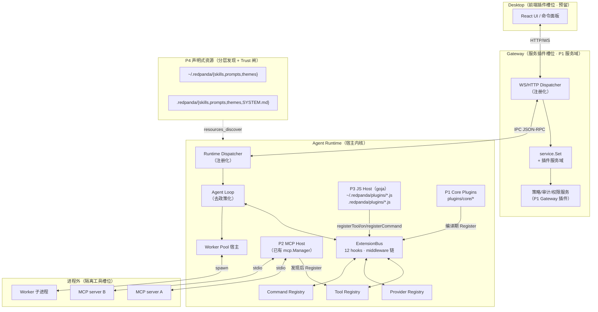

# v0.3.0 插件系统重构设计（Plugin Architecture）

| 字段 | 值 |
| --- | --- |
| 目标版本 | `0.3.0` |
| 状态 | Proposed |
| 变更性质 | **Breaking change**：删除全部硬编码注册点，不提供 v0.2.x 内部 API 兼容层；外部协议（HTTP/WS/JSON-RPC 方法名与事件信封 V2）保持兼容 |
| 日期 | 2026-07-29 |
| 替代范围 | `docs/04-agent-runtime-design.md` 的工具/Provider 组织方式、`docs/19-mcp-stdio-tools-design.md` 中工具接合面、`docs/41-redundancy-overimpl-optimization-plan.md` 的工具面收敛结论 |
| 参考设计 | `earendil-works/pi`（pi.dev）的扩展系统（extension / hook / skill / prompt / package 模型） |

## 1. 结论

v0.3.0 将 red_panda 从「编译期内置」架构改造为「注册表 + 钩子 + 插件」架构。核心变化：

1. **Runtime 收敛为宿主内核**：只保留传输多路复用、Run 生命周期、Worker 池宿主、插件宿主四件事；工具、Provider、MCP 接合、状态工具桥接全部变为「核心插件」，通过统一注册表接入。
2. **三处硬编码 switch 全部删除**：`handleLine` 的 18 个 RPC case、工具的四层 dispatch switch、`providerFromOptions` 的 3-case switch，统一替换为 `Dispatcher` / `Registry`。
3. **新增扩展总线 `ExtensionBus`**：12 个生命周期钩子，按注册顺序链式执行，支持阻断与改写（middleware 语义）。权限门、审计、计划模式、安全策略等「政策」全部以扩展实现，核心零政策。
4. **插件四种形态**：
   - **P1 核心插件**：与宿主同仓库、编译期注册（`plugins/core/...`），享受内部访问权限。内置 30 个工具迁移为 5 个核心插件。
   - **P2 进程外工具插件**：MCP（已有能力），补齐声明式加载与清单化。
   - **P3 嵌入式 JS 扩展**：基于 goja，加载全局/项目目录中的 `.js` 扩展文件，提供 pi 式单文件工厂体验，可注册工具/钩子/命令，可覆盖内置工具。
   - **P4 声明式资源**：skills / prompts / themes / system prompt 片段，目录约定 + 分层发现 + Project Trust 闸。
5. **配置分层落地**：新增 `settings.json`（全局 `~/.redpanda/` 与项目 `.redpanda/`）+ SQLite 资源表 + 环境变量，优先级「环境变量 > 项目 > 全局 > DB > 默认」。插件启停、JS 插件 trust、路径记忆全部持久化。
6. **进程拓扑不变**：Desktop → Gateway → Runtime → MCP/Worker。插件可插的位置显式建模为四个「槽位」：Desktop 前端、Gateway 服务、Runtime 宿主、进程外。

本次重构**主动不保留** v0.2.x 内部 API：工具定义函数（`*ToolDefinitions()`）、dispatch switch、`ToolRunner` 执行器字段、`providerFromOptions` 工厂、硬编码 RPC 分发表、旧的 skill 目录约定，全部删除或迁移，不做别名兼容。

## 2. 背景与现状问题

当前 v0.2.x 的核心能力组织方式已阻碍演进：

1. **工具系统是四层硬编码 switch**：`stableToolDefinitions()` 聚合 + `dispatchLocalTool/dispatchOrchestrationTool/dispatchStateTool/dispatchWebTool` 四组按名字 switch-case + MCP 前缀兜底。新增一个工具要改 3~6 个文件（defs、dispatch、实现、超时分类、顺序锁定测试，状态类还需 Gateway domain switch），并重新编译 Runtime。
2. **Provider 工厂是 3-case switch**：`providerFromOptions`（`factory.go:73`）硬编码 `openai_compatible/openai_responses/anthropic`，新端点只能改源码。
3. **RPC 分发是两张硬编码表**：Runtime `handleLine` 18 个 case、Gateway WS `handleRequest` 7 个 case，插件无法新增方法。
4. **无扩展钩子**：`EnvelopeV2` 事件是单向数据流（Runtime→Gateway→WS），权限、审计、压缩等「政策」写死在 service/loop 里，第三方无法挂载。
5. **配置无分层**：仅环境变量 + SQLite + per-run `ReplyOptions`，没有全局/项目配置文件，也没有「启用/禁用某个扩展」的概念。
6. **扩展通道只有 MCP 一条**：MCP 已成熟（发现、`mcp__server__tool` 规范名、RiskHigh、策略/权限复用、崩溃预算），但它是纯进程外工具面；skill 系统（`.codex/skills/*.md` 磁盘扫描）证明了声明式加载可行，但两者都没有统一的「插件」心智模型。
7. **职责过载**：`Runtime` 同时是传输多路复用器、Run 生命周期管理器、Worker 池宿主、MCP 宿主、工具宿主、Provider 宿主——任何一处扩展都要理解全部。

pi 的启示（已被本设计吸收）：核心极简、一切皆扩展（连 plan mode/权限门都是 extension）；扩展点分四类资源（代码/skill/prompt/theme）；事件驱动 middleware 链（可干预事件链式执行、返回 partial patch）；约定目录 + 分层加载 + project trust 闸；工具 schema-first、`{content, details}` 分离；复用 git 而非自建 registry。

## 3. 目标与非目标

### 3.1 功能目标

- 任何工具（内置/JS 扩展/MCP）通过同一 `Registry` 注册、查询、过滤、分发；同名注册即覆盖，来源可追溯。
- 任何 Provider 通过 `Registry` 注册工厂，支持 per-run 覆盖与动态模型发现。
- Runtime 与 Gateway 的 RPC 方法通过 `Dispatcher` 注册，插件可新增方法。
- 12 个生命周期钩子开放给 P1/P3 扩展；`tool_call`、`tool_result`、`provider_request_before`、`permission_check` 支持阻断与改写。
- P3 JS 扩展可注册工具与命令、订阅钩子、覆盖内置工具；单文件即插件，免编译、可热重载（`/reload` 语义或 `extension.reload` RPC）。
- P4 资源（skill/prompt/theme/system 片段）按全局/项目分层发现；项目层加载受 Project Trust 闸控制。
- 配置文件分层生效；插件启停状态持久化，重启不丢。

### 3.2 非功能目标

- 新增一个本地工具（P1）改动文件数 ≤ 2（插件目录内一个文件 + 可选测试），不再需要改 `registry.go`/dispatch switch。
- 新增一个 JS 工具（P3）改动文件数 = 1（一个 `.js` 文件），无需重启 Runtime（reload 后生效）。
- 工具/Provider/RPC 的注册与分发路径 O(1) 查询；钩子链执行开销在空注册时 ≈ 一次 interface 断言。
- JS 扩展 panic/死循环被 goja `Interrupt` + panic recover 双重兜底，不拖垮 Runtime；单扩展故障隔离到单次调用。
- 不引入 CGO；JS 运行时（goja）与 HTTP 客户端保持纯 Go。

### 3.3 非目标

- 不做插件沙箱（不做 seccomp/namespace/rlimit）；信任模型 = 加载闸 + 进程边界（MCP/Worker），与 pi 的「无沙箱」哲学一致但更保守（多进程天然隔离）。
- 不做插件市场/registry，不分发签名与审核；分发用 git 仓库 + `redpanda-plugin.json`。
- 不做 Desktop 前端插件化（React 侧热更新、UI 组件注入），仅预留清单字段。
- 不支持插件新增 Gateway→Runtime 的持久化表结构（migration 仍属核心）；插件需要状态用 `plugin_state` KV 或 `RunEvent` 载荷。
- 不支持远程插件热更新与 A/B 灰度。
- 不保留 v0.2.x 内部 API 兼容层（无别名、无 deprecated 桥接）。
- 不实现 pi 的 TUI 扩展面（red_panda 无 TUI）；命令面板/斜杠命令仅到「解析 + 分发」层。

## 4. 方案比较

| 方案 | 描述 | 优点 | 代价 | 结论 |
| --- | --- | --- | --- | --- |
| A. 注册表 + 钩子 + 内嵌 JS（goja） | 核心注册化，P1 Go 插件 + P3 goja JS 扩展 + P2 MCP + P4 资源 | 与 pi 心智模型一致；Go 接口类型安全；goja 无 CGO、单文件；MCP 已成熟 | 需自研 goja ↔ Registry/Dispatcher 桥；事件链语义需精确设计 | **采用** |
| B. 原生 Go plugin（`.so`/`.dll`） | 编译期动态库加载 | 类型安全、性能同宿主 | Windows 不支持；宿主与插件 Go 版本/依赖必须一致；无法热重载 | 不采用 |
| C. 纯进程外（一切走 MCP/JSON-RPC） | 所有扩展都是子进程 | 隔离最强、多语言 | 无法「原地改写」请求/上下文（共享内存语义丢失）；钩子延迟高；Provider 钩子不现实 | 不采用（保留为 P2 工具通道） |
| D. Yaegi（Go 解释器） | Go 子集脚本 | 语言统一 | 性能差、泛型/反射受限、生态远小于 JS | 不采用 |

**关键决策依据**：pi 选择「TS 模块同进程」是因为其宿主是 TS、扩展要共享内存改 `event.input`、且用户群熟悉 TS。red_panda 宿主是 Go、进程边界已存在、且 MCP 已证明进程外工具面可行——因此「Go 接口注册表（类型安全 + O(1)）+ goja（pi 式单文件体验 + 免编译）+ MCP（隔离工具）」三层组合是对 pi 设计在 Go 多进程语境下的最优平移。goja 相对 v8 绑定：无 CGO、二进制增量 < 2MB、Interrupt 语义清晰。

## 5. 总体架构



**与 pi 的映射**：pi 单进程内 ExtensionRunner/ExtensionLoader/Tool Registry/TUI ↔ red_panda 的 ExtensionBus/P3 JS Host/Tool Registry/Desktop（无 TUI）。pi 的「packages（npm/git）」↔ red_panda 的「git 仓库 + `redpanda-plugin.json`」。pi 的 `project_trust` ↔ red_panda 的 `trusted_dirs` + `ext_project_trust` 钩子。


## 6. 核心抽象

### 6.1 插件槽位（Slot）

red_panda 的插件可插入位置显式分为四个槽位，每个槽位有自己的扩展点集合和隔离模型：

| 槽位 | 进程 | 扩展点 | 隔离 | P1/P3 可达 |
| --- | --- | --- | --- | --- |
| **Runtime 宿主** | Agent Runtime | `ToolRegistry`、`ProviderRegistry`、`ExtensionBus`、`CommandRegistry`、`Dispatcher`（仅 Runtime） | 无（同进程） | P1/P3 直达 |
| **Gateway 服务** | Gateway | `WS Dispatcher`、服务域注册、资源 CRUD | HTTP 隔离 | 仅 P1（Gateway 插件） |
| **Desktop 前端** | Desktop | 命令面板、UI 组件（预留） | HTTP 隔离 | v0.3.0 不做 |
| **进程外** | MCP/Worker 子进程 | `mcp__server__tool` 工具面 | 进程隔离 | 仅 P2 |

核心原则：**「政策」不进核心**。权限门、审计、压缩策略、安全审查、计划模式全部以 P1/P3 插件实现；核心只负责「发现 → 注册 → 执行 → 钩子调度」。

### 6.2 Tool Registry（`registry.go` 重构）

**删除**：`stableToolDefinitions()`、`stableToolRegistry()`、`stableToolTimeoutByName`、`timeoutClassForStableTool`、`dispatchLocalTool`/`dispatchOrchestrationTool`/`dispatchStateTool`/`dispatchWebTool`、`ToolRunner` 的 6 个执行器字段（WorkerDelegate/WorkerList/...）。

**新增 `ToolEntry` + `Registry`**：

```go
type ToolEntry struct {
    Definition   ptools.Definition // Name/DisplayName/Description/Risk/Parameters
    Handler      HandlerFunc       // func(ctx *ToolContext, args map[string]any) (*tools.Result, error)
    TimeoutClass TimeoutClass
    OpsOnly      bool              // 替代 policy.go 的 opsOnlyTools
    Source       string            // "builtin:<domain>" | "js:<ext>" | "mcp:<server>"
    Overriden    string            // 若非空，表示覆盖了同名的内置/其他来源
}

type HandlerFunc func(ctx *ToolContext, args map[string]any) (*tools.Result, error)

type ToolContext struct {
    RunID       string
    SessionID   string
    MessageID   string
    Provider    provider.Provider
    ProviderReq provider.Request
    CWD         string
    WorkingDir  string
    Permission  PermissionService
    Session     SessionService
    Memory      MemoryService
    Todo        TodoService
    WorkerPool  *worker.Pool
    Events      EventEmiter        // emitEvent
    RunStates   RunStateService
    Signal      AbortSignal
}

type Registry struct {
    mu      sync.RWMutex
    entries map[string]ToolEntry  // 按 name 索引
    order   []string              // 注册顺序（公开顺序）
    bySrc   map[string][]string   // Source → []name，用于按来源过滤
}
```

**关键行为**：

- `Register(e ToolEntry) (prev *ToolEntry)`：同名 = 覆盖，返回被覆盖的 entry；记录 `Overriden` 来源。
- `Definitions() []ptools.Definition`：按 order 返回，等价旧 `AvailableTools()`。
- `Handle(ctx *ToolContext, call tools.Call) (*tools.Result, error)`：查找 entry → 超时包装（`TimeoutClass`）→ 调用 hook `tool_call` 前置（改写/阻断）→ `Handler(ctx, args)` → hook `tool_result`（改写）→ 返回。
- `ListBySource(srcPrefix string) []string`：支持 `AvailableToolsForOptions` 按 `tool_allowlist/denylist` 过滤。
- `Clear(prefix)` / `Remove(name)`：热重载时清理旧入口（P3 reload 入口）。

**超时行为**：原 `toolTimeoutClass` 的 3 类（`localToolTimeout`=30s / `gatewayToolTimeout`=30s / `selfManagedToolTimeout`=0 无限）保留语义，合并为 `TimeoutClass`，在 `Register` 时指定，默认 30s。

### 6.3 Dispatcher（替换 `handleLine` / `handleRequest` switch）

```go
type MethodHandler func(ctx context.Context, req jsonrpc.Request) (jsonrpc.Response, error)

type Dispatcher struct {
    mu     sync.RWMutex
    methods map[string]MethodHandler
}

func (d *Dispatcher) Register(method string, h MethodHandler)
func (d *Dispatcher) Dispatch(ctx context.Context, req jsonrpc.Request) (jsonrpc.Response, error)
```

**两个 Dispatcher 实例**：

| 实例 | 所在 | 职责 |
| --- | --- | --- |
| `runtimeDispatcher` | `runtime.go` 替换 `handleLine` 的 switch | 18 个内置方法 + 插件新增 |
| `gatewayDispatcher` | `gateway/controller/websocket.go` 替换 `handleRequest` switch | 7 个内置方法 + 插件新增 |

内置方法在 `init()` 中 `Register`，顺序与旧 switch 一致以通过既有集成测试。

### 6.4 Provider Registry（替换 `factory.go` switch）

```go
type ProviderFactory func(options provider.RequestOptions, log io.Writer) (provider.Provider, error)

type ProviderRegistry struct {
    factories map[string]ProviderFactory  // key = "openai_compatible" / "anthropic" / ...
    mu        sync.RWMutex
}

func (r *ProviderRegistry) Register(name string, f ProviderFactory)
func (r *ProviderRegistry) Resolve(options provider.RequestOptions, log io.Writer) (provider.Provider, error)
func (r *ProviderRegistry) Models(name string) []provider.Model // 支持动态模型发现
```

`NewFromEnv` 变为 `Resolve` 调用默认 provider + 环境变量覆盖。内置三个工厂在 `init()` 中注册。


### 6.5 ExtensionBus（新增，钩子总线）

```go
type HookContext struct {
    RunID       string
    SessionID   string
    MessageID   string
    CWD         string
    Mode        string  // "tui" | "rpc" | "json" | "print"
    HasUI       bool
    IsIdle      func() bool
    Abort       func() error
    UI          UIOps   // 通知/对话框（非 TUI 模式为 no-op）
}

type HookResult struct {
    Block   bool   // true = 阻断当前操作
    Reason  string // block 原因（日志 + 返回给 LLM 的提示）
    Cancel  bool   // 用于 session_before_* 取消
    Transform map[string]any // 改写载荷（tool input / messages / provider request）
}

type HookHandler func(ctx HookContext, event interface{}) *HookResult

type ExtensionBus struct {
    mu     sync.RWMutex
    hooks  map[HookName][]HookHandler  // 链式顺序
    order  []string
}

const (
    HookRunStart               HookName = "run.start"
    HookRunEnd                 HookName = "run.end"
    HookBeforeProviderRequest  HookName = "provider.request_before"
    HookAfterProviderResponse  HookName = "provider.response_after"
    HookToolCall               HookName = "tool.call"
    HookToolResult             HookName = "tool.result"
    HookPermissionCheck        HookName = "permission.check"
    HookSessionBeforeCompact   HookName = "session.before_compact"
    HookSessionAfterCompact    HookName = "session.after_compact"
    HookContextCompose         HookName = "context.compose"
    HookMessageEnd             HookName = "message.end"
    HookProjectTrust           HookName = "ext.project_trust"
)
```

**干预语义（middleware 链）**：

- handler 按注册顺序链式执行；前一个 handler 的 `Transform` 成为后一个 handler 的输入（深度拷贝，安全修改）。
- 任意 handler 返回 `{Block: true}` 即短路后续链；`{Cancel: true}` 用于 session 生命周期钩子。
- 非阻塞钩子（`run.start`、`run.end`、`provider.response_after` 等）`HookResult` 可忽略，仅作通知/审计。
- 内置插件（权限门、压缩策略）注册时带 `Source`，用户插件注册时带自定义来源，`HookOrder` 字段控制介入顺序（系统钩子默认 0，插件默认 100，数值小先执行）。

**在 Agent Loop 中的挂载点**（`loop.go:100 runProviderLoopSegment` 改造后）：

```
HookProjectTrust   → 首次进入项目目录时（信任闸回调）
HookRunStart       → run.execute 开始
HookBeforeProviderRequest → 每次 LLM 调用前（改写 messages / 增删 headers）
HookAfterProviderResponse  → 每次 LLM 返回后（审计、日志）
HookToolCall       → 每个工具调用前（可 block / 改写 input args）
HookToolResult     → 每个工具执行后（可 block 结果 / 改写 content）
HookPermissionCheck → 权限请求时（自定义策略）
HookSessionBeforeCompact → 压缩前（可 cancel / 自定义 summary）
HookContextCompose → 组消息时（改写 system prompt）
HookMessageEnd     → 最终消息发出前（改写最终答案）
HookRunEnd         → run.execute 完成（清理、审计）
```


## 7. 插件形态详细设计

### 7.1 P1 核心插件（Go，编译期注册）

**定位**：与宿主同仓库，享受宿主内部接口访问权限。内置能力全部下沉为 P1 插件。

**目录结构**（`modules/agent/plugins/core/`）：

```
modules/agent/plugins/core/
  workspace/   → workspace 11 个工具（read/list/find/grep/write/edit/...）
  coding/      → git.* + shell.exec
  orchestration/ → worker.* 委派工具 + skill.* 工具
  state/       → todo.* + memory.* + web.*
  gateway/     → Gateway 侧服务域（permission、state_tool 桥接）
  builtin.go   → init() 中调用所有子包 Register 函数，统一入口
```

每个子包暴露一个 `Register(reg *tools.Registry, bus *ExtensionBus) []string` 函数（返回已注册的工具名列表，供测试锁定顺序）。实现模式：

```go
// workspace/register.go
package workspace

import (
    "redpanda/agent/plugins/core/workspace/internal"
    "redpanda/agent/runtime"
)

func Register(reg *tools.Registry, bus *ExtensionBus) []string {
    names := make([]string, 0, len(tools))
    for _, t := range tools {
        reg.Register(t)
        names = append(names, t.Name)
    }
    // 注册 workspace 域特有的钩子（如写文件前审计）
    bus.Register(HookToolCall, runtime.HookOrderPlugin, func(ctx HookContext, ev any) *HookResult {
        if tt, ok := ev.(*ToolCallHook); ok && tt.Name == "workspace.write_file" {
            // 内置写文件校验（原子写入、路径防越界）
        }
        return nil
    })
    return names
}

var tools = []tools.ToolEntry{
    {
        Definition: ptools.Definition{
            Name: "workspace.read_file", Description: "...", Risk: ptools.RiskLow,
            Parameters: map[string]any{"type":"object","properties":map[string]any{"path":map[string]any{"type":"string"}},"required":[]string{"path"}},
        },
        Handler:    internal.RunReadFile,
        TimeoutClass: tools.LocalToolTimeout,
        Source:     "builtin:workspace",
    },
    // ... 10 more
}
```

**内置工具的改造成本**：每个工具实现函数从 `func(workingDir string, args ...) (string, error)` 改为 `func(ctx *tools.ToolContext, args map[string]any) (*tools.Result, error)`。函数体逻辑不变，只是参数解构从 `map[string]any` 取（替代原来的 `args["path"]` 模式）。这是机械替换，30 个工具共约 2~3 小时。

### 7.2 P3 JS 扩展（goja 嵌入式）

**定位**：单文件 `.js` 即插件，pi 式体验——default-export 一个工厂函数，拿到 `rp` API 对象，用 `rp.on("tool.call", ...)` 挂钩子、`rp.registerTool(...)` 注册工具、`rp.registerCommand(...)` 注册命令。

**目录发现**：

| 位置 | 作用域 | Trust |
| --- | --- | --- |
| `~/.redpanda/plugins/*.js` | 全局 | 无需 trust |
| `~/.redpanda/plugins/*/index.js` | 全局目录式 | 无需 trust |
| `.redpanda/plugins/*.js` | 项目 | 需 Project Trust |
| `.redpanda/plugins/*/index.js` | 项目目录式 | 需 Project Trust |

**JS 宿主设计**：

```go
// modules/agent/runtime/jsplugin/host.go
type JSHost struct {
    vm    *goja.Runtime
    bus   *ExtensionBus
    reg   *tools.Registry
    ctx   *HookContext
}

func (h *JSHost) Load(path string) error {
    h.vm = goja.New()
    h.vm.Set("rp", map[string]any{
        "registerTool": h.exportRegisterTool,
        "registerCommand": h.exportRegisterCommand,
        "on": h.exportOn,
    })
    _, err := h.vm.RunScript(filepath.Base(path), scriptBytes)
    return err
}
```

**JS 扩展 API**（pi 式，但参数用 Go struct 映射）：

```javascript
// ~/.redpanda/plugins/greeter.js
module.exports = function(rp) {
  // 注册一个简单工具
  rp.registerTool({
    name: "greeter.hello",
    description: "Say hello to someone",
    risk: "low",
    parameters: {
      type: "object",
      properties: { name: { type: "string" } },
      required: ["name"]
    },
    execute: function(args) {
      return { output: `Hello, ${args.name}!` };
    }
  });

  // 注册斜杠命令
  rp.registerCommand("hi", {
    description: "Say hi",
    handler: function(args) {
      // args 是字符串
      return `Hi, ${args || "world"}!`;
    }
  });

  // 钩子：阻断危险操作
  rp.on("tool.call", function(event) {
    if (event.name === "shell.exec" && event.args.command.includes("rm -rf /")) {
      return { block: true, reason: "Dangerous: rm -rf / blocked" };
    }
  });

  // 钩子：改写发给 LLM 的上下文
  rp.on("context.compose", function(event) {
    event.messages.push({
      role: "system",
      content: "Always include a greeting before any code output."
    });
  });
};
```

**JS 扩展的桥接要点**：

1. JS 内的 `map[string]any` 参数通过 goja 的 `Value` ↔ Go `map[string]any` 自动转换（反射）。
2. `execute` 返回 `{output, isError, details}`，由宿主映射到 `tools.Result`。
3. `registerTool` 最终调用 Go 的 `ToolRegistry.Register`——JS 注册的工具与内置工具在分发层面完全等价。
4. **热重载**：Runtime 收到 `extension.reload` RPC → 停止旧 VM → 创建新 VM → 重新 `Load` 所有 JS 文件 → 重新注册；`ToolRegistry.Clear("js:")` 清理旧工具。

**JS 故障隔离**：

| 场景 | 防护 |
| --- | --- |
| JS 函数 panic | goja `func() error` 中 defer recover，返回 `{isError: true, error: "panic"}`，不拖垮 Runtime |
| JS 死循环 | goja `vm.Interrupt()` —— 每个 `tool.call` / `tool.result` 钩子执行前检查 `ToolContext.Signal`，超限后 `vm.Interrupt("timeout")` |
| JS 注册了非法工具（无 name/risk） | 宿主 `Register` 校验 + reject（返回 `HookResult{Block, Reason}`） |
| 单扩展 hang | 每个 `Load` 用独立 goroutine + 5s 超时 |

**JS 的局限（如实记录）**：
- 无法 `require()` / `import` 任意 Go 包——桥接的是宿主提供的 `rp` 子集。
- 无 `async/await`（goja 不支持原生 Promise），全部同步；工具执行用同步 `execute`。
- 性能：goja 比原生 Go 慢 ~5~10×；但对 tool 调用的边际成本可接受（瓶颈在 LLM 而非工具注册）。
- 内存：每个扩展一个 VM，大项目 10~20 个扩展的内存开销约 10~20MB。

### 7.3 P2 MCP 插件（进程外，增强）

**现状不变**：MCP 发现、`mcp__server__tool` 规范名、RiskHigh、崩溃预算、会话复用、`mcpkit` 封装全部保留。

**增强（v0.3.0 新增）**：

1. **声明式 MCP server 清单**：`mcps/` 目录从「文档快照」变为「声明式加载清单」。

```json
// mcps/fetch/redpanda-plugin.json
{
  "name": "fetch",
  "version": "1.0.0",
  "type": "mcp",
  "command": ["npx", "-y", "@modelcontextprotocol/server-fetch"],
  "tools": ["fetch"],
  "risk_default": "medium"
}
```

启动时自动注册为 `MCPServerConfig`（等价手动 `/api/v1/mcp/servers` POST），discover 后按既有流程注入 `ToolRegistry`（Source: `"mcp:fetch"`）。

2. **MCP 来源的工具过滤**：`AvailableToolsForOptions(tool_allowlist/denylist)` 按 `mcp:xxx` 前缀过滤，无需改 `tool_policy` 枚举。

3. **MCP 插件清单字段**：`redpanda-plugin.json` 预留 `"hooks"` 数组（MCP server 可声明「我需要权限钩子」等声明式元数据，v0.4.0 再实现运行时效果）。

### 7.4 P4 声明式资源

**目录约定**（全局 + 项目两层，`resources_discover` 钩子可扩展）：

```
~/.redpanda/                 # 全局
  skills/*/SKILL.md           # skill 目录
  prompts/*.md                # prompt 模板（/name 命令）
  themes/*.json               # 主题（Desktop 配置）

<project>/.redpanda/          # 项目级（需 Trust）
  skills/*/SKILL.md
  prompts/*.md
  SYSTEM.md                   # 追加到 system prompt（AGENTS.md 同级）
```

**Skill**（扩展现有 `.codex/skills`）：沿用现有磁盘扫描模式；路径扩展为全局 + 项目；模型通过工作区读取工具自行加载匹配的 `SKILL.md`，不提供独立 skill runner 工具。

**Prompt 模板**（新增）：`.md` 文件，frontmatter 可选（name/description），正文支持 `$1`/`$@`/`${1:-default}` 参数。

**System Prompt 片段**（新增）：`.redpanda/SYSTEM.md` 追加到 system prompt（无条件加载，类似 AGENTS.md 的「上下文文件无论信任与否都加载」）。


## 8. 配置分层体系（新增）

### 8.1 配置来源与优先级

| 优先级 | 来源 | 格式 | 作用域 | 覆盖关系 |
| --- | --- | --- | --- | --- |
| 1（最高） | 环境变量 | `RED_PANDA_*` | 全局 | 覆盖一切 |
| 2 | 项目 `.redpanda/settings.json` | JSON | 项目 | 覆盖全局 |
| 3 | 全局 `~/.redpanda/settings.json` | JSON | 全局 | 覆盖 DB/默认 |
| 4 | SQLite `configs` 表 | GORM | 全局/项目 | 覆盖默认 |
| 5 | 默认值 | Go const | — | 兜底 |

嵌套 JSON 深合并（`maps.Clone` + 递归 merge）；数组不合并（项目级 `skills` 完全替换全局，而非追加）。

### 8.2 settings.json 结构

```json
{
  "$schema": "https://redpanda.dev/schema/v0.3.0.json",
  "provider": {
    "name": "openai_compatible",
    "baseURL": "https://...",
    "apiKey": "${RED_PANDA_API_KEY}",
    "model": "gpt-5.5",
    "stream": true
  },
  "run": {
    "maxToolTurns": 48,
    "defaultWorkerPoolSize": 8
  },
  "plugins": {
    "extensions": ["~/.redpanda/plugins/*.js", ".redpanda/plugins/*.js", "!.redpanda/plugins/internal/*"],
    "packages": []
  },
  "resources": {
    "skills": ["~/.redpanda/skills/", ".redpanda/skills/"],
    "prompts": ["~/.redpanda/prompts/", ".redpanda/prompts/"]
  },
  "tools": {
    "allowlist": [],
    "denylist": ["mcp:__secret_server__*"]
  }
}
```

- **项目级 settings** 在 `project_trust` 通过后才读取；未经 trust 的项目回退到全局 settings。
- 环境变量覆盖（`RED_PANDA_PROVIDER_NAME`、`RED_PANDA_PROVIDER_BASE_URL` 等）保持既有行为，无需改。
- SQLite `configs` 表存「运行时动态配置」（如 DB 连接参数），不在 settings.json 中出现。

### 8.3 插件启停与信任持久化

新增三张 SQLite 表：

```sql
-- 插件启停状态（与 MCPServerConfig 同构）
CREATE TABLE plugin_configs (
    id         INTEGER PRIMARY KEY,
    name       TEXT NOT NULL UNIQUE,  -- 插件名（JS 文件名 / 目录名 / MCP server 名）
    source     TEXT NOT NULL,         -- "js" | "mcp" | "core"
    enabled    INTEGER NOT NULL DEFAULT 1,  -- 1=启用 0=禁用
    trust_level INTEGER NOT NULL DEFAULT 0, -- 0=未信任 1=已信任 2=全局信任
    settings   TEXT DEFAULT '{}',     -- JSON 扩展配置
    created_at DATETIME DEFAULT (datetime('now')),
    updated_at DATETIME DEFAULT (datetime('now'))
);

-- 项目目录信任（project_trust 决策持久化）
CREATE TABLE trusted_dirs (
    id         INTEGER PRIMARY KEY,
    dir        TEXT NOT NULL UNIQUE,  -- 项目目录绝对路径
    trusted    INTEGER NOT NULL DEFAULT 0, -- 1=信任 0=不信任
    remember   INTEGER NOT NULL DEFAULT 0, -- 1=记忆 0=每次询问
    created_at DATETIME DEFAULT (datetime('now'))
);

-- JS 扩展运行时状态
CREATE TABLE plugin_js_state (
    id         INTEGER PRIMARY KEY,
    name       TEXT NOT NULL UNIQUE,
    vm_hash    TEXT,                  -- JS 内容 hash，用于检测变更 → 触发 reload
    last_load  DATETIME,
    last_error TEXT
);
```


## 9. 加载顺序

v0.3.0 的启动流程（Runtime 视角，Gateway 类似）：

```
1. Transport 建立（IPC/stdio）
2. Config 加载：settings.json（全局 → 项目，需 trust）→ DB configs → 环境变量覆盖
3. Dispatcher 构建 + 注册内置 RPC 方法
4. Registry 构建 + 注册内置工具（P1 核心插件：workspace/coding/orchestration/state）
5. ProviderRegistry 构建 + 注册内置 provider（3 个工厂）
6. ExtensionBus 构建 + 注册内置钩子（权限门、压缩策略、审计）
7. 信任闸：首次进入项目目录时触发 project_trust 钩子
8. JS 扩展加载（P3）：加载全局 ~插件 → 信任后加载项目 ~插件；
   - 每个 .js 调 vm.RunScript → 工厂函数 → 拿到 rp 对象
   - 工厂内的 registerTool/on/registerCommand 调用 Go 的 Registry/Bus Register
9. MCP 发现（P2）：启动已启用的 MCP server → discover → 注册到 ToolRegistry（Source: mcp）
10. P4 资源发现：扫描 skills/prompts/SYSTEM.md → 注入 system prompt / 注册斜杠命令
11. Serve() → 进入主循环
```

**热重载（`/reload` 语义 → `extension.reload` RPC）**：

```
1. 发 run_shutdown(reason: "reload") 给所有进行中的 run
2. ExtensionBus.emit("session_shutdown", {reason: "reload"})
3. JSHost.Stop() → 销毁旧 VM 数组
4. ToolRegistry.Clear("js:*") + CommandRegistry.Clear("js:*")
5. 重新执行步骤 8（JS 加载）
6. ExtensionBus.emit("session_start", {reason: "reload"})
7. 继续主循环（Gateway 已完成的 run 不受影响）
```

## 10. Project Trust 闸

**触发条件**：项目目录中存在以下任意文件/目录：

- `.redpanda/settings.json`
- `.redpanda/plugins/`
- `.redpanda/skills/`
- `.redpanda/prompts/`
- `.redpanda/SYSTEM.md`

**流程**（对照 pi 的 `project_trust` 钩子）：

```
1. Runtime 启动时检查 cwd 是否匹配 trusted_dirs（已信任 → 跳过）
2. 未信任且项目含信任标记 → 发 permission_required 事件到 Gateway
3. Gateway UI 弹出「信任此项目的 JS 插件/Skill/Prompt？」（与现有 permission.resolve 同模态）
4. 用户确认 → trusted_dirs 写入 trust=1
5. 项目级插件/资源加载；若拒绝 → 仅加载全局插件 + AGENTS.md/CLAUDE.md 级别上下文文件
```

**信任级别**：

| trust_level | 含义 |
| --- | --- |
| 0 | 未信任：不加载项目级插件/Skill/Prompt，仅加载 AGENTS.md 上下文 |
| 1 | 信任：加载全部项目级资源 |
| 2 | 全局信任：此域名/作者的全部包自动信任（预留，v0.4.0） |

**非交互模式**：环境变量 `RED_PANDA_PROJECT_TRUST=always|never|ask`，类比 pi 的 `defaultProjectTrust`。

## 11. 插件清单格式（redpanda-plugin.json）

用于 git 仓库分发（无 npm registry 时），放在仓库根：

```json
{
  "name": "redpanda-scheduled-report",
  "version": "1.2.0",
  "description": "定时生成项目进展报告",
  "type": "js",              // "js" | "mcp"
  "main": "./dist/index.js",
  "commands": ["schedule:run", "schedule:status"],
  "tools": ["schedule.create", "schedule.list"],
  "resources": {
    "prompts": ["./prompts/*.md"],
    "skills": ["./skills/*"]
  },
  "engine": {
    "red_panda": ">=0.3.0"
  },
  "peer_dependencies": ["~/.redpanda/plugins/common-utils.js"]
}
```

**安装方式**（v0.3.0 仅 CLI 辅助，无自动 pip/npm 式安装）：

```bash
# 从 git clone 到全局/项目插件目录
git clone https://github.com/user/redpanda-scheduled-report ~/.redpanda/plugins/scheduled-report
# 或手动 cp，重启 Runtime 自动发现
```

Gateway 层可后续提供 `/api/v1/plugins` CRUD，与 MCP server config 同模态。


## 12. 破坏性变更清单（Breaking Changes）

### 12.1 代码层面（模块内，v0.3.0 必须全部完成）

| 旧（v0.2.x） | 新（v0.3.0） | 影响 |
| --- | --- | --- |
| `stableToolDefinitions()` | 各 P1 插件 `Register(reg)` | 测试需改用 registry 快照 |
| `dispatchLocalTool / dispatchOrchestrationTool / dispatchStateTool / dispatchWebTool` | `Registry.Handle()` 单一入口 | 删除约 200 行 switch 代码 |
| `ToolRunner`（6 个执行器字段） | `ToolContext`（依赖注入） | 工具实现函数签名全部迁移 |
| `timeoutClassForStableTool` | `ToolEntry.TimeoutClass` | 超时逻辑下移到 handler 包装层 |
| `stableToolTimeoutByName`（init cache） | `Registry.Timeout(name)` | 动态工具也有超时 |
| `runtime.handleLine`（18 case） | `runtimeDispatcher.Dispatch()` | 删除 switch，改用注册表 |
| `gateway handleRequest`（7 case） | `gatewayDispatcher.Dispatch()` | 同上 |
| `providerFromOptions`（3 case） | `ProviderRegistry.Resolve()` | 删除 switch |
| `factory.NewFromEnv()` | `ProviderRegistry.Resolve(options, log)` | 接口名不变，内部走 registry |
| `policy.go` 的 `opsOnlyTools` | `ToolEntry.OpsOnly` | 硬编码列表 → 注册标记 |
| `AvailableToolsForOptions` | `Registry.ListBySource` | 过滤逻辑简化 |
| `.codex/skills/` | `.redpanda/skills/`（并存，`.codex` 标记 deprecated） | skill 路径统一 |
| `run_states.go` 权限硬编码 | `HookPermissionCheck` + P1 权限插件 | 权限门从核心下沉 |
| `loop.go` 压缩硬编码 | `HookSessionBeforeCompact` | 压缩策略可插拔 |
| `run.go` run.start 硬编码审计 | `HookRunStart` | 审计从 service 下沉 |

### 12.2 协议层面（**保持兼容**，不破坏）

| 协议 | v0.2.x | v0.3.0 | 兼容 |
| --- | --- | --- | --- |
| HTTP 路由 | `/api/v1/...` | 不变 | 是 |
| WS 方法 | `agent.status` 等 | 不变 | 是（Dispatcher 注册） |
| JSON-RPC 方法名 | `run.execute` 等 | 不变 | 是（Dispatcher 注册） |
| 事件信封 | `EnvelopeV2` | 不变（仍用 EnvelopeV2） | 是 |
| 事件类型 | 15 种 | 不变 | 是 |
| MCP 工具名 | `mcp__server__tool` | 不变 | 是 |

**核心设计原则**：破坏性只发生在 Runtime/Gateway **模块内部**；跨进程协议（JSON-RPC method name、WS method name、HTTP path、Event envelope）全部保留。Desktop UI 和第三方集成不受影响。

### 12.3 环境变量

- **不删除**任何现有 `RED_PANDA_*` 环境变量。
- **新增**：`RED_PANDA_PROJECT_TRUST`、`RED_PANDA_PLUGIN_JIT_TIMEOUT`、`RED_PANDA_PLUGIN_GC_INTERVAL`。

## 13. 测试策略

### 13.1 回归测试（必须 100% 覆盖）

| 测试 | 目标 | 改造方式 |
| --- | --- | --- |
| `TestStableToolRegistryPreservesPublicOrder` | 工具公开顺序不变 | 读 Registry.Order 断言 |
| 工具执行单测 | 每个工具输入 → 输出 | 改用 `ToolContext` 构造测试 fixture |
| 集成测试（Gateway→Runtime→工具→结果） | 端到端不变 | Dispatcher 注册后行为不变，无需改测试 |
| MCP discover/call | 工具面一致 | 注册到同一 Registry，集成测试不变 |

### 13.2 新增测试

| 测试 | 场景 |
| --- | --- |
| `TestRegistryOverride` | 同名注册后，新 entry 替换旧，旧被覆盖来源记录到 `Overriden` |
| `TestRegistryClearPrefix` | `Clear("js:*")` 只清 JS，不清内置 |
| `TestDispatcherRegisterAndDispatch` | 注册 + 分发，method not found 返回 -32601 |
| `TestProviderRegistryResolve` | 内置 3 个 + 新增 1 个 provider |
| `TestHookChainSequential` | 两个 handler 链式执行，Transform 传递 |
| `TestHookChainBlockShortCircuit` | 首个 handler Block → 后续不调用 |
| `TestHookChainErrorSafe` | 某 handler panic → 记录日志 → 继续执行下一 handler |
| `TestJSHostLoadExecute` | 加载 .js → 注册工具 → 调用 → 结果正确 |
| `TestJSHostPanicRecover` | JS panic → Go recover → 返回 `{isError}` |
| `TestProjectTrustLoadSkip` | trust=0 跳过项目级资源 |
| `TestSettingsMerge` | 全局 + 项目 + 环境变量 合并顺序 |
| `TestReloadCleansOldJS` | reload → 旧工具消失 → 新工具出现 |


## 14. 迁移计划（分 Slice）

### Slice A：基础注册化（核心，不动行为）

**改动文件**（估计）：`registry.go`、`dispatch_*.go`（4 个，删）、`runner.go`（重构）、`tool_*.go`（30 个工具实现文件，签名迁移）、`factory.go`、`runtime.go`（handleLine→Dispatcher）、`loop.go`（权限下沉）、`tool_batch.go`（ToolContext 注入）。

**步骤**：

1. 新建 `modules/agent/runtime/registry/` → `registry.go`（ToolRegistry + ProviderRegistry + Dispatcher）。
2. 新建 `modules/agent/runtime/hooks/` → `bus.go`（ExtensionBus + 12 个钩子常量）。
3. 新建 `modules/agent/plugins/core/workspace/` → 迁移 workspace 11 个工具为 Register 形式；其他 4 个核心域类推。
4. 实现 `ToolRegistry.Handle()` 包装：超时 → 钩子链（`tool_call` 前置 + `tool_result` 后置）→ handler。
5. `executeToolBatch` 改用 `Registry.Handle()` 替代 4 个 dispatch switch。
6. `ProviderRegistry` 替换 `factory.go`。
7. `runtimeDispatcher` / `gatewayDispatcher` 替换两个硬编码 switch。
8. 权限门（`policy.go` + `permission.go`）迁移为 `HookPermissionCheck` + P1 `plugins/core/gateway/permission`。
9. 更新所有测试。

**验收标准**：`go test ./...` 全部通过；`TestStableToolRegistryPreservesPublicOrder` 仍锁定原顺序；端到端 run（Gateway→Runtime→工具→WS 事件）与 v0.2.x 字节级一致（hook 全未注册，行为回退到内置）。

### Slice B：P3 JS 扩展

**改动文件**：新增 `modules/agent/runtime/jsplugin/`（host.go、bridge.go、loader.go）。

**步骤**：

1. 接入 goja（`github.com/gojago/goja`，无 CGO）。
2. 实现 `JSHost.Load()`：vm → 设置 `rp` API 对象 → RunScript。
3. `rp.on` 桥接到 `ExtensionBus.Register`；`rp.registerTool` 桥接到 `ToolRegistry.Register`。
4. 实现热重载：`ToolRegistry.Clear("js:*")` + 新 VM 加载。
5. 实现 `project_trust` 对 JS 扩展的作用域控制。

**验收标准**：一个 .js 文件注册工具 → Gateway 调用 → Runtime 执行 → 结果正确；JS panic 不拖垮 Runtime；reload 后工具刷新。

### Slice C：P4 声明式资源 + Project Trust

**改动文件**：新增 `modules/agent/runtime/resources/`（skills.go、prompts.go、trust.go、loader.go）；`gateway/service/settings.go`（配置加载）。

**步骤**：

1. 配置加载：settings.json 解析 + 环境变量覆盖 + DB configs 合并。
2. Project Trust：`trusted_dirs` 表 + 触发检查 + Gateway UI 信任弹窗（复用现有 permission 模态）。
3. 资源发现：启动时扫描 skills/prompts/system 片段。
4. 斜杠命令：prompt 模板 → 注册到 CommandRegistry。

**验收标准**：未信任项目不加载 .redpanda/plugins；信任后加载；prompt 模板 `/name $1` 正确展开。

### Slice D：MCP 增强 + 文档

**改动文件**：`mcps/*/redpanda-plugin.json`（新增清单）；`runtime.go`（清单加载）。

**步骤**：

1. 为已存在的 MCP server（fetch、robotgo-flow、sequential-thinking、tasks）编写 `redpanda-plugin.json`。
2. 启动时扫描 `mcps/`，按清单自动注册为 `MCPServerConfig`。
3. 更新 `docs/19-mcp-stdio-tools-design.md`，补充 v0.3.0 的声明式加载。

### Slice 顺序与依赖

```
Slice A ──→ Slice B（B 依赖 A 的 Registry/Bus）
    └──→ Slice C（C 与 B 并行，都依赖 A）
         └──→ Slice D（D 独立，与 B/C 并行）
```

建议交付节奏：A（1~2 周）→ B + C 并行（1 周）→ D（0.5 周）。

## 15. 风险与缓解

| 风险 | 概率 | 影响 | 缓解 |
| --- | --- | --- | --- |
| 工具签名迁移引入回归（30 个工具 × 6 参数重构） | 中 | 高 | Slice A 第一优先级跑全量集成测试；保留 `TestStableToolRegistryPreservesPublicOrder` 顺序锁定 |
| goja 在 Windows 上的内存/性能问题 | 低 | 中 | P3 做"可选"特性；Windows 下默认禁用（环境变量 `RED_PANDA_PLUGIN_JIT=0`），Linux/macOS 默认启用 |
| 钩子链的执行开销 | 低 | 低 | 空注册时断言开销 ≈ 一次 map 查找；基准测试验证 |
| JS 扩展被滥用（挂掉/死循环） | 中 | 中 | panic recover + goja Interrupt + 单扩展超时 + 单扩展独立 VM |
| Project Trust 闸阻塞 CI 自动化 | 中 | 高 | `RED_PANDA_PROJECT_TRUST=always` 环境变量 + trusted_dirs remember 字段 |
| settings.json 合并逻辑复杂（全局/项目/DB/默认四源） | 中 | 中 | 先做全局 + 项目 + 默认三源（DB configs 不变）；v0.4.0 再补第四源 |
| 破坏性变更影响已编译的二进制用户 | 低 | 低 | 外部协议（HTTP/WS/RPC/Event）保持兼容；破坏性仅限模块内部；`v0.3.0` 作为 breaking 大版本发布，与 v0.2.x 语义分离 |

## 16. 附录

### A. P1 核心插件与 v0.2.x 工具的映射

| v0.2.x 文件 | 工具（名） | P1 插件 |
| --- | --- | --- |
| `defs_workspace.go` | workspace.{read_file,read_files,list,find_files,grep,stats,diff_file,write_file,edit_file,apply_patch} | `plugins/core/workspace` |
| `defs_coding.go` | git.{status,diff,log,show}, shell.exec | `plugins/core/coding` |
| `defs_orchestration.go` | skill.{list,create,update,delete,run}, worker.{delegate,list,cancel,pool_status,send,receive} | `plugins/core/orchestration` |
| `defs_state.go` | todo.{write,list}, memory.{list,create,update,delete}, web.{search,fetch} | `plugins/core/state` |

### B. 与 pi 设计的差异对照

| 维度 | pi | red_panda v0.3.0 | 理由 |
| --- | --- | --- | --- |
| 宿主语言 | TypeScript | Go | 项目现有 |
| 扩展运行时 | TS 模块（jiti，同进程） | Go 接口（P1）+ goja JS（P3） | Go 无 jiti 等价物；goja 无 CGO |
| 进程模型 | 单进程 | 多进程（Gateway/Agent/Desktop/MCP） | 项目现有 |
| 隔离 | 无沙箱 | 进程隔离（MCP/Worker） + Trust 闸 | 多进程天然隔离 |
| 配置 | settings.json（全局/项目） | settings.json（全局/项目）+ 环境变量 + SQLite DB | 环境变量是红熊猫现有基础设施 |
| 分发 | npm/git | git（v0.3.0）；OCI registry（预留） | 无 npm 生态 |
| TUI 扩展 | 大（自定义组件/overlay） | 无（Desktop 前端，预留） | 项目无 TUI |
| 热重载 | `/reload` | `extension.reload` RPC（等效） | 语义一致 |

### C. 参考实现位置

| 组件 | 路径（建议） |
| --- | --- |
| ToolRegistry | `modules/agent/runtime/registry/registry.go` |
| ProviderRegistry | `modules/agent/runtime/registry/provider.go` |
| Dispatcher | `modules/agent/runtime/registry/dispatcher.go` |
| ExtensionBus | `modules/agent/runtime/hooks/bus.go` |
| P1 核心插件 | `modules/agent/plugins/core/*/` |
| P3 JS 宿主 | `modules/agent/runtime/jsplugin/host.go` |
| P4 资源加载 | `modules/agent/runtime/resources/` |
| Project Trust | `modules/agent/runtime/resources/trust.go` |
| 配置加载 | `modules/gateway/internal/gateway/infra/settings/` |

