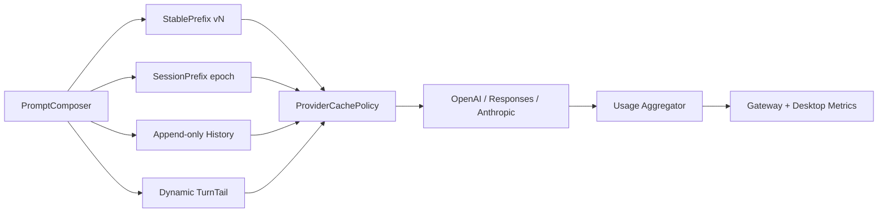

# Prompt Cache Hit Optimization Implementation Plan

> **For Claude:** REQUIRED SUB-SKILL: Use superpowers:executing-plans to implement this plan task-by-task.

**Goal:** Rebuild the LLM request pipeline around deterministic prompt segments so repeated requests maximize provider-side prompt-cache reads without caching final answers.

**Architecture:** Replace free-form message composition with a versioned four-segment prompt protocol: immutable application prefix, session-stable prefix, append-only conversation history, and per-turn dynamic tail. Provider adapters own cache breakpoints and provider-specific cache identity. Usage is aggregated per provider call and exposed as cache-read/cache-write metrics.

**Tech Stack:** Go, OpenAI-compatible Chat Completions, OpenAI Responses API, Anthropic Messages API, Gateway session context, React Desktop observability.

---

## Requirements

- Increase cache-read ratio for repeated tool turns and continued conversations.
- Do not cache final model answers at application level.
- Preserve exact prompt byte ordering within a cache epoch.
- Make cache invalidation explicit and observable.
- Accept breaking protocol and persistence changes.
- Keep credentials and user content out of cache identity logs.

## Target Architecture

## ADR-001: Explicit Prompt Segments

**Decision:** Replace `provider.Message{Role, Content, CacheControl}` with an explicit `PromptEnvelope` containing `StablePrefix`, `SessionPrefix`, `History`, and `TurnTail`.

**Rationale:** The current model lets callers reorder or insert dynamic messages before cached content. Segment ownership makes prefix stability mechanically enforceable.

**Trade-off:** This breaks provider fakes, hooks, logging, and tests. The migration cost is justified because correctness cannot be guaranteed by boolean cache flags.

## ADR-002: Cache Epochs Instead of Incidental Invalidation

**Decision:** Compute a session cache epoch from prompt schema version, provider/model, tool schema digest, stable policy digest, skill catalog digest, and session-summary digest.

**Rationale:** Cache invalidation becomes explainable. Todo state, current time, user text, permission state, and tool output must never enter the epoch.

**Trade-off:** Skill/tool changes reset the epoch. This is correct and measurable rather than accidental.

## ADR-003: Append-only Tool Transcript

**Decision:** During one Run, freeze the initial `StablePrefix` and `SessionPrefix`. Append tool calls/results after the current user message without recomposing earlier segments.

**Rationale:** Refreshing Todo and context on every tool turn changes request bytes and destroys prefix reuse.

**Trade-off:** Todo updates become UI/runtime state and are injected only at explicit model checkpoints, not every tool turn.

## ADR-004: Provider-aware Cache Policy

**Decision:** Anthropic receives explicit ephemeral cache breakpoints; OpenAI Responses receives stable `prompt_cache_key`/retention fields only when the selected endpoint declares support; generic OpenAI-compatible endpoints default to implicit caching with no unsupported fields.

**Rationale:** A universal request body is not portable across compatible gateways.

**Trade-off:** Provider profiles gain capability flags and older profiles require migration.

## Task 1: Add Deterministic Prompt Protocol

**Files:**
- Create: `modules/agent/internal/provider/prompt_envelope.go`
- Modify: `modules/agent/internal/provider/provider.go`
- Modify: `modules/agent/internal/runtime/prompt_composer.go`
- Test: `modules/agent/internal/runtime/prompt_composer_test.go`

**Steps:**
1. Write failing tests asserting two ordinary requests produce byte-identical `StablePrefix` and `SessionPrefix`.
2. Add `PromptEnvelope` and segment types with canonical ordered slices.
3. Remove `Message.CacheControl` and make cacheability a segment property.
4. Move time, Todo, current memory injection, permissions, and current input into `TurnTail`.
5. Run `go test ./modules/agent/internal/runtime ./modules/agent/internal/provider`.
6. Commit: `refactor(agent): introduce deterministic prompt envelope`.

## Task 2: Freeze Run Context and Make Tool History Append-only

**Files:**
- Modify: `modules/agent/internal/runtime/loop.go`
- Modify: `modules/agent/internal/runtime/run_state_store.go`
- Test: `modules/agent/internal/runtime/runtime_chain_test.go`
- Test: `modules/agent/internal/runtime/loop_segment_test.go`

**Steps:**
1. Write a failing multi-tool-turn test that hashes every request prefix.
2. Snapshot the prompt envelope once when the Run starts.
3. Stop refreshing `TodoContext` inside each provider turn.
4. Append only assistant tool calls and tool results for subsequent turns.
5. Add an explicit `context.checkpoint` operation for intentional session-prefix refresh.
6. Verify every tool turn keeps the previous request as an exact prefix.
7. Commit: `refactor(runtime): freeze prompt context across tool turns`.

## Task 3: Canonicalize Tool Definitions and Policies

**Files:**
- Create: `modules/agent/internal/provider/canonical.go`
- Modify: `modules/agent/internal/runtime/prompt_policies.go`
- Modify: `modules/agent/internal/runtime/registry/provider.go`
- Test: `modules/agent/internal/provider/content_test.go`

**Steps:**
1. Add golden tests for canonical JSON serialization of tool schemas.
2. Sort tool definitions by public tool name before serialization.
3. Canonicalize schema object keys recursively.
4. Version fixed policies with a single `prompt_schema_version` constant.
5. Hash tool/policy bytes and store them in the cache epoch.
6. Commit: `feat(provider): canonicalize cacheable prompt inputs`.

## Task 4: Add Provider Capability Negotiation

**Files:**
- Modify: `modules/gateway/internal/gateway/model/models.go`
- Modify: `modules/gateway/internal/gateway/service/provider_profile.go`
- Modify: `modules/protocol/methods/methods.go`
- Modify: `modules/agent/internal/provider/factory.go`
- Test: provider profile and factory tests.

**Steps:**
1. Add profile fields: `cache_mode`, `cache_key_supported`, `cache_retention`, and `min_cache_tokens`.
2. Treat missing fields as `implicit` for compatible gateways.
3. Reject explicit cache options when profile capabilities do not allow them.
4. Pass capability data into `RequestOptions`.
5. Commit: `feat(provider): negotiate prompt cache capabilities`.

## Task 5: Implement Provider-specific Cache Policies

**Files:**
- Modify: `modules/agent/internal/provider/anthropic.go`
- Modify: `modules/agent/internal/provider/openai_http.go`
- Modify: `modules/agent/internal/provider/openai_responses.go`
- Test: provider request-body tests.

**Steps:**
1. Anthropic: place cache breakpoints after the immutable prefix and tool definitions.
2. Responses: send the epoch-derived cache key only for explicitly supported profiles.
3. OpenAI-compatible Chat: do not send non-standard fields unless configured.
4. Record the effective cache policy in diagnostic request logs.
5. Commit: `feat(provider): apply provider-aware prompt caching`.

## Task 6: Redesign Session Compaction Around Cache Epochs

**Files:**
- Modify: `modules/gateway/internal/gateway/service/session_context.go`
- Modify: `modules/gateway/internal/gateway/service/session.go`
- Modify: session-context tests.

**Steps:**
1. Write tests proving compaction creates one intentional epoch change.
2. Persist `summary_digest`, `prompt_schema_version`, and `cache_epoch` with session context metadata.
3. Compact only at turn boundaries, never during a tool loop.
4. Keep a stable tail of complete user-led turns.
5. Commit: `refactor(gateway): align compaction with prompt cache epochs`.

## Task 7: Aggregate Usage and Add Cache Diagnostics

**Files:**
- Modify: `modules/agent/internal/provider/provider.go`
- Modify: `modules/agent/internal/runtime/provider_hooks.go`
- Modify: `modules/agent/internal/runtime/loop.go`
- Modify: `modules/desktop/frontend/src/components/RunActivityPanel.jsx`
- Create: `modules/desktop/frontend/src/lib/cacheMetrics.js`

**Steps:**
1. Aggregate split stream Usage chunks into one provider-call Usage record.
2. Emit `cache_read_tokens`, `cache_write_tokens`, input tokens, cache epoch, and miss reason once per call.
3. Classify miss reasons: `unsupported`, `below_minimum`, `epoch_changed`, `prefix_changed`, `provider_miss`, `unknown`.
4. Display hit ratio and miss reason in Activity without exposing prompt text.
5. Commit: `feat(observability): expose prompt cache effectiveness`.

## Task 8: Migration and Validation

**Files:**
- Create: `docs/architecture/prompt-cache-protocol.md`
- Modify: provider profile migration code and fixtures.

**Steps:**
1. Add a one-way migration for provider capability fields and session cache metadata.
2. Capture two consecutive diagnostic request bodies and verify prefix hashes match.
3. Run `go test ./modules/agent/... ./modules/gateway/... ./modules/protocol/...`.
4. Run `npm test` and focused Playwright cache-metrics tests.
5. Build all Windows executables.
6. Commit: `docs: document prompt cache protocol and migration`.

## Success Metrics

- Tool-loop prefix hash reuse: 100% after the first provider call in a Run.
- Cache-read ratio for eligible input tokens: at least 70% on the second tool turn.
- Continued conversation cache-read ratio: at least 50% before compaction.
- Unexplained misses: below 5% of eligible calls.
- No provider request failures caused by unsupported cache fields.

## Risks and Mitigations

- **Provider claims caching but ignores it:** distinguish `provider_miss` from unsupported behavior using returned Usage.
- **Canonicalization changes model behavior:** canonicalize ordering only, never descriptions or schema semantics.
- **Stale session context during long Runs:** allow explicit checkpoints; do not silently mutate the frozen prefix.
- **Cache key privacy:** hash only schema/policy digests and opaque IDs; never raw user text or API keys.
- **Higher cache writes after deployments:** prompt schema versions intentionally create a new epoch and should be visible in metrics.
